# 使用 Webstorm 的 N 个理由

## 使用 Webstorm 的 N 个理由

### 导航

#### 文件跳转+搜索

#### 方法跳转+引用

* 跳转到变量定义的地方 ctrl+b
* 查询引用变量的位置(雾, 不太准确, 勉强够用), 不太准确的原因是 js 是动态类型的语言, 动态类型判断引用关系会比较麻烦.

古语有云:”动态类型一时爽，代码重构火葬场”,

* 上/下一个光标位置 win + [ ]

* 一个编辑位置 win+shitf+<–

#### 文件结构 快速跳转方法

文件结构视图, 查看当前文件的所有元素.

好用的地方是支持搜索, 可以快速跳转到你要的方法.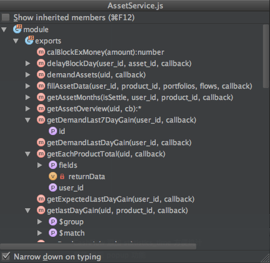

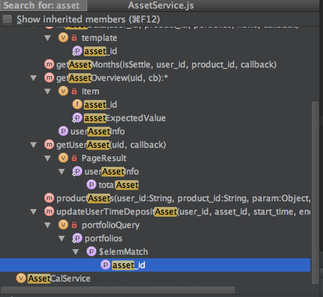

#### 书签

经常编辑的功能 就加个书签吧

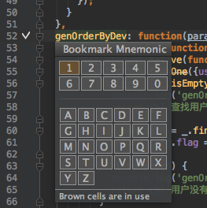

### 编辑

#### 重构

rename 神器

variable 将表达式抽出为变量(消灭重复表达式)

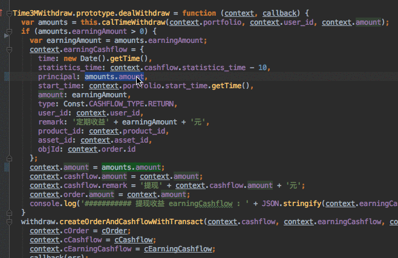

inline variable 的反操作, 适合这个变量只使用了一次的时候

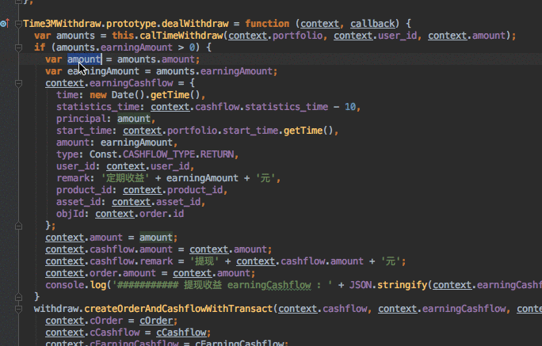

parameter

#### 自定义模板

live template

将常用的方法抽出为模板, 再也不用 Ctrl+CV 了.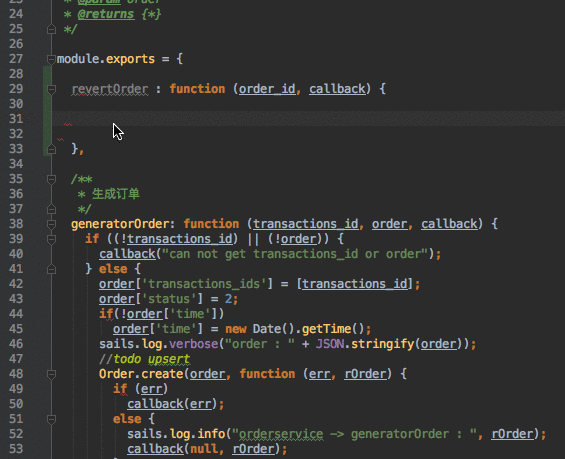

#### format + validate

* 自带 format 工具,也支持 eslint 等工具, 实时检查代码格式或 error
* 找出未被使用的变量
* 使用 F2 跳到错误位置

#### 方便你快速编辑的

* 选择块代码 alt+up 用鼠标小心翼翼地选择一小段代码真的很累的.
* 复制行 win+d 写一个列表的时候常用
* 删除行 + win 能少按几下是几下
* vim 插件 vim 党

### 版本控制

#### change list

变更列表, 方便区分不同任务的变更, 避免提交暂时不需要提交的东西. 也方便 code review

建议配合 Task 功能使用.

change list 还有个不易发现的神级功能, Shelve Changes 搁置提交列表 

如果你改动一堆文件, 然后你想切换分支, 但是 git 冲突不让你切换, 在之前你的选择只有两个

* commit 当前的修改
* 放弃

Shelve Changes 提供第三个选择, 把这堆修改搁置, 这样 git 就不会冲突了.

#### 对比视图

code review 神器 

配合 change list 提交代码之前 review 一下本次修改的代码.

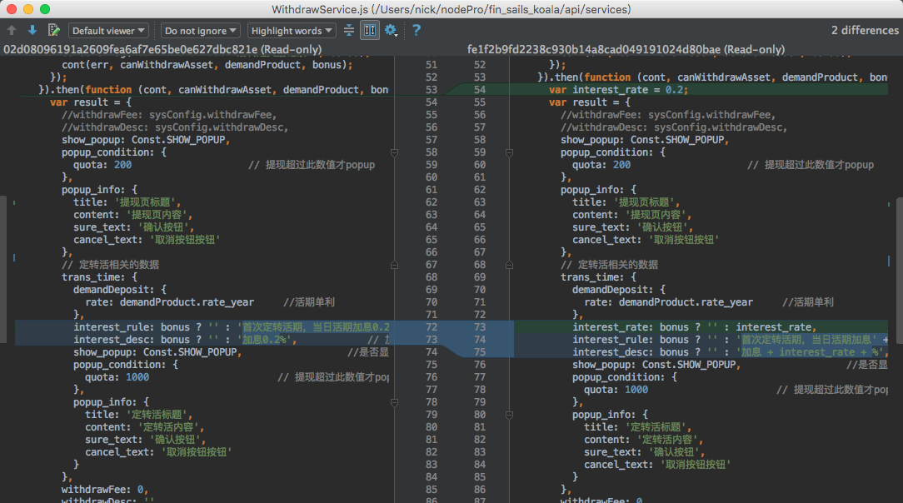

#### 解决冲突

非常实用的功能, 简单的冲突还能手动解决, 复杂的冲突只能依赖这个工具了.

左侧的代码是你的, 右边的是 server 的, 中间是合并的结果. 

首先接受不冲突的更新, 然后手动选择你需要的修改, << 表示接受, X表示放弃.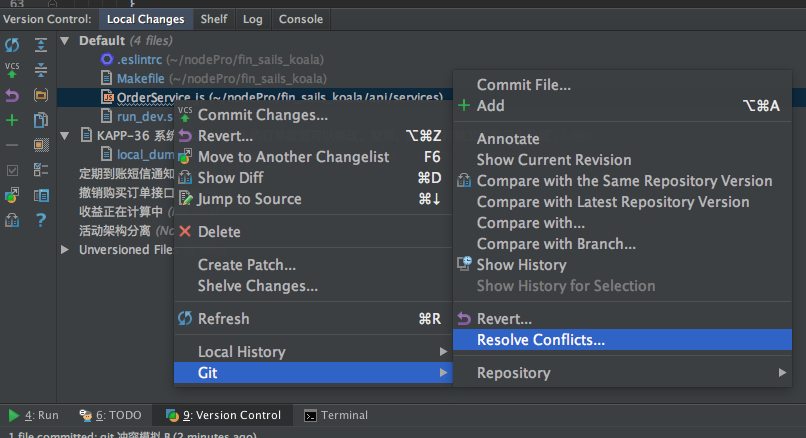

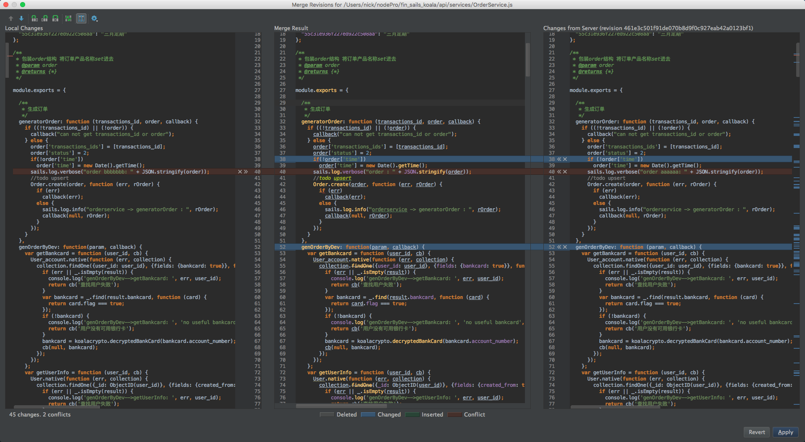

#### git 历史

在行号后面点击右键, 选择 Annotate 可以查看代码的最后修改人. 

在当前文件点击右键, 选择 Git –> show history 则可以查看该文件的提交历史.

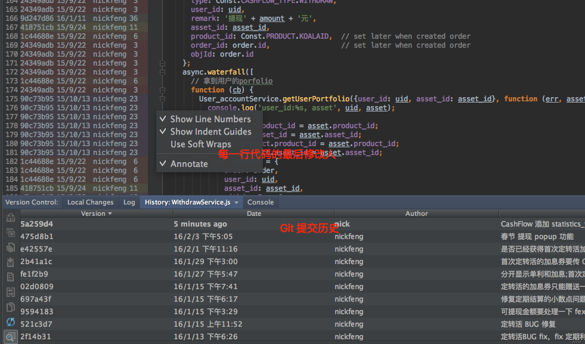

选中一个提交, 点击右键选择 Compare (或者按下 Ctrl + D ), 可以打开对比视图, 查看本地提交修改了哪些东西. 

#### 本地历史

一般用不上, 但是关键时刻能救你一命的功能. 

详细记录你每一次修改, 如果你 git 上误操作, 代码被吃了, 在这里还能找回来.

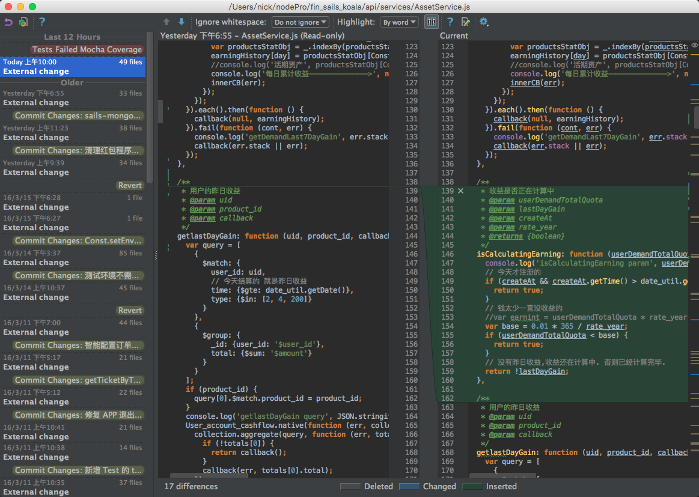

### RUN 程序运行

#### RUN

快速定位出错位置

方便搜索 log 不要再用 ####### 来定位 log 了. 你有 Ctrl+ F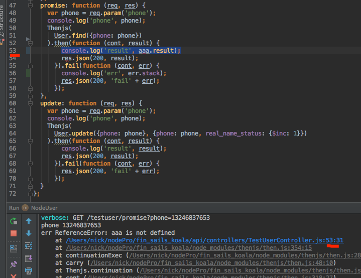

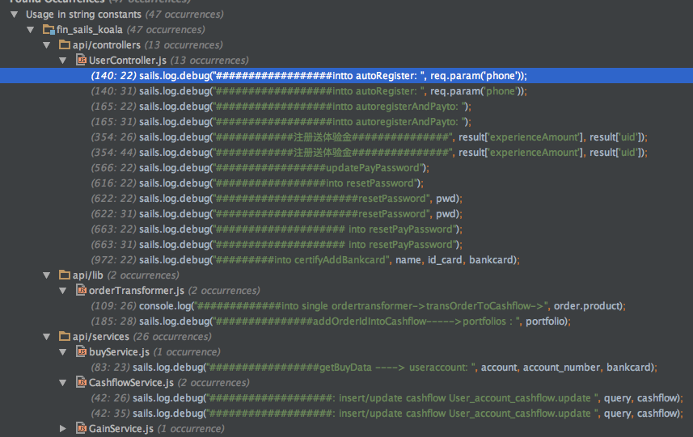

#### Debug

Debug 的清晰度会比 log 高很多, 可以方便地查看上下文, 可以更快的找出问题. 

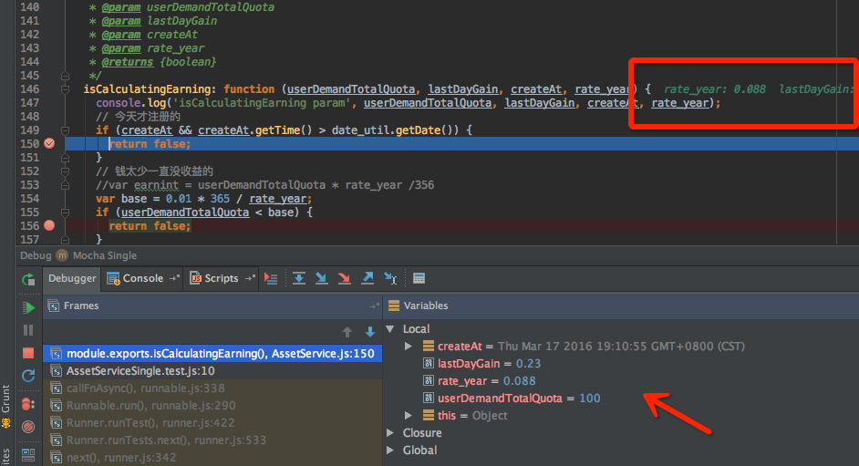

Debug 整个工程的话, 速度非常慢, 不建议使用. 推荐用来 Debug 单文件执行.

#### TEST

配置 Mocha 运行环境 (注意: Webstorm 11 对 Mocha 的支持出现了问题)

清晰的视图,快速定位 log. 抛弃那种 ============ 的 log 方式吧.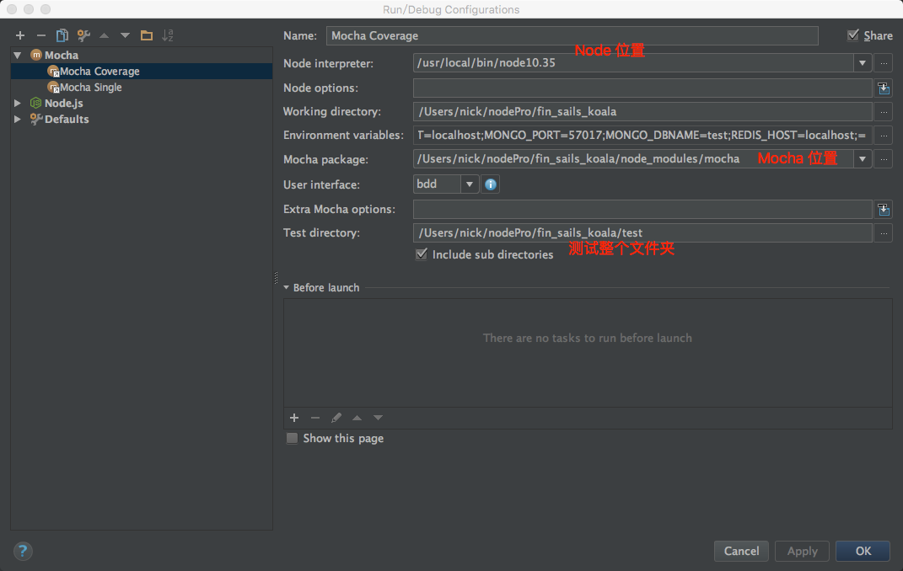

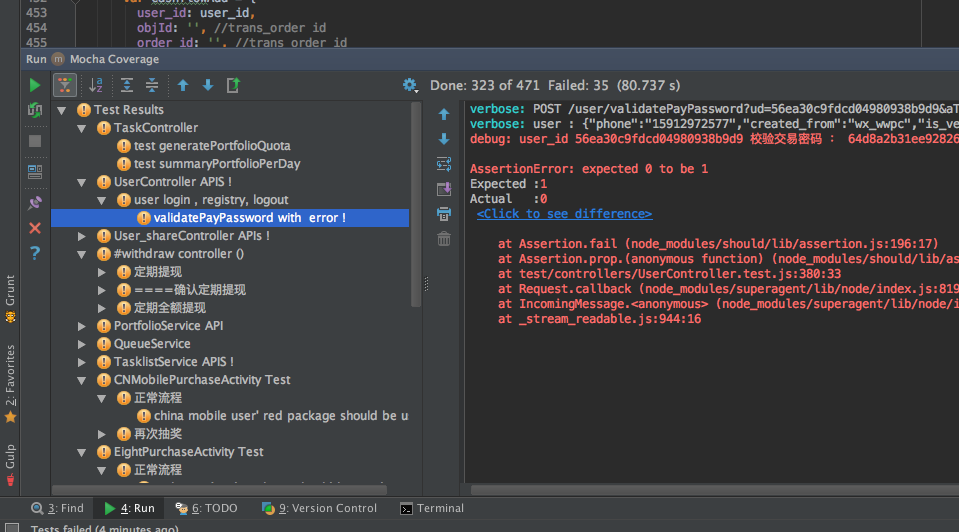

### 集成

集成第三方的项目管理工具到 Task 功能

#### Trello

#### Jira

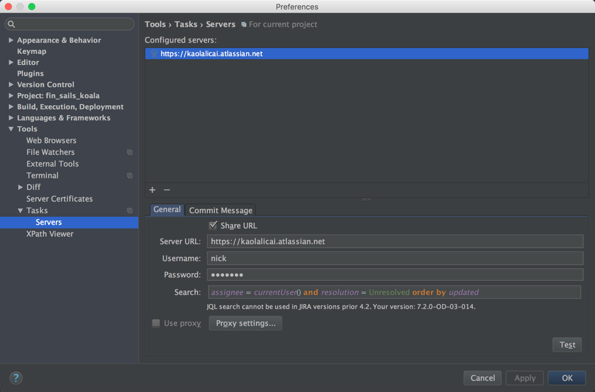

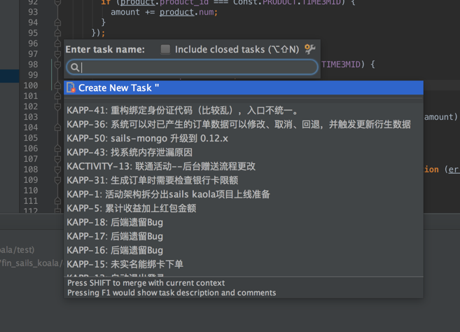

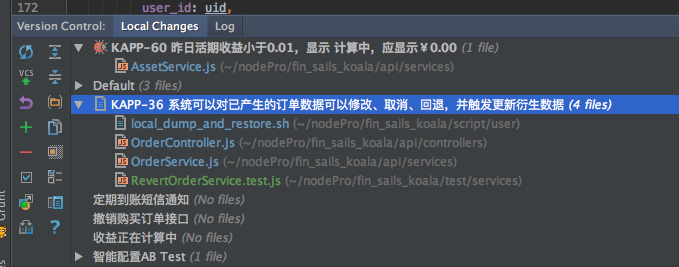

### 开发工具的选择

开发工具和编程语言一样, 没有最好的, 只有最合适的. 

合适的工具只是为了提升开发效率而已.

### 跑题

1. 推荐开发环境升级 sails 和 sails-mongo 到最新版.
npm install sails@latest 

npm install sails@latest -g 

npm install sails-mongo@latest 

npm install sails-hook-autoreload

1. 推荐使用马克飞象编辑器

