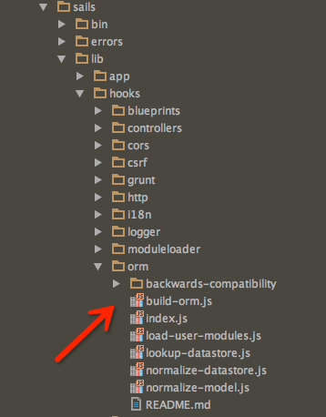

# 单独测试 waterline


# 单独测试 waterline

本文主旨：更简单更快速地测试 sails Model 操作。

waterline 是 sails 里使用的 orm 工具。 

sails 官方提供了 mocha 的测试例子 [Testing | Sails.js Documentation](http://sailsjs.org/documentation/concepts/testing)

其原理主要是在 mocha 启动之前，先启动 sails，这样全局变量 sails 以及全局 Model 、Service 对象就生成了，之后就可以针对 sails 的功能进行测试了。 

在 test 目录的 bootstrap.test.js 添加如下代码：

```
var sails = require('sails');before(function(done) {  // Increase the Mocha timeout so that Sails has enough time to lift.  this.timeout(5000);  sails.lift({    // configuration for testing purposes  }, function(err, server) {    if (err) return done(err);    // here you can load fixtures, etc.    done(err, sails);  });});after(function(done) {  // here you can clear fixtures, etc.  sails.lower(done);});
```

看起来很简单对不对。 

是很简单，但是，用过 sails 的童鞋有清楚，项目稍微大一点的时候，sails 的启动速度有点慢，假设你只是想测试一个 model 的一个简单操作，你还是需要启动整个 sails。每次操作你都需要等待几十秒的时间。。。 

国外某位童鞋还专门吐槽了这个事情：

* sails 测试慢成狗啦 [node-require-is-dog-slow](https://kev.inburke.com/kevin/node-require-is-dog-slow/)
* 吐槽 sails 和 waterline 的各种问题 [dont-use-sails-or-waterline](https://kev.inburke.com/kevin/dont-use-sails-or-waterline/)
好吧，这个问题的确是存在的，那要怎么解决呢，如果尝试把对 controller 和 service（操作数据库）的测试分开，那么在测试 service 的时候只加载 orm 会不会快一点呢？来试一试吧。

## 单独加载 waterline

### 相关文档

1. waterline 的官方文档提供了 [ getting started 示例](https://github.com/balderdashy/waterline-docs/blob/master/introduction/getting-started.md)
比较简单，示例里连接的是内存数据库，没有提供怎么配置连接 mongo 的信息。

1. sails 的人员也提供了一个 Express 里使用 waterline 的示例 [Waterline v0.10 Express Example.js](https://gist.github.com/mikermcneil/8443381)
跟上一个例子同样的问题，还是没讲怎么配置 mongo。


### 自己实现

既然网上的例子不靠谱，那么就去扒 sails 的源码吧。 

让我们小心翼翼地打开 node_module 下的 sails 目录



额，好直接，文件名已经告诉我们 waterline 是在哪里初始化的了。点进去看看吧。

```
module.exports = function howto_buildORM(sails) {  return function buildORM(modelDefs, cb) {    // 来自 Nick 注释 这里拿到项目的定义的 Model 然后逐个 waterline.loadCollection    // -> Instantiate ORM in memory.    // -> Iterate through each model definition:    //    -> Create a proper Waterline Collection for each model    //    -> then register it w/ the ORM.    sails.log.verbose('Starting ORM...');    var waterline = new Waterline();    _.each(modelDefs, function loadModelsIntoWaterline(modelDef, modelID) {      sails.log.silly('Registering model `' + modelID + '` in Waterline (ORM)');      waterline.loadCollection(Waterline.Collection.extend(modelDef));    });    // 来自 Nick 注释 拿系统配置的 connections    // Find all the connections used    var connections = _.reduce(sails.adapters, function getConnectionsInPlay(connections, adapter, adapterKey) {      _.each(sails.config.connections, function(connection, connectionKey) {        if (adapterKey === connection.adapter) {          connections[connectionKey] = connection;        }      });      //console.log('connections', connections);      return connections;    }, {});    var appDefaults = sails.config.models;    // -> "Initialize" ORM    //    : This performs tasks like managing the schema across associations,    //    : hooking up models to their connections, and auto-migrations.    waterline.initialize({      adapters: sails.adapters,      connections: connections,      defaults: appDefaults    }, function (err, orm) {      if (err) return cb(err);      var models = orm.collections || [];      _.each(models, function eachInstantiatedModel(thisModel, modelID) {        // 来自 Nick 注释 这个操作不能省        _.bindAll(thisModel);        ......        ......        ......        ......        sails.models[modelID] = thisModel;        // 配置全局 Models        if (sails.config.globals && sails.config.globals.models) {          var globalName = sails.models[modelID].globalId || sails.models[modelID].identity;          global[globalName] = thisModel;        }      });      cb();    });  };};
```

吧啦吧啦一大堆，从这源码可以得到两个关键的信息，

1. 要先把 api/model 里定义的 models 都 load into waterline。
2. waterline.initialize 的时候需要3个参数：

* adapters: 也就是那个 ‘sails-mongo’
* connections: mongo 连接的配置信息
* defaults: 连接方式，就是 models.js 里配置的那个 migrate

#### load models

先解决第一个问题， load models，源码里暂时没看到怎么实现的，自己实现也不难：

```
 /** * require api/models 里面的每个对象 * @param connection 每个 models 配置的默认 connection * @returns {{}} */function getModelDefs(connection) {  console.log('Loading app models...');  let models = {};  let sourceFolder = process.cwd() + '/api/models';  let files = fs.readdirSync(sourceFolder);  for (let i = 0; i < files.length; i++) {    try {      if (files[i].includes('.js')) {        let model = require('../api/models/' + files[i]);        let identity = files[i].toLowerCase().replace('.js', '');        console.log('found model', identity);        model.identity = identity;        model.connection = connection;        models[identity] = model;      }    } catch (err) {      console.log('extend model err', err.stack || err);    }  }  return models}
```

#### waterline initialize

好了，接下来是第二个问题 waterline initialize。

1. 先拿到项目里的 /config/connections 配置：

```
 /** * 读取系统的 connections 配置 * @param connectionName 指定的连接 * @returns {Object} */function getConnections(connectionName) {  let connections = require('../config/connections');  if (connectionName) {    let result = {};    result[connectionName] = connections.connections[connectionName];    return result  } else {    return connections.connections  }}
```

1. 准备完毕，调用 waterline.initialize

```
module.exports.buildORM = function (connectionName, appDefaults, cb) {  // -> Instantiate ORM in memory.  // -> Iterate through each model definition:  //    -> Create a proper Waterline Collection for each model  //    -> then register it w/ the ORM.  console.log('Starting ORM...');  if (!connectionName || !appDefaults) {    return cb('miss connectionName or appDefaults')  }  appDefaults.connection = connectionName;  let modelDefs = getModelDefs(connectionName);  let waterline = new Waterline();  _.each(modelDefs, function loadModelsIntoWaterline(modelDef, modelID) {    console.log('Registering model `' + modelID + '` in Waterline (ORM)');    waterline.loadCollection(Waterline.Collection.extend(modelDef));  });  // Find all the connections used  let connections = getConnections(connectionName);  let adapters = {    'sails-mongo': sailsMongoAdapter  };  console.log('buildORM appDefaults', appDefaults);  console.log('buildORM connections', connections);  console.log('buildORM adapters', Object.keys(adapters));  // -> "Initialize" ORM  //    : This performs tasks like managing the schema across associations,  //    : hooking up models to their connections, and auto-migrations.  waterline.initialize({    adapters: adapters,    connections: connections,    defaults: appDefaults  }, function (err, orm) {    if (err) return cb(err);    let models = orm.collections || [];    _.each(models, function eachInstantiatedModel(thisModel, modelID) {      // Bind context for models      // (this (breaks?)allows usage with tools like `async`)      _.bindAll(thisModel);    });    // Success    cb(null, models);  });};
```

搞定，这样 waterline 就启动完毕啦，默认加载 api/models 里定义的对象，加载 /config/connections 的里 DB 连接信息。

### 在 Mocha 里使用 waterline

#### 初始化

在 test 目录的 bootstrap.test.js 添加如下代码：

```
'use strict';let BuildWaterLine = require('../hack/BuildWaterLine');let _ = require('underscore');let start_time = Date.now()before(function (done) {  // Increase the Mocha timeout so that Sails has enough time to lift.  this.timeout(10000);  // Initialize Waterline  BuildWaterLine.buildORM('testMongodb', {migrate: 'drop'}, function (err, models) {    if (err) throw err;    console.log('buildORM models', Object.keys(models));    console.log('waterline init time %s s', (Date.now() - start_time) / 1000);    done();  })});after(function (done) {  done();  // here you can clear fixtures, etc.});
```

BuildWaterLine.buildORM 方法就是上文我们自定义的加载方法，该方法返回的 models 就是每个带查询方法的 model 对象啦。

#### 怎么调用 Model 方法

上面只是返回了 models 对象，怎么在 mocha 的测试文件里使用到这些对象呢，两个方法。

1. 全局化，跟 sails 那样

```
 _.each(models, function eachInstantiatedModel(thisModel, modelID) {     global[modelID] = thisModel; });
```

需要注意 modelID 的大小写问题哦。把每个 Model 都全局化之后，就可以直接在 mocha 直接调用啦。

1. 拓展到其他对象上

```
var _ = require('lodash');let UserDao = require('../dao/UserDao')_.extend(UserDao, models['user']);
```

lodash 的 extend 提供了对象拓展功能。上文的代码把 user 这个 Model 的方法拓展到了 UserDao 对象上。 

或者你可以将 Model 拓展到 api/models 里的同名对象。这话听起来是不是很奇怪？这里有个细节你需要了解： 

**sails 里全局的 Model 对象，例如 User ，和你在 api/models/User.js 对象是不一样的哦**

至于为什么，你自己去 Google 吧。

做好拓展后，在测试文件里你只需要这样引入

```
let UserDao = require('......../UserDao');UserDao.create({phone: '13848965325'}, (err, cUser) => {   should.exist(cUser);   done(err)})
```

## 结果

单独加载 waterline 耗时

```
waterline init time 0.532 s
```

sails 启动耗时

```
sails start time 3.122 s
```

这个对比结果是基于新建的 sails 项目，只有4个 Model 文件。

## 源码

[https://github.com/myfjdthink/CodeNode/tree/master/sails/waterline_init](https://github.com/myfjdthink/CodeNode/tree/master/sails/waterline_init)


