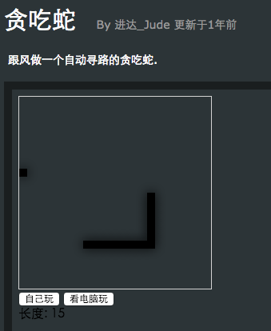
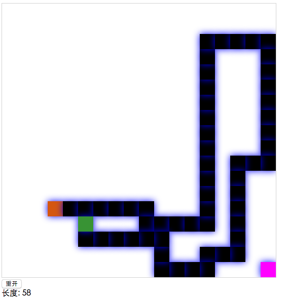

# 写个自动寻路的贪吃蛇


# 写个自动寻路的贪吃蛇

## 前言

偶尔看到两年前写的贪吃蛇，当时没把自动寻路的算法写好，蛇容易挂，周末找了个时间把当年的坑填上，写了个不会挂的贪吃蛇。

[两年前的版本_点击查看](http://runjs.cn/detail/q0w7il3b)



[这次更新的版本_点击查看](https://myfjdthink.github.io/snake/snakeAuto.html)



代码比较简单，抛开 A* 算法的实现，整个 html 代码在 300 行以内~ 

源码 ： 

[https://github.com/myfjdthink/myfjdthink.github.io/blob/master/snake/snakeAuto.html](https://github.com/myfjdthink/myfjdthink.github.io/blob/master/snake/snakeAuto.html)

## 原理说明

### 不死的方法

首先要找出一个模式可以保持蛇不挂，这个模式就是 

“跟着尾巴跑”

如果蛇头和蛇尾是可以连通的，那么就不会挂。 

所以只要保证任意时刻蛇头和蛇尾能连通即可。 

寻路的伪代码如下：

```
if(head to  flood){ // 蛇头能连通食物    模拟蛇吃到食物后的状态    if(newHead to tail){   // 吃到食物后还能连接尾巴 安全        eat flood    }  else {        // 吃到食物后无法连接尾巴 放弃        flow tail    }} else {    flow tail   // 跟着尾巴跑}
```

在吃食物之前，需要模拟吃到食物后蛇的状态，判断此时蛇是否还能连接尾巴，由此决定是否吃掉食物。

### 如何找到最短路径

使用 A* 算法可以快速找到俩点之间的最短路径，网上找了个实现，就直接扒下来使用啦。 

[http://devpro.it/examples/astar/index2.html](http://devpro.it/examples/astar/index2.html)

### TODO

目前只是实现了不死，在某些条件下，程序还是会陷入一个循环，这个有空在改进吧，欢迎提 PR。


