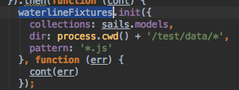
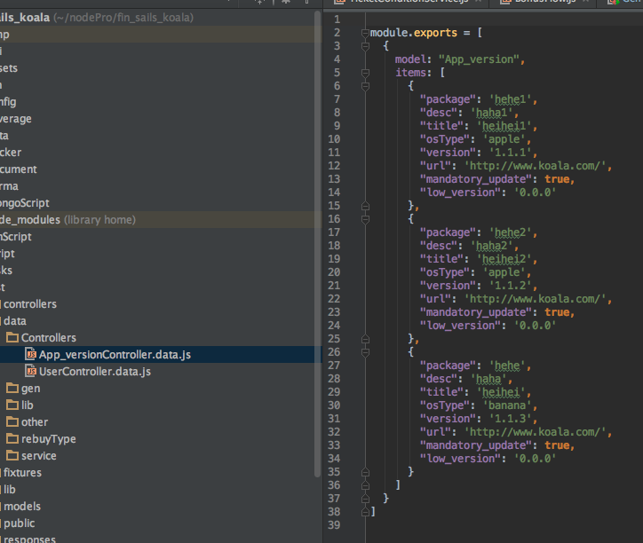
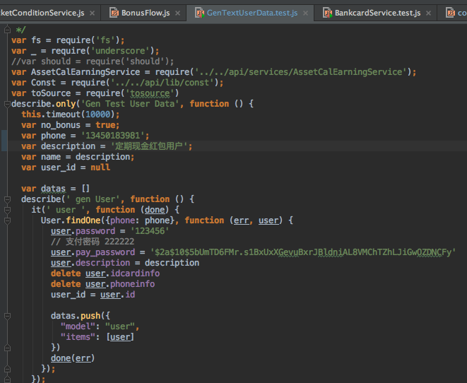
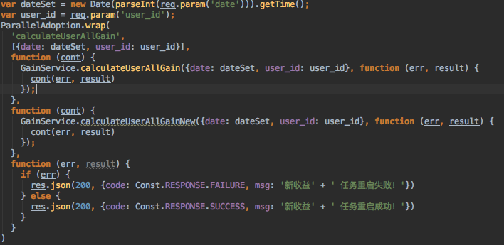
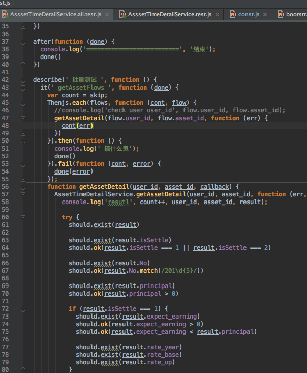

# Node 后端开发的几种测试方式

后端开发中，只需要针对接口（无 GUI）做自动化测试，还是比较容易实现的，所以在开发过程中尽量写好测试。在这里总结下我在工作中用到的测试方法。这里以 Nodejs 的后端开发为例。

## 单元测试

单元测试的重要性不言而喻，算是业界共识了。 

在有完善的单元测试的基础上，可以很方便地做到持续集成。 

提到单元测试，大家很容易想到 TDD，我个人认为 TDD 并不是一件很容易做到的事情，特别是小团队需求多变的时候，往往会追求先出功能后补测试。

## 集成测试

考拉里的集成测试一般是通过一个接口对 N 个方法进行集成，这个接口会调用 N 个方法。这种集成测试是对单元测试的一种补充。 

因为集成测试的粒度比较大，在做测试的时候往往会碰到个很麻烦的问题：怎么准备测试数据？

### 准备测试数据

测试数据存储位置 

使用 js 来存储数据，相对于 json 来说 js 可以编程，例如需要定义一个日期是昨天，json 是做不到的。

在测试开始前载入测试数据

准备测试数据是件比较繁琐的事情，建议直接从生产环境拉取用户数据。脱敏后作为测试数据用。

写个脚本去线上拉取数据

GenTextUserData.test.js 

关键点： 

mongodump with query 

tosource

## 平行测试

重构用，新写一个方法，新旧方法一起执行，判断结果是否一致。把不一致的结果收集起来。 

效果卓群，可以发现很多意想不到的 BUG。 

但是比较使用范围有限，只能测试只读的方法。

## 灰度测试

最实用，成本很低的方案。 

灰度发布，只有部分人可以使用新功能，观察一段时间。

## 全量覆盖测试

使用大量真实数据来测试，真实数据可以提供足够的样本。 

例如开发一个新功能，把所有用户的数据 load 进来，模拟使用这个新功能，看看是否有报错。 

但是这个做法成本毕竟高，只有重要的功能才需要这样做。 

而且用户数据大于百万级别时，整个测试耗时将非常漫长，可以考虑过滤部分用户把量控制在10万以内。

## 人工测试

在测试环境，作为用户，体验一遍此次开发的功能，看看前面的测试是否有遗漏。 

辅助工具 

HDC 

POSTMAN

