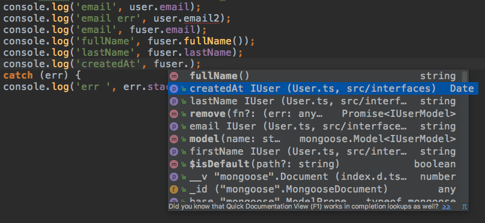
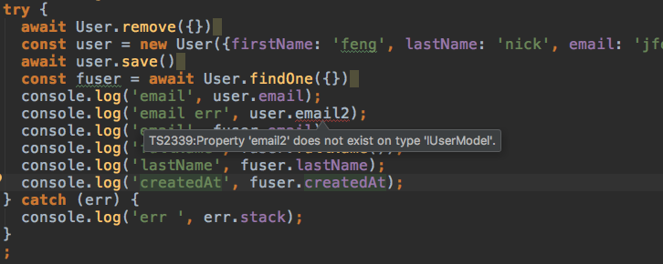
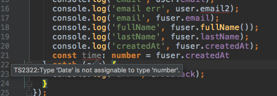

# Typescript 与 Mongoose 的最佳实践


## Update

2019-11-21 更新： 

这篇文章写于 2017 年，有些过时了，现在 typescript + mongoose 也有些开源实现了，建议使用以下开源项目： 

[typegoose](https://github.com/szokodiakos/typegoose) ： 使用 class 来定义mongoose 的 Schema。 

[typeorm](https://typeorm.io/#/) ：应该是目前 Node 业界最好的 orm，但它主要是面向 sql 类数据库，对 mongodb 的支持欠佳

## 前言

mongoose 是 node.js 里操作 mongodb 的最好的 orm 工具。 

typescript 则是带了 type 的 js 超集。 

在开发过程中经常会碰到写错字段名的问题，只有到了运行阶段才能发现（或许也没发现。。。），使用 typescript 可以达到以下目的：

1. 智能提示，不会输错字段名啦，当然这个取决于你的 IDE 是否支持 typescript。

2. 类型检查，错误的类型定义可以在编译期发现。
接下来就看看这两个东西怎么配合吧。

完整的 Express + Typescript + Mongoose 的 Demo 可以参考之前的文章 ：[使用 typescript 做后端应用开发](http://myfjdthink.com/%E4%BD%BF%E7%94%A8-typescript-%E5%81%9A%E5%90%8E%E7%AB%AF%E5%BA%94%E7%94%A8%E5%BC%80%E5%8F%91/)

## 安装准备

1. typescript

typescript 的安装配置这里不赘述，可以看 typescript 的官方文档。

2. mongoose
下载 mongoose 的类型定义文件

```
$ npm install mongoose --save
$ npm install @types/mongoose --save-dev
$ npm install @types/mongodb --save-dev
```

typescript 的 tsd 的组织方式一直在变化，目前的方式算是比较简单的，typescript 官方把常见的库 Definition 都放在 npm 上了。

## Model 的定义

以一个 User Model 为例。

### 先定义一个接口

src/interfaces/User.ts:

```
export interface IUser {
  createdAt?: Date;
  email?: string;
  firstName?: string;
  lastName?: string;
}
```

### Schema + Model

src/model/User.ts:

```
import {Document, Schema, Model, model} from "mongoose";
import {IUser} from "../interfaces/User";

export interface IUserModel extends IUser, Document {
  fullName(): string;
}

export const UserSchema: Schema = new Schema({
  createdAt: Date,
  email: String,
  firstName: {type: String, required: true},
  lastName: {type: String, required: true}
});
UserSchema.pre("save", function (next) {
  let now = new Date();
  if (!this.createdAt) {
    this.createdAt = now;
  }
  next();
});
UserSchema.methods.fullName = function (): string {
  return (this.firstName.trim() + " " + this.lastName.trim());
};

export const User: Model<IUserModel> = model<IUserModel>("User", UserSchema);
```

Mongoose 的 tsd 中是使用泛型来实现对具体 Model 的定义的，我们自己定义的 Model 是 IUser（包含数据库字段），Mongoose 提供的基础的 Model 定义是 Document（包括 find findOne 等操作） ，继承这个两个接口就是最后的 Model 啦。

有个比较尴尬的地方是：Mongoose 的 Schema 定义和 IUser 的定义是非常相似却又不是同一个东西，你需要写两遍属性定义。而且应该会经常改了一处忘了另一处。

这里提供一个解决方案是：**用代码生成器根据 Schema 来生成 Interface 。**

只提供思路，不给实现。

## RUN 起来

引入 User Model。 

src/app.js：

```
import * as mongoose from 'mongoose'
// mongoose.Promise = global.Promise;
import {User} from './model/User'
mongoose.connect('mongodb://localhost:57017/test');

const db = mongoose.connection;
db.on('error', console.error.bind(console, 'connection error:'));
db.once('open', async function () {
  console.log('we\'re connected!');
  try {
    await User.remove({})
    const user = new User({firstName: 'feng', lastName: 'nick', email: 'jfeng@kalengo.com'})
    await user.save()
    const fuser = await User.findOne({})
    console.log('email', user.email);
    console.log('email err', user.email2);
    console.log('email', fuser.email);
    console.log('fullName', fuser.fullName());
    console.log('lastName', fuser.lastName);
    console.log('createdAt', fuser.createdAt);
  } catch (err) {
    console.log('err ', err.stack);
  }
});
```

一切正常。

## 得到了什么

### 智能提示

IDE 会根据 IUser 的结构来智能提示，终于不用怕很长的字段名啦



### 类型检查

属性不存在



类型不匹配 



OK， 这样就实现文章开头提到的目的啦。

## 源码

见 [https://github.com/myfjdthink/typescript-mongoose](https://github.com/myfjdthink/typescript-mongoose)

## 参考文章

[TypeScript: Declaring Mongoose Schema + Model](http://brianflove.com/2016/10/04/typescript-declaring-mongoose-schema-model/)

[mongoose 文档](http://mongoosejs.com/index.html)


