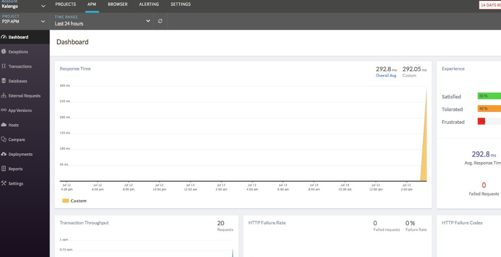
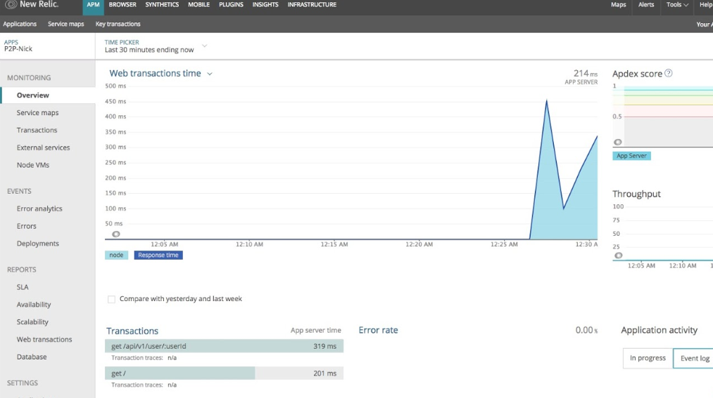
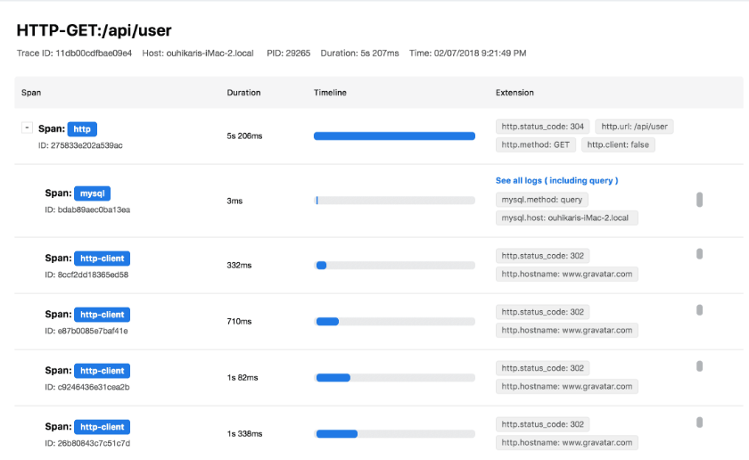
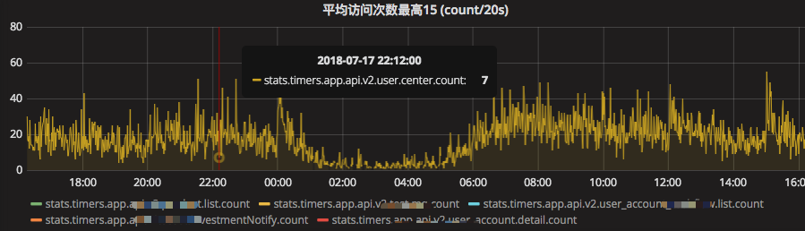
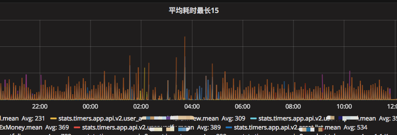

# Node.js APM 软件调研报告

## 前言

最近做 Node 服务的性能优化工作，在 2016年3月，我写过 [Node 性能优化](http://myfjdthink.com/2016/03/22/node-%E6%80%A7%E8%83%BD%E4%BC%98%E5%8C%96/) 这篇文章， 讲解了常见的 Node 服务缓慢原因，还介绍了 内存泄露 和 cpu profile 的知识。

这一次，是侧重中应用运行信息收集这一块，根据同事 Leo 的介绍，我对一些支持 Node.js 的 APM 软件做了一次调研。

在分别介绍每个软件之前，我要先阐述我使用这些软件的目的：它可以发现慢的 http 请求，并且可以查看当时的 Node 服务状态（包括内存 CPU 占用状态），database 状态（这里是 mongodb），帮助 dev 准确分析出请求处理缓慢的原因。

下文的体验报告将以此目标为标准进行评价。

## 软件列表

本次体验的 APM 软件有：

|名称                       |介绍                     |开源/收费情况                 |
|atatus                     |支持多种语言，包括前端   |不开源，收费                  |
|newrelic                   |支持多种语言，包括前端   |开源，收费                    |
|keymetrics                 |pm2, Node 应用管理器     |开源，限额免费                |
|Pandora.js                 |阿里出品，Node 应用管理器|开源，免费（自建服务）        |
|alinode                    |Node 底层的监控          |开源，免费（阿里云上配置实例）|
|statsd + graphite + grafana|监控三件套，开发自由度高 |开源，自建服务                |

## atatus

atatus 提供了 npm 工具包 [atatus-node](https://www.npmjs.com/package/atatus-node) 用于监控数据收集，具体配置见[官方文档](https://www.atatus.com/getting-started/node-js)。

使用报告：不是 100 % 的采样率，没有收集到官网宣传的各种维度的信息，使用 Koa 框架，基本上只能看到总的 http response time。

## newrelic

网址 [https://newrelic.com/](https://newrelic.com/) ，和 atatus 基本相同，也提供 npm 工具包 newrelic。

## keymetrics

偏向应用生命周期管理，可以看到 Node 服务的 cpu 内存等占用情况，有错误（crash）收集功能，国内访问很卡。

## Pandora.js

Pandora.js 是一个 Node.js 应用监控管理器。它集成了多种类型的能力诸如：监控、链路追踪、调试、进程管理等等。

它是个很有趣的东西，总结来说是它很强大但是还不够成熟，包括 Pandora 自身和整个 Node 生态都不成熟。

### 应用管理

可以对标 PM2，不赘述。

### 应用度量

有操作系统指标，包含 Load、CPU、内存、磁盘、网络、TCP 等各种指标； 

有 Node.js 指标（内存占用）； 

还可以自定义指标，类似 statsd 做的事情，但是后续的存储和展示嘛，非常简单，没有 statsd + graphite + grafana 好用。

### 链路追踪

这个是 Pandora 提供的比较“先进”的功能，链路追踪理论上可以分析出一个 http 哪里耗时多，例如一个 get 请求，做的事情有，查询 db ，调用 第三方服务等。链路追踪会记录每一个环节的耗时：

链路追踪的实现依赖了 Node 的一个实验性特性 async_hooks，因为是新特性，目前还有很多问题没有解决，例如 mongoose 和 superagent 两个工具包的 Promise 实现方式会导致 async_hooks，具体可以见我在 Pandora 提的 [issue](https://github.com/midwayjs/pandora/issues/221) ，也就是说，如果你刚好用了这两个框架，Pandora 链路追踪就失效了。

## alinode

Node.js 性能平台 [https://cn.aliyun.com/product/nodejs](https://cn.aliyun.com/product/nodejs) ，alinode 是在 node runtime 层面做的应用信息收集，而不是上述各个框架在应用层进行信息收集，所以 alinode 可以监控到 进程数据，堆快照、堆时间线、CPU Profile、GC Trace 等非常底层的信息，如果你的应用性能瓶颈在 Node 服务本身，使用该工具会有很大的帮助，如果你的应用性能瓶颈在 DB，那应该是用 DB 监控工具。

## statsd + graphite + grafana

这个三件套有意思的是，监控指标是开发自己定义的，考拉用这三件套监控请求处理时间，记录每个请求的处理时间 

这样在 grafana 上可以快速看出当前应用的请求量与趋势，已经快速分析哪些接口缓慢。

接口访问量的趋势变化：

处理最慢的接口：

这套工具的优势在于 grafana， 提供了非常直观的图表。 

这套工具的搭建方法我之前也写过文章，可以看看 [快速搭建一个监控服务](http://myfjdthink.com/2016/01/08/%E5%BF%AB%E9%80%9F%E6%90%AD%E5%BB%BA%E4%B8%80%E4%B8%AA%E7%9B%91%E6%8E%A7%E6%9C%8D%E5%8A%A1/)

## 总结

回到我们的目标“帮助 dev 准确分析出请求处理缓慢的原因”， 

理论上最贴合这个目标的是 Pandora.js ，但是我们还需要再等等，等它成熟。 

最简单而强大的是 statsd + graphite + grafana 三件套，不用考虑 atatus newrelic 等。 

如果你使用 Node 做高并发服务，alinode 将会很有用。

