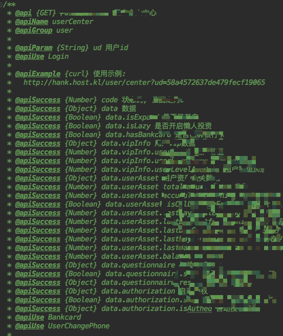
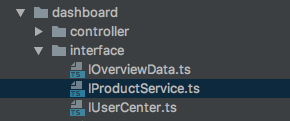

# API 接口与 Typescript Interface


## 前言

Interface 就是接口，在 typescript 用于类型限定。 

在 Node 项目中，我们常用 apidoc 来定义接口文档。 

那么，他们俩是否能结合起来呢？

## apidoc 的痛点

[apidoc](http://apidocjs.com/) Inline Documentation for RESTful web APIs，使用起来非常方便，直接在 api 上添加注释，就可以生成可视化的文档。

但是，在实际业务中，我们有些接口比较复杂，定义返回值是一件比较痛苦的事情，如图：



而且，过了一段时间之后，出于惰性，开发人员会放弃更新 API 文档，导致文档落后于实际。

## API Interface

### API 未定义的问题

在 js 项目中，api 返回结构一般是无法清晰地看出来的，你得跑一下接口，才知道会返回什么，或者仔细看一遍代码。这种情况下，开发人员维护 API 会面临以下问题：

* 文档缺失：接口文档缺少对某个字段的定义，不知道该字段作何用处
* 字段混乱：明明是一个字段，可能在 接口 A 是叫 amount， 在接口 B 却叫 number
* 重复定义：多个接口中都用到一个叫 Banner 的东西，需要在每个接口文档中定义一遍，稍有改动，需要更改多处
### 使用 interface 的好处

所以可以尝试使用 typescript 的 interface 来定义 API 的返回值结构，一个接口对应一个 interface。



假设一个 api 是 product info ，定义结构如下：

```js
/**
 * 产品明细
 */
export interface IProductInfo {
  /**
   * 基础利息
   */
  baseRate: number
  /**
   * 加息
   */
  bonusRate: number
  /**
   * 加息提示
   */
  bonusRateStr: string
}
```

另一个 api 是 product list ，可以很方便地进行复用：

```js
/**
 * 产品列表
 */
export interface IProductList {
  list: Array<IProductInfo>
}
```

这些接口定义也可以共享给前端（前端也用 typescript 的话）

## apidoc + interface

很多时候，你的痛点其实也是其他人的痛点，所以就有了开源项目，通过搜寻，我们可以找到一个 apidoc 的插件 [apidoc-plugin-ts](https://github.com/tgreyjs/apidoc-plugin-ts)，这个插件可以根据 interface 的定义帮你生成 apidoc 需要的 @apiSuccess 内容。 

定义一个接口：

```js
filename: ./employers.ts

export interface Employer {
  /**
   * Employer job title
   */
  jobTitle: string;
  /**
   * Employer personal details
   */
  personalDetails: {
    name: string;
    age: number;
  }
}
```

引入 interface:

```js
 @apiInterface (./employers.ts) {Person}
```

翻译的效果:

```js
 @apiSuccess {String} jobTitle Job title
 @apiSuccess {Object} personalDetails Empoyer personal details
 @apiSuccess {String} personalDetails.name
 @apiSuccess {Number} personalDetails.age
```

还支持数组结构定义呢~ 

有了这个插件，就可以通过维护 interface 来维护 apidoc 了。

### 注意：

该插件不支持匿名接口定义数组结构， 如下：

```js
export interface IProductList {
  list: Array<{
    a: string,
    b: string
  }>
}
```

AST 解析代码的时候会拿不到某些属性，会报错


