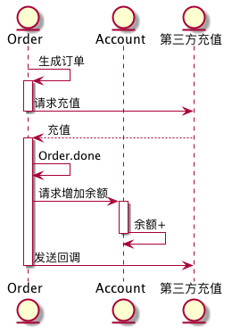
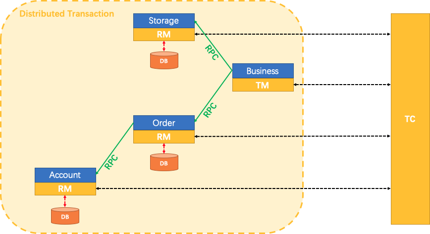
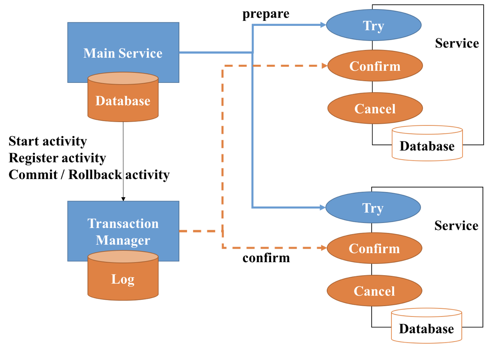
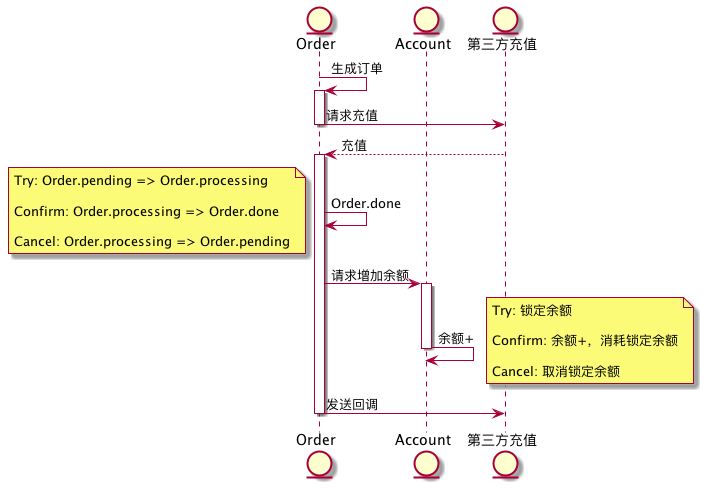
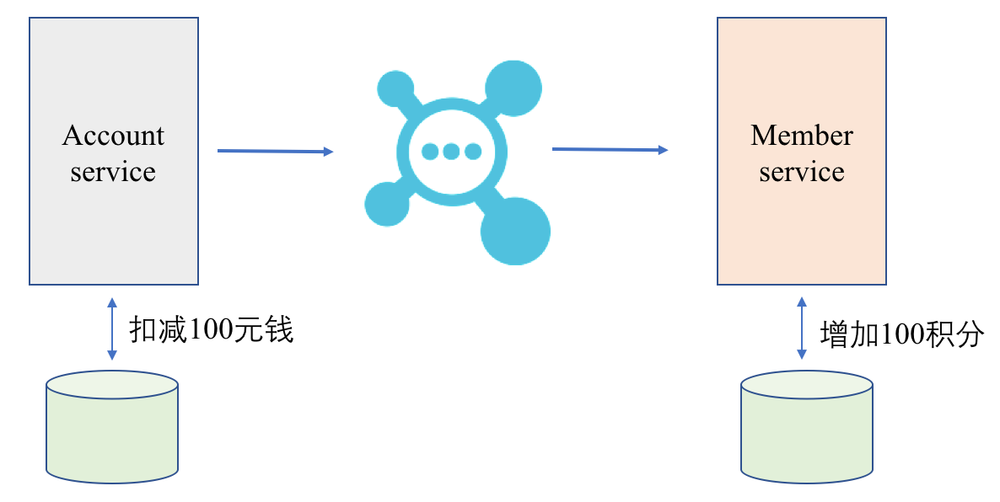
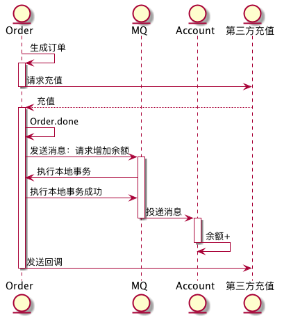
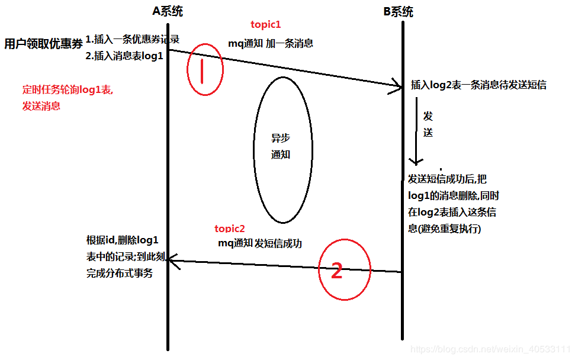
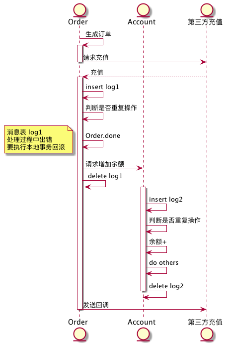
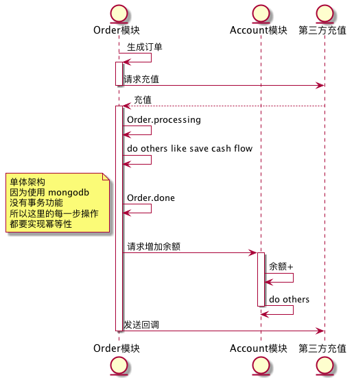
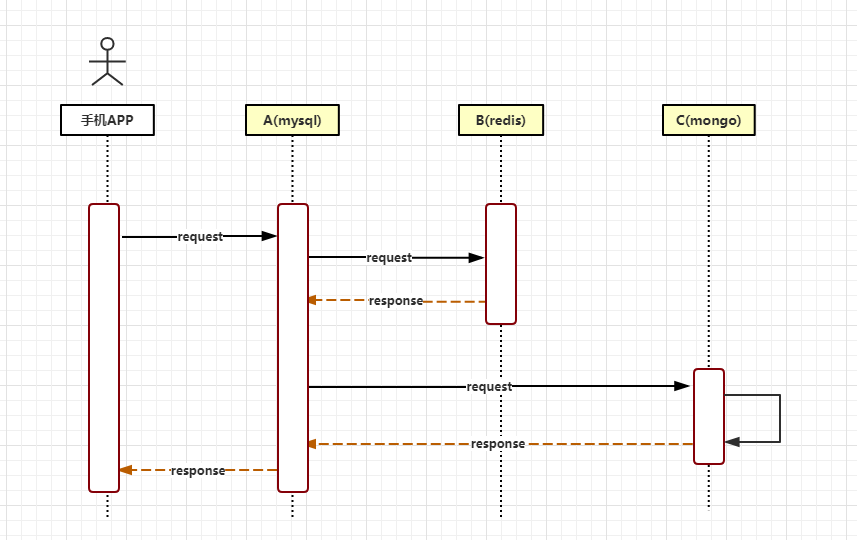

# 分布式事务的 N 种实现

## 目录

* [目录]()
* [需求缘起]()
* [理论基石]()
* [ACID 和 BASE]()
* [2PC]()

* [需求样例]()
* [实现1 Seata]()
* [介绍 & 框架]()
* [原理]()
* [实现充值需求]()
* [代码示例]()

* [实现2 TCC]()
* [介绍]()
* [原理]()
* [实现框架]()
* [代码示例]()
* [实现充值需求]()

* [实现3 事务消息]()
* [介绍]()
* [实现框架]()
* [原理]()
* [代码示例]()
* [实现充值需求]()

* [实现4 本地消息表]()
* [介绍 & 原理]()
* [实现充值需求]()

* [实现5 考拉的方案]()
* [介绍 & 原理]()
* [实现充值需求]()

* [总结]()
* [参考文章]()

## 需求缘起

在微服务架构中，随着服务的逐步拆分，数据库私有已经成为共识，这也导致所面临的分布式事务问题成为微服务落地过程中一个非常难以逾越的障碍，但是目前尚没有一个完整通用的解决方案。

其实不仅仅是在微服务架构中，随着用户访问量的逐渐上涨，数据库甚至是服务的分片、分区、水平拆分、垂直拆分已经逐渐成为较为常用的提升瓶颈的解决方案，因此越来越多的原子操作变成了跨库甚至是跨服务的事务操作。最终结果是在对高性能、高扩展性，高可用性的追求的道路上，我们开始逐渐放松对一致性的追求，但是在很多场景下，尤其是账务，电商等业务中，不可避免的存在着一致性问题，使得我们不得不去探寻一种机制，用以在分布式环境中保证事务的一致性

引用自 https://www.infoq.cn/article/2018/08/rocketmq-4.3-release

## 理论基石

### ACID 和 BASE

见 [https://www.infoq.cn/article/2018/08/rocketmq-4.3-release](https://www.infoq.cn/article/2018/08/rocketmq-4.3-release)

见 [https://www.txlcn.org/zh-cn/docs/preface.html](https://www.txlcn.org/zh-cn/docs/preface.html)

### 2PC

谈到分布式事务，首先要说的就是 2PC（two phase commit）方案，如下图所示：

2PC 把事务的执行分为两个阶段，第一个阶段即 prepare 阶段，这个阶段实际上就是投票阶段，协调者向参与者确认是否可以共同提交，再得到全部参与者的所有回答后，协调者向所有的参与者发布共同提交或者共同回滚的指令，用以保证事务达到一致性。

2PC 是几乎所有分布式事务算法的基础，后续的分布式事务算法几乎都由此改进而来。

## 需求样例

这里我们定义一个充值需求，后续我们在各个实现中看看如何为该需求实现分布式事务。

Order 和 Account 分别是独立的一个服务，充值完成后，要分别将订单Order 设置为成功以及增加用户余额。

## 实现1 Seata

### 介绍 & 框架

[Seata（Fescar）](https://github.com/seata/seata) is a distributed transaction solution with high performance and ease of use for microservices architecture.

阿里开源，其特点是用一个事务管理器，来管理每个服务的事务，本质上是 2PC（后文会解释） 的一种实现。

Seata 提供了全局的事务管理器

### 原理

[Fescar官方介绍](https://github.com/seata/seata/wiki/Home_Chinese)

[Fescar全局锁的理解](https://www.jianshu.com/p/4cb127b737cf)

代理 SQL 查询，实现事务管理，类似中间件

### 实现充值需求

用该方案实现需求的话，就是这样的：

Order 和 Account 都接入 Seata 来代理事务

### 代码示例

比起自己去实现 2PC，Seata 提供了简化方案，代码实例见 ：

[Seata Samples](https://github.com/seata/seata-samples)

## 实现2 TCC

### 介绍

TCC(Try-Confirm-Concel) 模型是一种补偿性事务，主要分为 Try：检查、保留资源，Confirm：执行事务，Concel：释放资源三个阶段，如下图所示：

其中，活动管理器记录了全局事务的推进状态以及各子事务的执行状态，负责推进各个子事务共同进行提交或者回滚。同时负责在子事务处理超时后不停重试，重试不成功后转手工处理，用以保证事务的最终一致性。

### 原理

每个子节点，要实现 TCC 接口，才能被管理。

优点：不依赖 local transaction，可以管理非关系数据库库的服务

缺点：TCC 模式多增加了一个状态，导致在业务开发过程中，复杂度上升，而且协调器与子事务的通信过程增加，状态轮转处理也更为复杂。而且，很多业务是无法补偿的，例如银行卡充值。

### 实现框架

[tx-lcn](https://github.com/codingapi/tx-lcn) LCN distributed transaction framework, compatible with dubbo, spring cloud and Motan framework, supports various relational databases https://www.txlcn.org

或者 Seata MT 模式

### 代码示例

[txlcn-demo](https://github.com/codingapi/txlcn-demo)

### 实现充值需求

需要把 Oder.done 和 Account 的余额+ 操作都实现 tcc 接口

可以看出，这样真的很麻烦，能用本地事务的还是尽量用本地事务吧

## 实现3 事务消息

### 介绍

以购物场景为例，张三购买物品，账户扣款 100 元的同时，需要保证在下游的会员服务中给该账户增加 100 积分。由于数据库私有，所以导致在实际的操作过程中会出现很多问题，比如先发送消息，可能会因为扣款失败导致账户积分无故增加，如果先执行扣款，则有可能因服务宕机，导致积分不能增加，无论是先发消息还是先执行本地事务，都有可能导致出现数据不一致的结果。

事务消息的本质就是为了解决此类问题，解决本地事务执行与消息发送的原子性问题。

### 实现框架

[Apache RocketMQ™](https://rocketmq.apache.org/) is an open source distributed messaging and streaming data platform.

### 原理

1. 事务发起方首先发送 prepare 消息到 MQ。
2. 在发送 prepare 消息成功后执行本地事务。
3. 根据本地事务执行结果返回 commit 或者是 rollback。
4. 如果消息是 rollback，MQ 将删除该 prepare 消息不进行下发，如果是 commit 消息，MQ 将会把这个消息发送给 consumer 端。
5. 如果执行本地事务过程中，执行端挂掉，或者超时，MQ 将会不停的询问其同组的其它 producer 来获取状态。
6. Consumer 端的消费成功机制有 MQ 保证。
优点：对异步操作支持友好

缺点：Producer 端要为 RMQ 实现事务查询接口，导致在业务开发过程中，复杂度上升。

### 代码示例

// TODO

### 实现充值需求

通过 MQ，来保障 Order 和 Acount 的两个操作要么一起成功，要么一起失败。

注意一个点，假设 Account 的余额+失败了，这里是无法回滚 Order 的操作的，Account 要保证自己能正确处理消息。

## 实现4 本地消息表

### 介绍 & 原理

分布式事务=A系统本地事务 + B系统本地事务 + 消息通知;

准备:

A系统维护一张消息表log1,状态为未执行,

B系统维护2张表,

未完成表log2,

已完成表log3,

消息中间件用两个topic,

topic1是A系统通知B要执行任务了,

topic2是B系统通知A已经完成任务了,

1. 用户在A系统里领取优惠券,并往log1插入一条记录
2. 由定时任务轮询log1,发消息给B系统
3. B系统收到消息后,先检查是否在log3中执行过这条消息,没有的话插入log2表,并进行发短信,发送成功后删除log2的记录,插入log3
4. B系统发消息给A系统
5. A系统根据id删除这个消息
假设出现网络中断和系统 Crash 等问题时，为了继续执行事务，需要进行重试。重试方式有：

1. 定时任务恢复事务的执行，
2. 使用 MQ 来传递消息，MQ可以保证消息被正确消费。
优点：简单

缺点：程序会出现执行到一半的状态，重试则要求每个操作需要实现**幂等性**

注意：分布式系统实现幂等性的时候，记得使用分布式锁，分布式锁详细介绍见文末参考文章

### 实现充值需求

通过消息表，把断开的事务继续执行下去。

## 实现5 考拉的方案

### 介绍 & 原理

考拉的方案，就是使用本地消息表，但是少了两个重要组件（MQ 和 关系型数据库），写起来还是比较辛苦的。

考拉方案有如下特点：

1. Order 表承担了消息表功能
2. 服务之间使用 http 通信，所以碰到问题要依赖定时任务发布补单重试
3. 没有使用关系型数据库，幂等性的实现比较困难。
### 实现充值需求

难点:

* 实现幂等性的要求太高，基本要求所有操作都需要实现幂等性,例如更新余额操作，要高效更新，简单的办法是使用乐观锁，但是要同时兼顾幂等性的话，乐观锁就不够用了。

* 程序在任一一步断开，都需要重新运行起来，补单程序会很难写（简单的业务还好，复杂业务就会混乱了）
改进建议：

* 服务直接使用 mq 通信，服务异常需要重试消费。
* 使用关系型数据库，通过本地事务，可以只程序开始处判断重复，简化幂等性的实现逻辑
实际上就是往上一个实现4上走

## 总结

我们先对这些实现方案进行一个总结：

|2PC       |Seata     |简单              |关系型数据库            |
|2PC       |TCC       |不依赖关系系数据库|实现 TCC 接口           |
|2PC       |事务消息  |高性能            |实现事务检查接口        |
|最终一致性|本地消息表|去中心化          |侵入业务，接口需要幂等性|

各个方案有自己的优劣，实际使用过程中，我们还是需要根据情况来选择不同事务方案来灵活组合。

例如存在服务模块A 、B、 C。A模块是mysql作为数据源的服务，B模块是基于redis作为数据源的服务，C模块是基于mongo作为数据源的服务。若需要解决他们的事务一致性就需要针对不同的节点采用不同的方案，并且统一协调完成分布式事务的处理。

方案：将A模块采用 Seata 模式、B/C采用TCC模式就能完美解决。

## 参考文章

[RocketMQ 4.3 正式发布，支持分布式事务](https://www.infoq.cn/article/2018/08/rocketmq-4.3-release)

[Seata](https://github.com/seata/seata)

[txlcn](https://www.txlcn.org/zh-cn/docs/preface.html)

[分布式事务 CAP 理解论证 解决方案](https://blog.csdn.net/weixin_40533111/article/details/85069536)

[再有人问你分布式锁，这篇文章扔给他](https://juejin.im/post/5bbb0d8df265da0abd3533a5)

