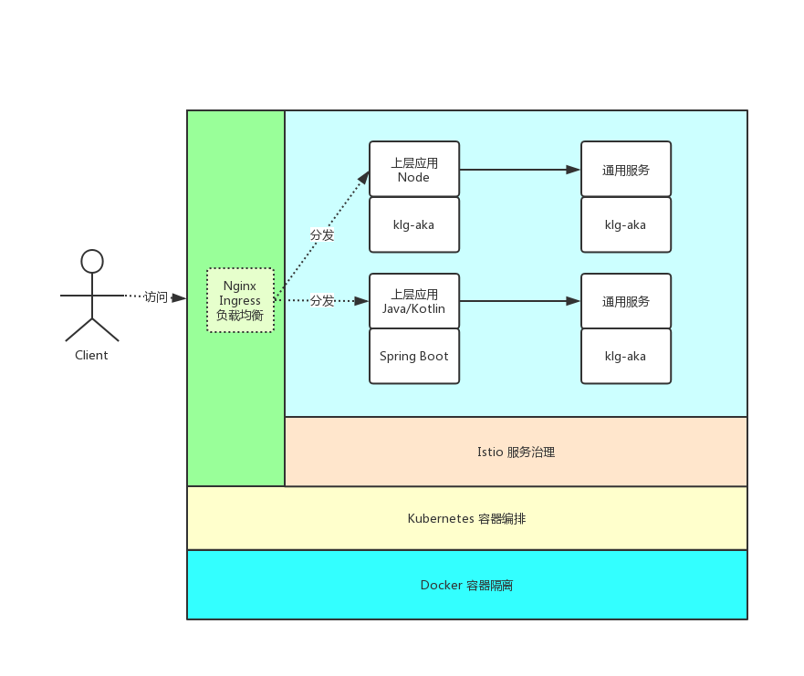

# 轻量型互联网应用架构方式

# 轻量型 Web 架构模式

* [轻量型 Web 架构模式]()
* [前言]()
* [Web 架构模式]()
* [基础架构实践]()
* [容器编排]()
* [日志收集]()
* [应用观测]()
* [流量控制]()

* [Web 应用架构]()
* [语言的选择，为什么是 Node.js]()
* [Web 框架如何选]()
* [社区优秀的框架们]()
* [自研的方向]()

* [总结]()

## 前言

说到互联网应用架构，就绕不开微服务，当下（2019）最热门的微服务架构体系应该还是 Spring Cloud 和 Dubbo，阿里也推出了自己的 Spring Cloud 实现 Spring Cloud Alibaba。这类框架围绕微服务体系提供了大而全的功能，包括服务发现、治理、流量监控、配置管理等，让人向往。

但是其缺点也是比较明显：

* 限定于 Java 体系，其他编程语言无法享受这个体系
* 侵入应用，几乎每个 Java 应用都挂载一堆 Spring 相关的 jar 包
所以目前社区发展的新方向是：云原生。

其中的翘楚便是 istio，基于 kubernetes 的 sidecar 模式，把 Sprint Cloud 做的大部分工作下沉到基础应用层面，让应用层无感。

有了 Istio 之后，微服务应用实现了大减负，所以我重新思考了**对于小型互联网公司来说，当下最适合的架构模式应该是什么**。

## Web 架构模式

适用场景：小型互联网公司，业务多而小，追求开发效率。

解决方案：把重复工作隐藏起来，让应用层轻量快跑

具体有两个方向

**基础架构层面**：使用 Kubernetes 和 Istio，提供微服务所需要的功能支持

**应用层面**：针对 Nodejs 后端编程领域，提供一个最佳实额

整体架构图：

## 基础架构实践

目前还没有足够的时间完成落地实践，只能说一下理论规划。

现在是云时代，所以直接用 Kubernetes 来做应用编排就可以了。

后期可以落地 Istio，就可以保证微服务们稳定运行。

### 容器编排

Kubernetes

### 日志收集

* 在 k8s 集成 elk
* 输入日志到阿里云 nas
### 应用观测

Istio 提供 Grafana 请求分析、 Jaeger链路追踪、告警等

### 流量控制

* 权限校验
* 加密
* 熔断限流
## Web 应用架构

在应用层，我最终选择是使用 Node.js 语言来做主要的业务开发。

使用 Koa + 自研框架。

### 语言的选择，为什么是 Node.js

主要原因是我目前所在团队技术栈在 Node 积累比较多。

其次原因是有了 typescript 之后，使用 node 编写后端应用变得更加可维护了，而且 node 小而快（开发效率快，当然IO密集型的应用运行效率也不差）非常适合微服务场景。

最后，Node 的上手难度真的很低。

**当然要使用其他语言也是可以的，如果有着复杂业务逻辑，可以使用 Kotlin + Spring Boot 这组套件，但不包括 Spring Cloud**。

Kotlin 能完美复用 JVM 生态，也可以避免 Java 语言的一些繁琐的写法，甚至后期还可以用上 Kotlin 的协程，来替代 Java 目前的多线程并发模型。

当然，本文讨论的是 Web 应用架构，如果你的应用是数据处理方面，本文无法提供任何帮助。而在 Web 领域，Python 和 PHP 对比起 Node，其实并没有优势，所以就不考虑了。

### Web 框架如何选

Node 的 Web 框架还挺多的，我比较熟悉的有：

* Sails.js 大而全，甚至有自己的 orm, node 世界的 ruby on rails
* Express 基础 web 框架
* Koa 更基础的 web 框架，甚至两 body-parse 都不自带
* Thinkjs Thinkphp 吧
* Egg 阿里出品，挺受欢迎的
* NestJS node 世界的 Spring MVC
我公司早期使用 sails，看中其集成的丰富功能，但是后期 sails 的成长速度跟不上社区，对一些新特性 Generator 等不能及时兼容，而且太笨重了。

所以团队在 17 年左右转型选择了 Koa，然后自己组装实践各个基础功能，这个做法的好处是高度自定义，非常契合公司发展需要。

#### 社区优秀的框架们

在 17 年之后，相继涌现一些优秀框架，像 egg 和 nestjs，当时我们并没有采用他们。

Egg 本身是优秀的框架，但是它是为中台打造的，但我公司需要用 Node 完成本来是 Java 做的事情，我们会用 Node 做比较重的业务，Egg 在这方便并不适合，例如没有模块划分的概念。

比起 Egg ，NestJS 就更适合我们，当时看它的文档就能感受出来，NestJS 的作者们是真的拿这个框架来做后端业务的，文档里讲到了我们日常碰到的很多痛点：

* 模块划分
* 循环引用
* OpenAPI
* IOC 依赖注入
* CRUD
当时感觉像是找到了真爱，但是实践过后，发现一些问题：

* 编码规范：NestJS 有自己的一套规范，而且它封装得足够多，基本上无法修改这套规范，只能妥协。
* 集成测试：我们在早期使用 Koa 的过程中，沉淀了一套集成测试方案，特别是对 mongodb，我们做了一些工具可以自动注入和清除测试数据，要在 NestJs 实现这个功能，需要有足够的时间对其改造
基于上面两个原因，NestJS 并没有在团队推广开来。

#### 自研的方向

社区的框架既然不合适，那就博采众长，自己组装一套框架出来，所以我最近捣鼓出了 [@akajs](https://github.com/kaolalicai/akajs), 预期说这个东西是框架，更准确的说法是，Kalengo团队的Node后端开发最近实践集合。就是把后端常用的东西集合打包起来，包含：

* IOC 依赖注入
* 注解式路由
* CRUD 我们很多项目非常简单，重复的 CRUD 工作必须简化
* Mongoose + Typescript 封装
* Redis + Redlock 封装
* 集成测试支持
* 常用 Util，如日期数字处理等
* 请求参数校验和全局异常处理
此外还有些最佳实践

* OpenAPI 文档自动生成
* Docker 支持
* UML 设计
* 模块划分
这些我们则通过项目模板来提供。

有了这套工具，后端可以更加轻量和统一，开发可以短时间内搭建起一个完备的后端服务。

## 总结

这套架构方式，不论是基础架构层面，还是应用层面，都是通过抽离通用的功能，把服务治理的东西抽出下沉到 Istio，把后端通用的工具和实践抽出放在 [@akajs](https://github.com/kaolalicai/akajs) 和项目模板中，以此来简化上层应用。

这样一线的后端开发，可以专注于业务逻辑的实现，不必在为基础设施烦恼。毕竟小公司要生存，“快”是很重要的。

