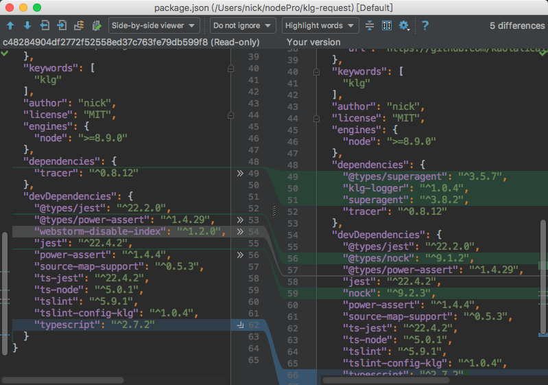

# IDE 常用功能 for Node.js

### 什么是 IDE

集成开发环境（IDE，Integrated Development Environment ）是用于提供程序开发环境的应用程序。使用 nodejs 开发后端应用的时候，我的常用 IDE 是 Webstorm，偶尔也用 vs code。 

根据我的日常使用经验，本文列举下 Webstorm 这个 IDE 提供了哪些比较实用功能，这些功能基本上 vs code 也支持。

### 编辑

#### 文件跳转

跳转都任意文件 

搜索功能

#### 快捷键

导出快捷键列表，仔细过一遍，

#### 自动补全

自动补全功能的实现一般有两种

1. 正则匹配，自动匹配出现过的字符
2. 语法树分析，因为 js 是动态类型语言，IDE 根据语法树预知变量类型，但是 typescript 是可以的，vs code 也会根据 js 库里的 d.ts 描述文件来做自动补全，所以 typescript 项目的自动补全体验会更好。
#### Refactor 重构

常见重构支持： 

重命名 

Inline : 表达式替换变量 

Extract ：变量替换表达式

该功能在 typescript 项目中会更强大

#### 模板功能

把常见的代码块设置为模板，方便快速输入。 

例如把 `console.log('$message$);` 这类常用语句定义为模板后定义关键字为 log ，只要输入 log 补全即可。

#### TODO 列表

列出项目里的所有 TODO，时刻提醒你还债~

#### eslint / tslint

集成 eslint / tslint 等 js 代码检查工具，错误代码直接标红。

#### Format

自动的格式化功能呢，支持 standard

### 运行

#### Build

支持 typescript flow 等语言的编译

#### Run

run 配置，支持以下常见库的运行配置。

在 Webstorm 中，配置好一个 run 配置之后，可以快速 debug 。

#### Debug

提供 debug 支持，断点比 console.log 清晰，也不会留下一堆乱七八糟的 log 代码，而且断点的设置还支持条件过滤，非常方便

#### Unit Test

清晰的 test 结果

#### Coverage

代码覆盖率直接显示到编辑器上，如下图，line 37-39 左侧是淡绿色，表示测试覆盖到了，下方的淡红色表明测试未覆盖

#### Deploy

支持 ftp 上传，IDE 也是可以直接在服务器编程的 

就是自动帮你执行 ftp 上传命令

#### Terminal

当前目录开启 terminal

### 版本控制

#### 支持主流的版本控制软件

git svn csv

#### Commit

除了 GUI commit 视图

还有 before commit 和 after commit 钩子

#### Review

review 视图帮助你清晰了解变更，强烈建议每次 commit 之前都要 review 一次。

#### Revert

撤销更改，git checkout – [filename]

#### 冲突解决

解决代码冲突，gui 视图，会清晰很多

#### Shelve 暂存

临时切换任务使用，就不用提交一个 “暂存” commit 了

#### ChangeList/Task

任务汇总，整理变更

#### History

1. version control 的 history 查看历史变更
2. Annotate，查锅神器，同 git blame ，可以看到每一行代码的最后编辑人
3. local history 防丢失非常重要
### 集成外部软件

有名的外部软件基本都能找到集成，我常用的有

#### Jira

直接获取 task ，根据 task 信息创建分支，自动填充 commit 信息

#### Plantuml

有插件，将 uml 渲染成图片

### 总结

上文列举了后端开发中比较实用的功能，但每个人的工作习惯都不一样，如何知道有哪些功能是你很喜欢的但是你还没发现呢？

**仔细过一遍 IDE 的菜单就好了**

