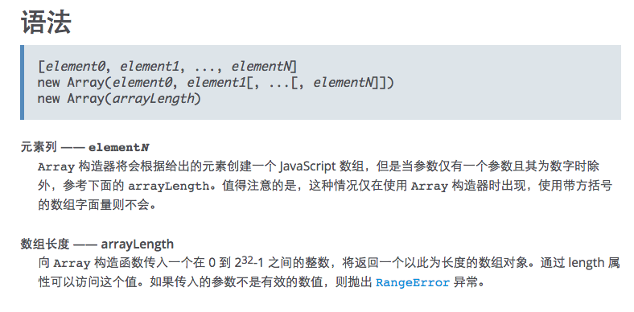

# JS 里怎么给数组填充默认值？


今天看到一段代码：

```
Array.apply(null, Array(30)).map(() => 4)
```

这代码的写法无法让人一下理解它的意图。 

Google 之后知道它的作用是构造一个长度为 30 的数组，默认值是 4。

#### 解析

但是为什么要写得这么别扭呢？我们来分解下它每一步在做什么：

```
Array.apply(null, Array(30)) 
```

这一段代码生成一个长度为30的数组，里面的值都是 **undefined**。 

之后的 `.map(() => 4)` ：负责填充默认值

但是为什么构造一个空值数组需要这么麻烦呢？还要用上 apply 方法，尝试用 `Array(30).map(() => 4)` 来生成数组的话，你会得到这样的一个结果，根本就没有值。

> [ , , , , , , , , , , , , , , , , , , , , , , , , , , , , , ]

查看[文档](https://developer.mozilla.org/zh-CN/docs/Web/JavaScript/Reference/Global_Objects/Array) 可以看到 Array 的构造函数语法，可以得知 Array 支持两种构造方式。使用参数形式给定 N 个数组元素，或者给定一个数组长度。

不过比较重要的一点文档里没提到，使用 `new Array(arrayLength)` 方式构造的数组是一个**稀疏数组**，里面是没有任何值的，只有长度。所以这个方式构造出来的数组是无法遍历的，也就无法用 map 遍历填充值了。

知道了上述的原因，我们就能理解：

`Array.apply(null, Array(30))`

其实等于 

`Array.apply(null, [, , , , , , , , , , , , , , , , , , , , , , , , , , , , ,]))`

然后我们要继续了解 apply 方法，在这里可以看 apply 的作用 [文档解释](https://developer.mozilla.org/zh-CN/docs/Web/JavaScript/Reference/Global_Objects/Function/apply)， 这里不作介绍。apply 方法会把生成的稀疏数组展开并当做参数再次传给 Array 的构造函数，就是这样子：

`Array(null,null,null......))`

这样最终就会得到一个数组，这样就不是稀疏数组了，里面是有值的，虽然是 undefined。

> [ undefined, undefined, undefined ……]

#### 结语

总结下，其实就是 js 的 Array 的默认构造函数生成的是稀疏数组，是无法用 map 遍历填充的。所以才写得这么绕。

不过，说了这么多，要实现原本的需求，其实有更简单的方法啦：

```
Array(30).fill(4)
```

fill 方法的[说明](https://developer.mozilla.org/zh-CN/docs/Web/JavaScript/Reference/Global_Objects/Array/fill)


