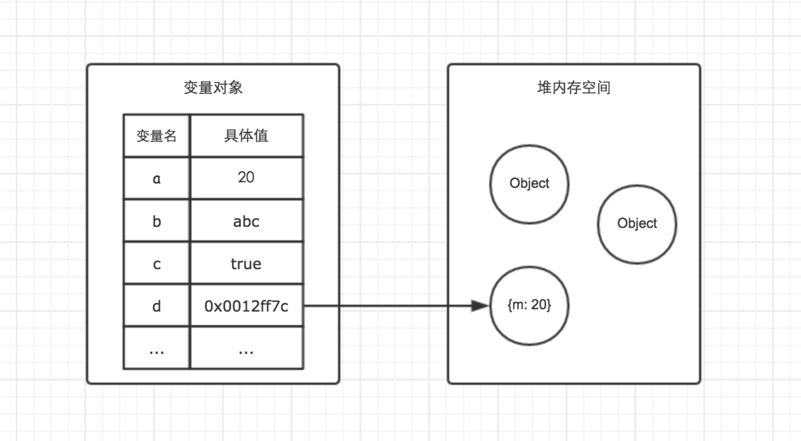

# Node.js 内存模型


### 前言

本文尝试理清 js 内存模型的相关知识点，鉴于 js 的教程非常丰富，这里就不重复写了，只建立个知识索引就好了，详细知识看文末的参考文章即可

### 栈与堆

基础数据类型存在栈中，对象存储在堆中

1. 基础数据类型

* Undefined
* Null
* Boolean
* Number
* String

2. 引用类型

Object、Function、Array和自定义的对象，可以看做是指针。指针是存在栈中，但是指向的变量在堆中


下面代码表现了基础类型和引用类型的区别

```
// demo01.js
var a = 20;
var b = a;
b = 30;
// 这时 a 的值是多少？ // 20
```

```
// demo02.js
var m = { a: 10, b: 20 }
var n = m;
n.a = 15;
// 这时 m.a 的值是多少? // 15
```

### 执行上下文

#### 概念

每次当控制器转到ECMAScript可执行代码的时候，就会进入到一个执行上下文。可执行代码的类型包括：

* 全局代码（Global code）

这种类型的代码是在”程序”级处理的：例如加载外部的js文件或者本地标签内的代码。全局代码不包括任何function体内的代码。 这个是默认的代码运行环境，一旦代码被载入，引擎最先进入的就是这个环境。
* 函数代码（Function code）
* Eval代码（Eval code）
执行栈 demo


#### 建立的细节

1、创建阶段【当函数被调用，但未执行任何其内部代码之前】

* 创建作用域链（Scope Chain）

* 创建变量，函数和参数。

* 求”this“的值
2、执行阶段 

初始化变量的值和函数的引用，解释/执行代码。

**我们可以将每个执行上下文抽象为一个对象，这个对象具有三个属性**

```
ECObj: {
    scopeChain: { /* 变量对象（variableObject）+ 所有父级执行上下文的变量对象*/ }, 
    variableObject: { /*函数 arguments/参数，内部变量和函数声明 */ }, 
    this: {} 
}
```

#### 变量对象

变量对象（Variable object）是说JS的执行上下文中都有个对象用来存放执行上下文中可被访问但是不能被delete的函数标示符、形参、变量声明等。它们会被挂在这个对象上。

#### 代码示例

```
var color = 'blue';

function changeColor() {
    var anotherColor = 'red';

    function swapColors() {
        var tempColor = anotherColor;
        anotherColor = color;
        color = tempColor;
    }

    swapColors();
}

changeColor();
```

### 闭包概念

MDN 对闭包的定义为：

> 闭包是指那些能够访问自由变量的函数。

那什么是自由变量呢？

> 自由变量是指在函数中使用的，但既不是函数参数也不是函数的局部变量的变量。

由此，我们可以看出闭包共有两部分组成：

> 闭包 = 函数 + 函数能够访问的自由变量

举个例子：

```
var a = 1;

function foo() {
    console.log(a);
}

foo();
```

foo 函数可以访问变量 a，但是 a 既不是 foo 函数的局部变量，也不是 foo 函数的参数，所以 a 就是自由变量。

那么，函数 foo + foo 函数访问的自由变量 a 就构成了一个闭包

js 不会销毁被闭包引用的对象

### GC 垃圾回收

Garbage Collection 垃圾回收是一种自动的内存管理机制。当一个电脑上的动态内存不再需要时，就应该予以释放，以让出内存，这种内存资源管理，称为垃圾回收。

#### 新生代和老生代内存分区

为什么要分区？为了 GC 效率

#### 新生代的 GC 算法

Scavenge 算法，它将堆内存一分为二，将存活对象在从空间 1 复制到空间 2，其他对象被回收。特点是速度快。新生代内存的对象过大或者存活时间过长就会去到老生代内存。

#### 老生代的 GC 算法

Mark-Sweep 标记清除算法，标记清除回收之后，内存会变得碎片化。 

Mark-Compact 标记整理算法，在整理过程中，将活着的对象往一端移动，移动完成后，直接清理掉边界外的内存。

#### 内存泄露

本质上，内存泄漏可以定义为：应用程序不再需要占用内存的时候，由于某些原因，内存没有被操作系统或可用内存池回收。编程语言管理内存的方式各不相同。只有开发者最清楚哪些内存不需要了，操作系统可以回收。一些编程语言提供了语言特性，可以帮助开发者做此类事情。另一些则寄希望于开发者对内存是否需要清晰明了。

#### 排除方法

1. 抓下内存快照，使用 chrome 分析，使用框架和各种库的时候干扰项非常多
2. [alinode](https://alinode.aliyun.com/)
### 参考文章

重要

1. [深入理解闭包（五）——作用域、作用域链和执行上下文](https://wanghan0.github.io/2017/05/07/closure5/)
2. [深入理解JavaScript闭包【译】](http://www.cnblogs.com/zldream1106/p/how-do-javascript-closures-work.html)
3. [深入理解JavaScript执行上下文、函数堆栈、提升的概念](https://segmentfault.com/a/1190000009041008)
4. [MDN 函数](https://developer.mozilla.org/zh-CN/docs/Web/JavaScript/Guide/Functions#%E9%97%AD%E5%8C%85%28Closures%29)
5. [JavaScript深入之闭包](https://github.com/mqyqingfeng/Blog/issues/9)
6. [轻松排查线上Node内存泄漏问题](https://cnodejs.org/topic/58eb5d378cda07442731569f)
7. [4类 JavaScript 内存泄漏及如何避免](https://jinlong.github.io/2016/05/01/4-Types-of-Memory-Leaks-in-JavaScript-and-How-to-Get-Rid-Of-Them/) 介绍了如何使用 chrome dev tool 排查内存泄露
不重要

1. [解读 V8 GC Log（二）: 堆内外内存的划分与 GC 算法](http://alinode.aliyun.com/blog/38)

1. [Node 性能优化](https://myfjdthink.com/2016/03/22/node-%E6%80%A7%E8%83%BD%E4%BC%98%E5%8C%96/)

2. [解读 V8 GC Log（一）: Node.js 应用背景与 GC 基础知识](http://alinode.aliyun.com/blog/37)
3. [NodeJS中被忽略的内存](http://huang-jerryc.com/2016/04/14/NodeJS%E4%B8%AD%E8%A2%AB%E5%BF%BD%E7%95%A5%E7%9A%84%E5%86%85%E5%AD%98/)
4. [前端基础进阶（一）：内存空间详细图解](http://leanote.com/blog/post/59128586ab644166f800ab45)
5. [前端基础进阶（二）：执行上下文详细图解](http://www.php.cn/js-tutorial-351911.html)
6. [JavaScript 内存模型](https://rawbin-.github.io/web%E5%BC%80%E5%8F%91/%E5%89%8D%E7%AB%AF%E5%BC%80%E5%8F%91/javascript/2017/05/08/js-memory-management/)


