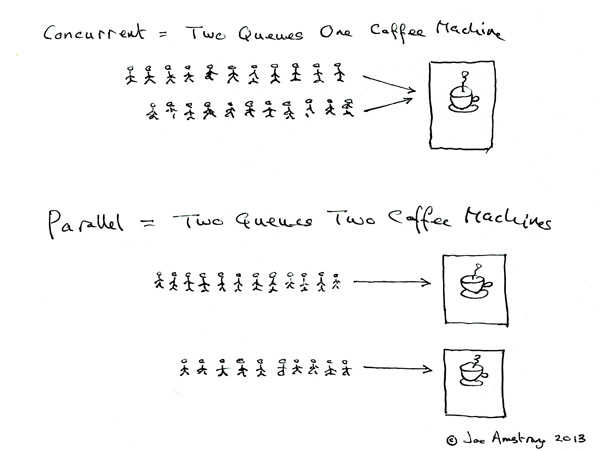
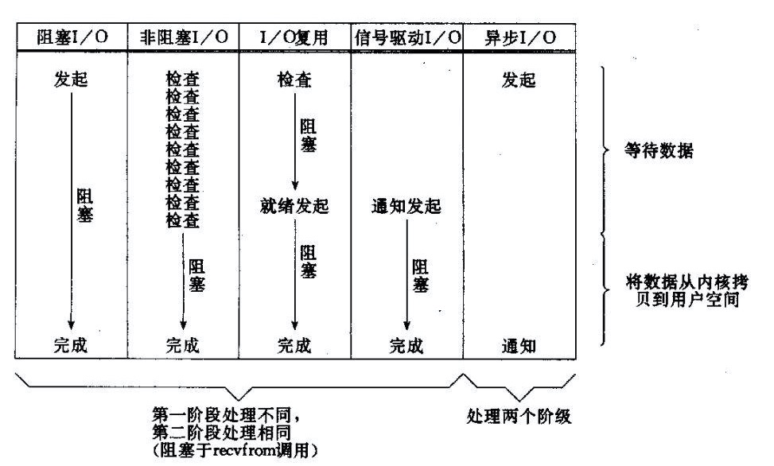
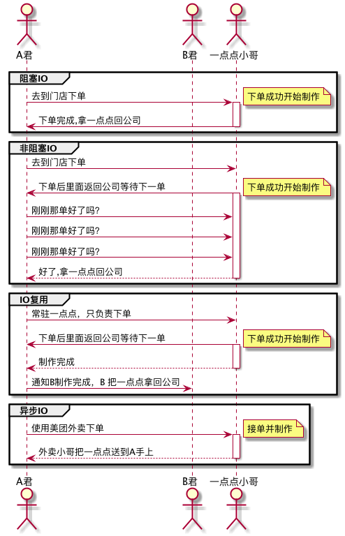
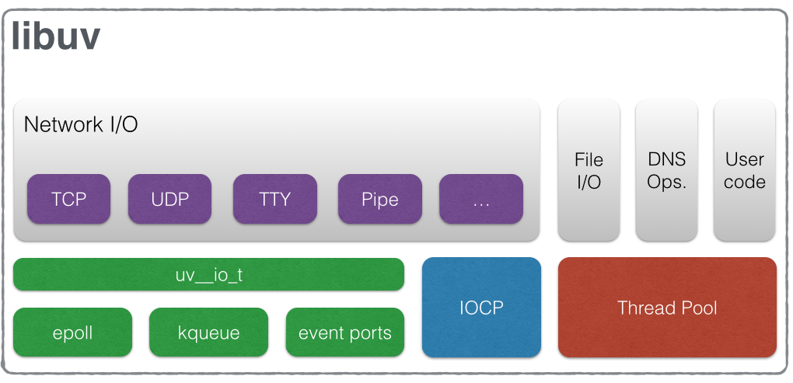
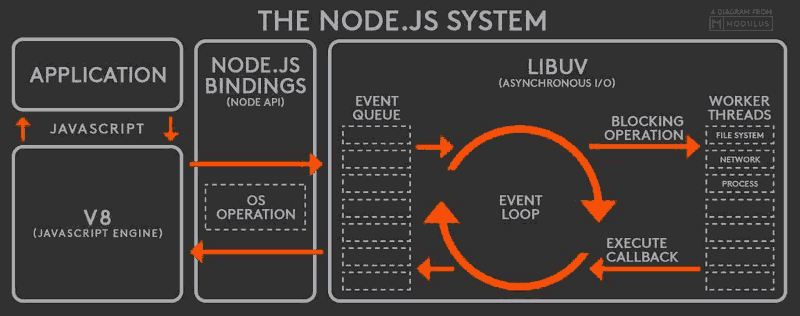

# Node.js 并发模型

### 前言

首先，什么是并发？

并发是指程序可以同时处理多个任务，是一个web 服务必备的能力。

自从 Nodejs 出现后，js 开始涉及后端领域，因为其出色的并发模型，被很多企业用来处理高并发请求，例如淘宝已经大量使用 node 处理中间层业务。

接下来本文就分析一下 js 的并发模型，来理解 node 相对于其他语言的优势以及其最合适的应用场景

tips:并发和并行区别

### 异步IO

什么是异步IO？ 

异步 IO 具体是如何实现的呢？ 

异步和同步有什么区别呢？ 

异步就不阻塞吗？IO 阻塞又是什么概念呢？ 

带着这些问题，我们慢慢分析。

#### IO 模型

《UNIX网络编程：卷一》第六章——I/O复用。书中向我们提及了5种类UNIX下可用的I/O模型：

* 阻塞式I/O；
* 非阻塞式I/O；
* I/O复用（select，poll，epoll…）；
* 信号驱动式I/O（SIGIO）；
* 异步I/O（POSIX的aio_系列函数）；

总结一下阻塞，非阻塞，同步，异步

* 阻塞，非阻塞：进程/线程要访问的数据是否就绪，进程/线程是否需要等待；
* 同步，异步：访问数据的方式，同步需要主动读写数据，在读写数据的过程中还是会阻塞；异步只需要I/O操作完成的通知，并不主动读写数据，由操作系统内核完成数据的读写。
#### 说人话

上面的解释太复杂我看不懂怎么办？我们把上文说到 IO 代入到生活的场景中，考虑到我们公司很多人喜欢买一点点饮料，就以买饮料为例，将四种常见 IO 模型转换为对应的买饮料流程。下面是一下设定：

* 把买一杯一点点的流程简化为两步：下单制作和拿一点点回公司
* 公司员工 === 线程
* 下单制作 === 发起IO请求
* 拿一点点回公司 === 读取数据

异步 IO 的特点就是把 IO 处理的事情都交给了操作系统（美团外卖），这样线程就不会被 IO 阻塞，可以继续处理其他请求

#### Node 的异步IO

Node.js 的异步 IO 由 Libuv 这个库提供实现，Libuv 是 Node.js 关键的一个组成部分，它为上层的 Node.js 提供了统一的 API 调用，使其不用考虑平台差距，隐藏了底层实现。

可以看出，它提供了非阻塞的网络 I/O，异步文件系统访问等功能，而且右下角居然还有个线程池，实际上 Libuv 收到的 IO 请求是同个多线程来实现的, 看来 Node 只是在程序层面单线程而已

### 事件循环

#### 任务队列

先看看 Node.js 结构

根据上图，Node.js的运行机制如下。

（1）V8引擎解析JavaScript脚本。

（2）解析后的代码，调用Node API。

（3）libuv库负责Node API的执行。它将不同的任务分配给不同的线程，形成一个Event Loop（事件循环），以异步的方式将任务的执行结果返回给V8引擎（callback 处理结果）。

（4）V8引擎再将结果返回给用户。

异步操作都会被压入任务队列，当任务队列为空的时候，程序退出。

#### 示例代码

### 总结

Libuv 使用异步IO + 线程池实现的事件循环处理机制提供的高效的 IO 处理，是 Node 能承担高并发请求的主要原因

### 参考文章与书籍

《深入浅出Node.js》 

《Unix 网络编程》 

《七周七并发模型》 

[并发与并行的区别](https://www.zhihu.com/question/33515481)

[JavaScript 运行机制详解：再谈Event Loop](http://www.ruanyifeng.com/blog/2014/10/event-loop.html)

[怎样理解阻塞非阻塞与同步异步的区别？ - 大姚的回答 - 知乎](https://www.zhihu.com/question/19732473/answer/26101328)

[Node.js 探秘：初识单线程的 Node.js](http://taobaofed.org/blog/2015/10/29/deep-into-node-1/)

[Linux IO模式及 select、poll、epoll详解](https://segmentfault.com/a/1190000003063859)

UML

