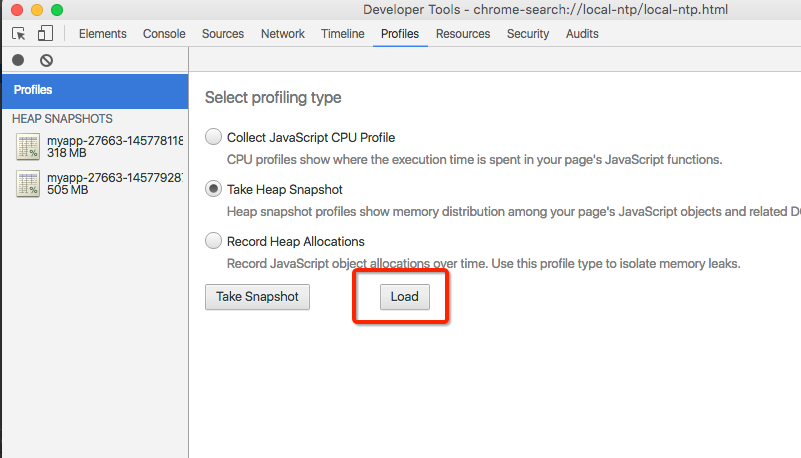
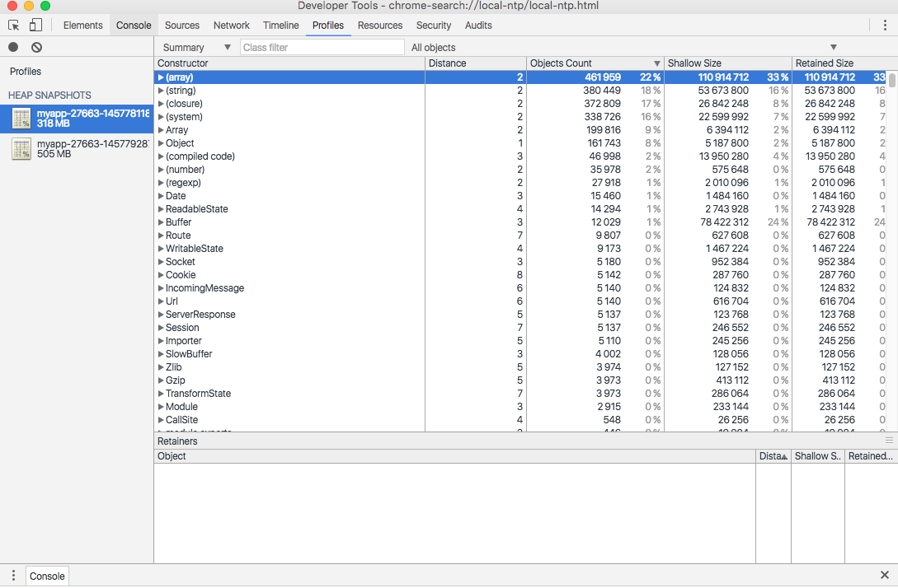
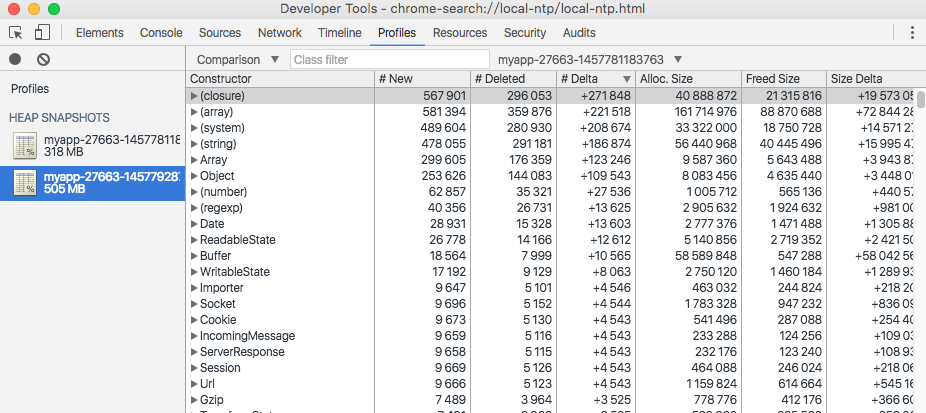
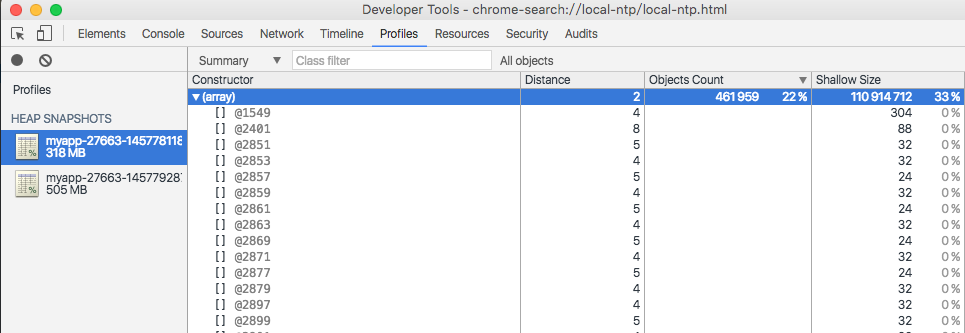

# Node 性能优化


## Node 性能优化

### 前言

没有 profile 谈优化都是耍流氓，性能优化的大前提是 profile ，有数据才能找出程序慢在哪里了。 

本篇文章主要介绍 Node 后端的性能优化，前端的同学可以看看 Chrome 的 devtools [https://github.com/CN-Chrome-DevTools/CN-Chrome-DevTools](https://github.com/CN-Chrome-DevTools/CN-Chrome-DevTools)

### 一、Web 应用优化

性能的瓶颈往往在 IO

#### IO 层优化

##### 磁盘 IO 为什么慢

计算机里的常见 IO 有 ：

* CPU 一二级缓存
* 内存
* 硬盘
* 网络
硬盘的 IO 开销是非常昂贵的，硬盘 IO 花费的 CPU 时钟周期是内存的 41000000/250 = 164000 倍。

所有在一般应用中，优化要首先考虑数磁盘 IO , 通常也就是数据层的优化，说到数据库优化，很多人第一时间会想到加索引，但是什么加了索引查询会变快呢？索引要怎么加才合适呢？

##### 为什么索引快

关于索引的原理可以看看这篇文章，[索引原理](http://tech.meituan.com/mysql-index.html)。索引快主要的原因是：

* 索引占用空间更小，可以有效减少磁盘 IO 次数。
* 索引可以使用方便快速查询的数据结构，如**b+树**。
##### 索引怎么加

回到我们的主题，**没有 profile 谈优化都是耍流氓**

以 mongo 为例，mongo 是带有慢查询功能的。 

[MongoDB 查询优化分析](http://www.cnblogs.com/zhoujinyi/p/3566773.html) 这篇文章介绍了如何开启和使用 mongo 的慢查询功能。 

开启慢查询收集功能后，使用 db.system.profile.find().pretty() 语句可以查询到哪些语句的查询比较慢。以下面这个查询语句为例：

```
query new_koala.llbrandomredpackage query: { user_id: "56ddb33e23db696f89fdae2a", status: { $ne: 1 } }
```

查询条件是 user_id、status 两个，所以给这两个字段加上索引可以提高查询速度。 

当然，如果 mongo 没有是先开启慢查询，扫描一下 mongo.log 也是个办法。

```
grep '[0-9][0-9][0-9]ms' /var/log/mongodb/mongodb.log
```

这样就可以找出所有查询耗时大于100 ms 的记录。然后再对症下药即可。

##### 缓存大法好，有选择地用。

上文有说到，内存 IO 比磁盘 IO 快非常多，所以使用内存缓存数据是有效的优化方法。常用的工具如 redis、memcached 等。 

缓存效果显著，所以很多时候一谈到优化，很多人就会想到加缓存，但是使用缓存是有代价的，你需要维护缓存的更新和失效，这是个**繁琐**的事情，用上了缓存后你会经常碰到缓存没有及时更新带来的问题。 

重要的事情说多几遍： 

**缓存有副作用**

**缓存有副作用**

**缓存有副作用**

并不是所有数据都需要缓存，**访问频率高，生成代价比较高**的才考虑是否缓存，也就是说影响你性能瓶颈的考虑去缓存。

而且缓存还有 **缓存雪崩**、**缓存穿透** 等问题要解决。见 [缓存穿透与缓存雪崩](http://www.cnblogs.com/fidelQuan/p/4543387.html)

##### 静态文件缓存

静态文件如图片、js 文件等具有不变性，是非常适合做缓存的。 

常见的静态文件缓存服务有 nginx、vanish 等。

#### 代码层面优化。

##### 合并查询

在代码这一块，常做的事情是将多次的查询合并为一次，消灭 for 循环，实际上还是减少数据库查询。例如

```
for user_id in userIds      var account = user_account.findOne(user_id)
```

这类代码实际上可以改写成：

```
var user_account_map = {}   // 注意这个对象将会消耗大量内存。user_account.find(user_id in user_ids).forEach(account){    user_account_map[account.user_id] =  account}for user_id in userIds     var account = user_account_map[user_id]
```

这样就把 N 次的查询合并为一次。 

实际上还是为了减少 IO。

#### 关于过早优化

性能优化的工作做多了以后，往往会陷入一个什么都想着去优化的状态，这样就可能陷入过早优化的深坑中。 

这里引用一下其他人的观点 

[https://www.zhihu.com/question/24282796](https://www.zhihu.com/question/24282796)


### 二、内存泄露排查

Node 是基于 V8 这个 js 引擎的，这里我们了解下 V8 里的内存相关的知识。

#### V8 的 GC 垃圾回收机制

##### V8 的内存分代

在 V8 中，主要将内存分为新生代和老生代两代。新生代的对象为存活时间比较短的对象，老生代中的对象为存活时间较长的或常驻内存的对象。

+—+—+—+—————————-+ 

| 新生代 | 。。。。。。老生代 | 

+—+—+—+—————————-+

默认情况下，新生代的内存最大值在 64 位系统和 32 位系统上分别为 32 MB 和 16 MB。V8 对内存的最大值在 64 位系统和 32 位系统上分别为 1464 MB 和 732 MB。

为什么这样分两代呢？是为了最优的 GC 算法。新生代的 GC 算法 Scavenge 速度快，但是不合适大数据量；老生代针使用 Mark-Sweep（标记清除） & Mark-Compact（标记整理） 算法，合适大数据量，但是速度较慢。分别对新旧两代使用更适合他们的算法来优化 GC 速度。

详情参见《深入浅出 nodejs》5.1 V8 的垃圾回收机制与内存限制

#### V8 的 GC log

在启动程序的时候添加 –trace_gc 参数，V8 在进行垃圾回收的时候，会将垃圾回收的信息打印出来：

```
➜  $ node --trace_gc aa.js...[94036]       68 ms: Scavenge 8.4 (42.5) -> 8.2 (43.5) MB, 2.4 ms [allocation failure].[94036]       74 ms: Scavenge 8.9 (43.5) -> 8.9 (46.5) MB, 5.1 ms [allocation failure].[94036] Increasing marking speed to 3 due to high promotion rate[94036]       85 ms: Scavenge 16.1 (46.5) -> 15.7 (47.5) MB, 3.8 ms (+ 5.0 ms in 106 steps since last GC) [allocation failure].[94036]       95 ms: Scavenge 16.7 (47.5) -> 16.6 (54.5) MB, 7.2 ms (+ 1.3 ms in 14 steps since last GC) [allocation failure].[94036]      111 ms: Mark-sweep 23.6 (54.5) -> 23.2 (54.5) MB, 6.2 ms (+ 15.3 ms in 222 steps since start of marking, biggest step 0.3 ms) [GC interrupt] [GC in old space requested]....
```

V8 提供了很多程序启动选项：

|–max-stack-size|设置栈大小                |
|–v8-options    |打印 V8 相关命令          |
|–trace-bailout |查找不能被优化的函数，重写|
|–trace-deopt   |查找不能优化的函数        |

#### 使用 memwatch 模块来检测内存泄露

npm模块 memwatch 是一个非常好的内存泄漏检查工具，让我们先将这个模块安装到我们的app中去，执行以下命令：

```
npm install --save memwatch
```

然后，在我们的代码中，添加：

```
var memwatch = require('memwatch');
```

然后监听 leak 事件

```
memwatch.on('leak', function(info) { console.error('Memory leak detected: ', info);});
```

这样当我们执行我们的测试代码，我们会看到下面的信息：

```
{ start: Fri Jan 02 2015 10:38:49 GMT+0000 (GMT), end: Fri Jan 02 2015 10:38:50 GMT+0000 (GMT), growth: 7620560, reason: 'heap growth over 5 consecutive GCs (1s) - -2147483648 bytes/hr'}mem
```

memwatch 发现了内存泄漏！memwatch 判定内存泄漏事件发生的规则如下：

**当你的堆内存在5个连续的垃圾回收周期内保持持续增长，那么一个内存泄漏事件被派发**

了解更加详细的内容，查看 [memwatch](https://www.npmjs.com/package/memwatch)

#### 使用 heapdump dump 出 Node 应用内存快照

检测到了内存泄露的时候，我们需要查看当时内存的状态，heapdump 可以抓下当时内存的快照。

```
memwatch.on('leak', function(info) { console.error(info); var file = '/tmp/myapp-' + process.pid + '-' + Date.now() + '.heapsnapshot'; heapdump.writeSnapshot(file, function(err){   if (err) console.error(err);   else console.error('Wrote snapshot: ' + file);  });});
```

运行我们的代码，磁盘上会产生一些 .heapsnapshot 的文件到/tmp目录下。

#### 使用 Chrome 的开发者工具分析内存消耗

heapdump 提供的内存快照是可以用 Chrome 的开发者工具来查看的。把 .heapsnapshot 文件导入到 Chrome Developer Tools





怎么使用内存分析工具呢？ 

[Chrome开发者工具之JavaScript内存分析](http://www.open-open.com/lib/view/open1421734578984.html#_label13)

这篇文件详细介绍了如何使用开发者工具来分析内存的使用情况。可以参考，这里就不细说了。

摘取个例子，使用对比视图。 

[对比视图 demo](https://developer.chrome.com/devtools/docs/heap-profiling-comparison)

这个例子展示了通过对比前后的内存变化来找出内存泄露的原因，看起来还是很简单方便的。

但是，理想很美好，现实很残酷。下面展示下日常开发中 dump 下的数据。 

使用对比视图：

 可以看出 array 是内存增长的主要元凶，但也只能得到这个线索，那具体是那些 array 消耗了内存呢？ 

 点开 array 查看详细信息：

一大堆的匿名数组，无法准确查到具体那些 array 消耗了内存。 

主要原因是后端使用了 sails 这个 web 框架，框架里的代码量比较多，干扰项太多，无法准确地判断是哪些 function 出现了问题。

#### 内存泄露原因

通常，造成内存泄露的原因有如下几个。

* 慎用内存当缓存，非用的话控制好缓存的大小和过期时间，防止出现永远无法释放的问题
* 队列消费不及时，数组、回调，生产者的速度比消费者速度快，堆积了大量生产者导致无法释放作用域或变量
* 作用域未释放，无法立即回收的内存有全局变量和闭包，尽量使用变量赋值为 null|undefined 来触发回收
这部分的详细解释请参考《深入浅出 nodejs》5.4 内存泄露。

### 三、优化应用 CPU 瓶颈

上面介绍了 IO 优化，内存优化，使用 Node 做后端的话还会经常碰到 CPU 瓶颈。总所周知，Node 是单线程的，所以对 CPU 密集的运算不是太胜任，所以应该避免使用 Node 来进行 CPU 密集的运算。 

那么如果出现了 CPU 类的问题要怎么处理呢？

#### V8log:

加入 –prof 参数可以在应用结束是收集 log，执行命令之后，会在该目录下产生一个 *-v8.log 的日志文件，我们可以安装一个日志分析工具 tick

#### tick 工具分析 log

可以分析每个 function 的处理时间。

```
➜  $ sudo npm install tick -g➜  $ node-tick-processor *-v8.log[Top down (heavy) profile]:  Note: callees occupying less than 0.1% are not shown.  inclusive      self           name  ticks   total  ticks   total    426   36.7%      0    0.0%  Function: ~<anonymous> node.js:27:10    426   36.7%      0    0.0%    LazyCompile: ~startup node.js:30:19    410   35.3%      0    0.0%      LazyCompile: ~Module.runMain module.js:499:26    409   35.2%      0    0.0%        LazyCompile: Module._load module.js:273:24    407   35.1%      0    0.0%          LazyCompile: ~Module.load module.js:345:33    406   35.0%      0    0.0%            LazyCompile: ~Module._extensions..js module.js:476:37    405   34.9%      0    0.0%              LazyCompile: ~Module._compile module.js:378:37...
```

前端的同学可以直接在 chrome 里收集 cpu profile 用于分析。

### 使用第三方平台

[alinode](https://alinode.aliyun.com/)，基于 Node 运行时的应用性能管理解决方案，笔者没有体验过，不预评价。

### 总结

文章主要介绍的还是后端开发中如何做性能优化的几种方式：

* 添加索引
* 接口缓存
* 静态文件缓存
* 合并查询

这几种方法的目的其实都是为了减少 IO。看来 IO 过高是 Node 应用反应慢的主要原因。
此外，文章也介绍了如何排查处理内存泄露和 CPU 过高的问题。这两类问题是也是影响 Node 性能的一大原因。

### 参考：

《深入浅出 nodejs》朴灵著 

[MySQL索引原理及慢查询优化](http://tech.meituan.com/mysql-index.html)

[MongoDB 查询优化分析](http://www.cnblogs.com/zhoujinyi/p/3566773.html)

[如何用redis/memcache做Mysql缓存层?](https://www.zhihu.com/question/27738066)

[缓存穿透与缓存雪崩](http://www.cnblogs.com/fidelQuan/p/4543387.html)

[http://www.barretlee.com/blog/2015/10/07/debug-nodejs-in-command-line/](http://www.barretlee.com/blog/2015/10/07/debug-nodejs-in-command-line/)

[http://www.w3ctech.com/topic/842](http://www.w3ctech.com/topic/842)

[https://addyosmani.com/blog/taming-the-unicorn-easing-javascript-memory-profiling-in-devtools/](https://addyosmani.com/blog/taming-the-unicorn-easing-javascript-memory-profiling-in-devtools/)

[http://m.oschina.net/blog/270248](http://m.oschina.net/blog/270248)

[http://www.cnblogs.com/constantince/p/4607497.html](http://www.cnblogs.com/constantince/p/4607497.html)

[http://www.open-open.com/lib/view/open1421734578984.html#_label13](http://www.open-open.com/lib/view/open1421734578984.html#_label13)


