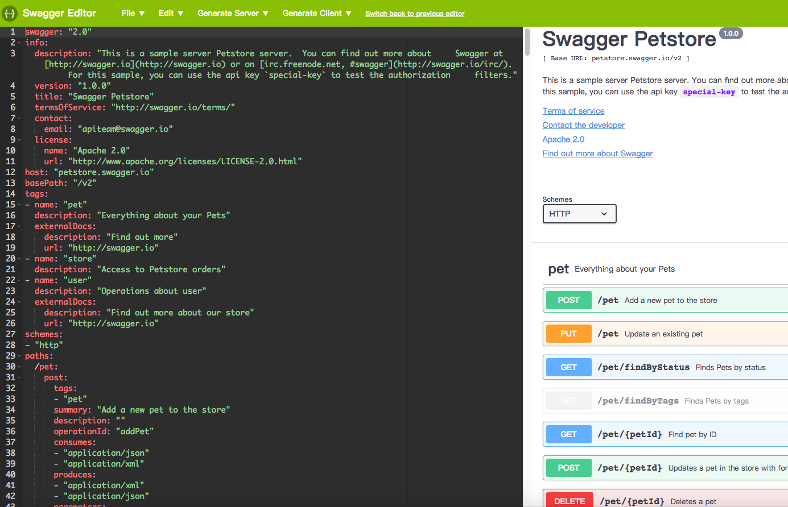
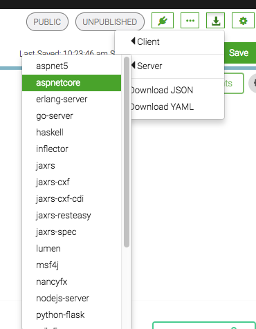
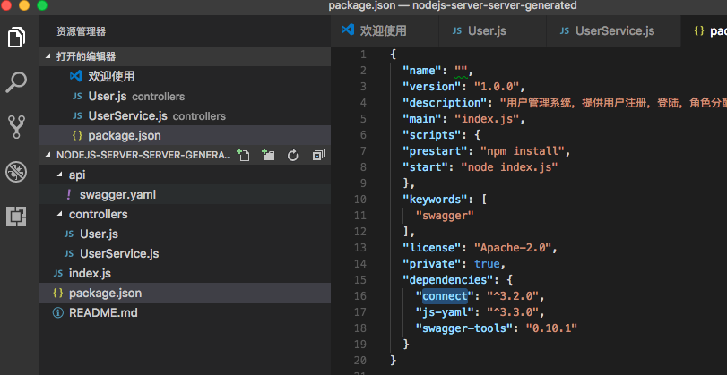

# Swagger

## 什么是 Swagger

官网的解释：

> Swagger is the world’s largest framework of API developer tools for
> 
> 
> the OpenAPI Specification(OAS), enabling development across the entire
> 
> 
> API lifecycle, from design and documentation, to test and deployment.

Swagger 提供了对 API 的设计、文档、测试、部署等阶段的支持。 

Web 开发的本质是 API 开发，Swagger 使用 swagger.json/yaml 文件来定义 API，语法基于 [OpenAPI Specification(OAS) 规范。](https://github.com/OAI/OpenAPI-Specification)

OpenAPI 语法入门：[https://www.gitbook.com/book/huangwenchao/swagger/details](https://www.gitbook.com/book/huangwenchao/swagger/details)

一个在线的 demo： [https://editor.swagger.io//?_ga=2.267808907.403623983.1505817850-1482371638.1504594291#/](https://editor.swagger.io//?_ga=2.267808907.403623983.1505817850-1482371638.1504594291#/)

## Swagger 可以做什么

围绕这个 API 定义，Swagger 生态提供了以下主要的服务：

1. API 编辑：Swagger Editor
2. API 文档：Swagger UI
3. Mock 服务：Easy Mock
4. 代码生成器：Swagger Codegen
[Swagger Hub](https://app.swaggerhub.com) 全家桶对上述功能提供了整套服务打包。 

理论上是可用，但是 mock 和 codegen 服务不够灵活。

接下来重点介绍 Mock 和 代码生成器这两个部分的内容。

## Mock 服务

### Swagger Hub 的 Auto Mock

Swagger Hub 提供的 [Mock 服务](https://swaggerhub.com/blog/swaggerhub-feature/the-smartbear-virtserver-integration/)， 只能区分 String 和 Number，不能提供更灵活的 Mock。

### Easy Mock

[Easy Mock](https://www.easy-mock.com/docs) 是一个可视化，并且能快速生成 模拟数据 的持久化服务，支持生成随机的文本、数字、布尔值、日期、邮箱、链接、图片、颜色等，支持扩展更多数据类型，支持自定义函数和正则。

重点是它可以导入 Swagger 配置，

## Codegen

### Swagger Hub 的 Codegen

官方宣称提供几十个 server 端和 client 端的代码生成服务，但是实际上用处非常有限，以 nodejs-server 为例，这个模板使用 connect 框架，使用 express 和 koa 框架的就不适用了，而且编码风格差距也非常大。

* 官方支持的 Codegen 模板：

* nodejs-server 模板生成的代码：

### 自定义模板

在代码生成器这一块，往往是半自动的工具更加灵活，自定义模板，根据 swagger.json 生成填充值，一键生成重复内容。 

在 Node 这一块，半自动生成器做得比较好的是 [swagger-js-codegen](https://www.npmjs.com/package/swagger-js-codegen)

这个工具使用 [mustache](https://mustache.github.io/) 模板工具，还提供了 gulp 工具。

根据这个思路我们可以自定义好模板，然后一键生成代码。

### npm 上的 Swagger 工具

1. 根据 Swagger 生成 Joi [https://github.com/zaaack/koa-joi-swagger](https://github.com/zaaack/koa-joi-swagger)
2. 根据 Swagger 生成 Mongoose [https://www.npmjs.com/package/swagger-mongoose](https://www.npmjs.com/package/swagger-mongoose)
## 番外

### apidoc to swagge

使用 apidoc-swagger 把现在的 apidock 转为 swagger 

[https://www.npmjs.com/package/apidoc-swagger](https://www.npmjs.com/package/apidoc-swagger)

## 参考

[http://blog.just4fun.site/swagger-note.html](http://blog.just4fun.site/swagger-note.html)

