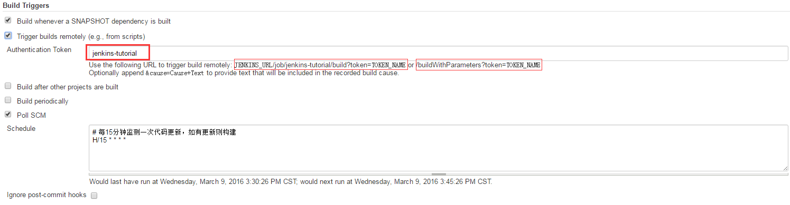
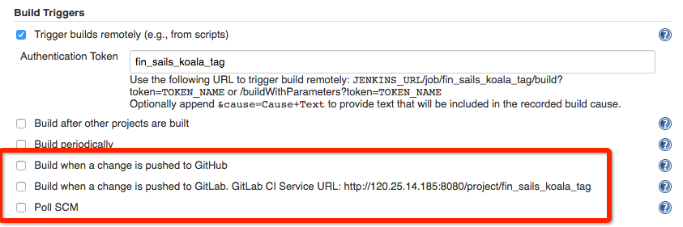
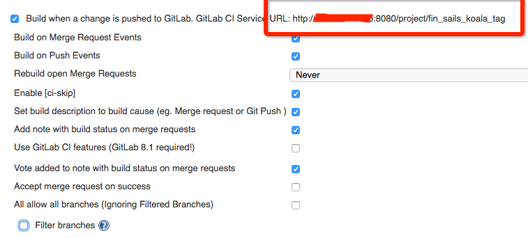
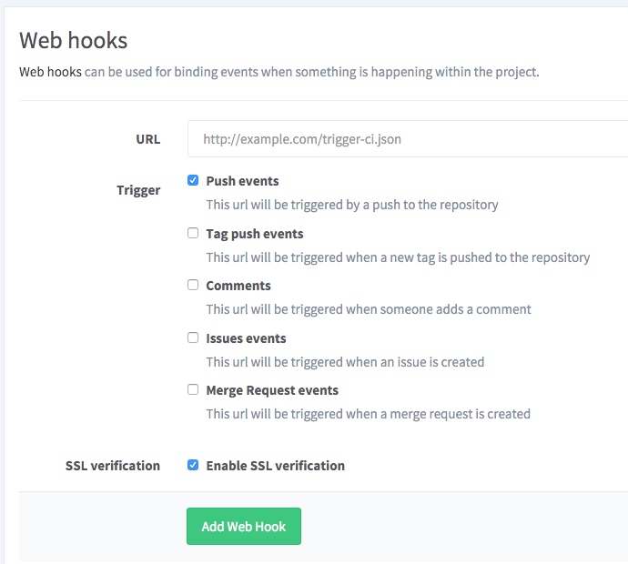

# 使用 Git Hooks 触发 Jenkins 构建任务

## 使用 Git Hooks 触发 Jenkins 构建任务

使用 Jenkins 构建任务的时候，很多任务需要根据 git 来触发。例如代码 push 到某分支后就触发 Jenkins 的集成测试。

下面介绍几种 Git 触发 Jenkins 的方式。

### Git Hooks 触发

Git Hooks，即钩子，关于 Git Hooks 的详细信息，可以看看[官方文档](https://git-scm.com/book/zh/v2/%E8%87%AA%E5%AE%9A%E4%B9%89-Git-Git-%E9%92%A9%E5%AD%90)

在 Jenkins 的配置页面，勾选 `Trigger builds remotely` 开启 Jenkins 的远程调用功能。

然后编辑服务器仓库中 jenkins-tutorial.git/hooks 中的 post-update，里面调用这两个链接中的一个即可达到通知 Jenkins 构建任务的目的。该钩子脚本将在代码提交到服务器仓库后执行。

### Jenkins 提供的监听方式

在 Jenkins 的 Build Triggers 配置页面，我们可以看到如下的配置项：

Jenkins 可以监听 Github 或者 GitLab 的事件，也可以通过轮询的方式来检查代码是否有更新。

#### 轮询

轮询的方式就是定时去访问 git 仓库，检查是否有更新，这个方式太傻这里就不细说了。

#### Web Hooks

介绍一下 Jenkins 是怎么监听 Github 和 Gitlab 的吧。

他们主要是通过 Web Hooks 来实现触发的，Github 和 Gitlab 都支持 Webhooks 这个功能，简单来说就是在有更新事件时会调用你配置好的 URL，并把相关的信息 POST 过来。详细可以见文档：[Github Webhooks](https://developer.github.com/webhooks/) 、 [Gitlab Webhooks](https://gitlab.com/gitlab-org/gitlab-ce/blob/master/doc/web_hooks/web_hooks.md)

#### GitLab 的监听配置

GIthub 的监听比较简单，勾选了就可以，这里不再细说。

Gitlab 的配置选项就比较丰富了。

在勾选了该选项后，我们就得到一个地址，这个地址就是接收 Gitlab 的 Webhooks 用的。去到 Gitlab 的 Webhooks 配置页面填上这个地址就行啦。

#### 批评一下 git.oschina

开源中国提供了个免费的 git 托管服务 [https://git.oschina.net/](https://git.oschina.net/) ，虽然这个服务是基于 Gitlab 框架修改的，但是它居然把 Webhooks 的 post 数据格式给改了。。。 

后果就是上文提到的 Gitlab 监听就没用了。。。 

所以我们就要自己处理 git.oschina 的 webhooks 了， 坑。 

可以考虑写个服务把 git.oschina 的 webhooks 转成 Gitlab 的 webhooks。

## 参考文档

[http://www.lovelucy.info/auto-deploy-website-by-webhooks-of-github-and-gitlab.html](http://www.lovelucy.info/auto-deploy-website-by-webhooks-of-github-and-gitlab.html)

[https://www.zoakerc.com/archives/jenkins-series-trigger-build-through-git-hooks/](https://www.zoakerc.com/archives/jenkins-series-trigger-build-through-git-hooks/)

