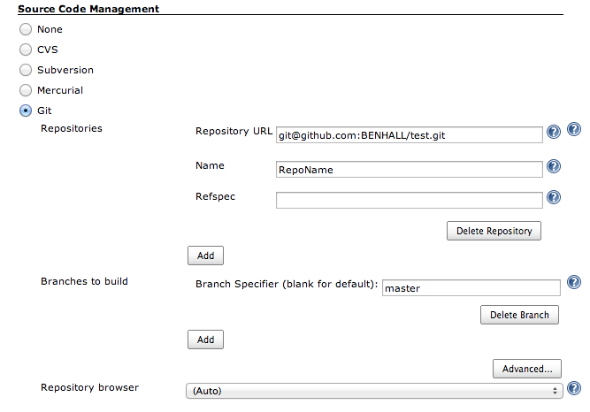
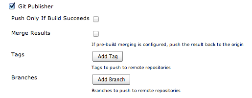
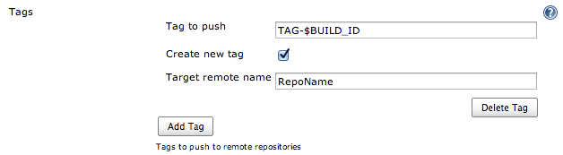
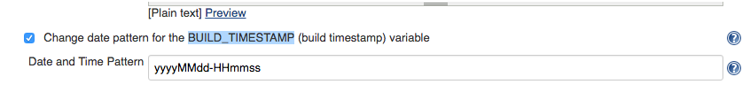
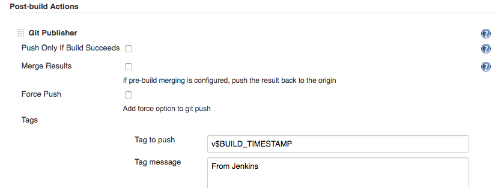
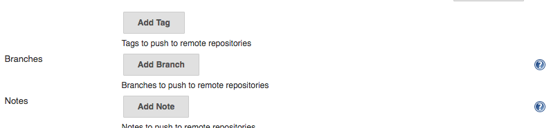

# 使用 Jenkins 给 GIT 自动打 Tag

## 使用 Jenkins 给 GIT 自动打 Tag

为了方便回滚代码，想给每次 Release 的代码打个 Tag。 

希望可以在每次代码提交到 master 分支后就能够自动 tag。

这里介绍下使用 Jenkins 来实现这个自动打 Tag 的功能，主要是通过 **GIT Publisher** 这个插件来实现的。阅读下文之前，你需要安装好 Jenkins 以及 GIT Publisher 这个插件。

### 配置 Jenkins

#### 配置 git 仓库的信息

填好仓库地址以及用户名密码

#### 配置 GIT Publisher

配置好 git 仓库信息后，滚动到 Jenkins 的 配置页面最下方，找到 GIT Publisher 这个插件， 开始配置， 你可以看到下图。

点击 “Add Tag” 

“Tag to Push”. 这个设置是指本次要打的 Tag 的名称。上图的例子中使用了 “BUILD_ID” 这个 Jenkins 提供的环境变量，最终打出的 Tag 会类似于 TAG-23。

注意：记得勾选 “Create new Tag”。

#### 自定义 Tag 名称

上文提到的 Tag 名称， 类似于 ” TAG-23”，并不能满足我的需求，我希望能使用日期+时间来定义 Tag 的名称，这样看起来就很清晰了，要实现这个，我们需要另一个插件的帮助。 

BUILD_TIMESTAMP 这个插件提供一个环境变量，它使用了 Java 的日期 format 格式。安装好这个插件，在 Jenkins 配置页面的顶部可以看到它的配置。

在配置项里填入自己想要的日期格式：`yyyyMMdd-HHmmss`

然后在 Add Tag 配置里的 “Tag to Push” 项里使用这个环境变量就好啦。

#### 其他功能

GIT Publisher 处理提供 Add Tag 功能，还提供以下两个功能： 

Add Branch 

Add Note 

你可以根据自己的需要进行配置。

#### 触发 Jenkins

上文的设置是没有提到如何在提交代码时触发 Jenkins 的 Build 的，这一块的可以看看这篇文章： 

[使用-git-hooks-触发-jenkins-构建任务](http://myfjdthink.com/2016/07/14/%E4%BD%BF%E7%94%A8-git-hooks-%E8%A7%A6%E5%8F%91-jenkins-%E6%9E%84%E5%BB%BA%E4%BB%BB%E5%8A%A1/)

### 参考文章

[http://www.benhallbenhall.com/2013/03/hudson-jenkins-create-git-tags-branches-automatically/](http://www.benhallbenhall.com/2013/03/hudson-jenkins-create-git-tags-branches-automatically/)

