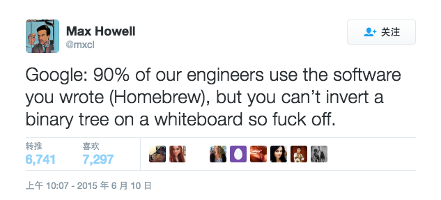
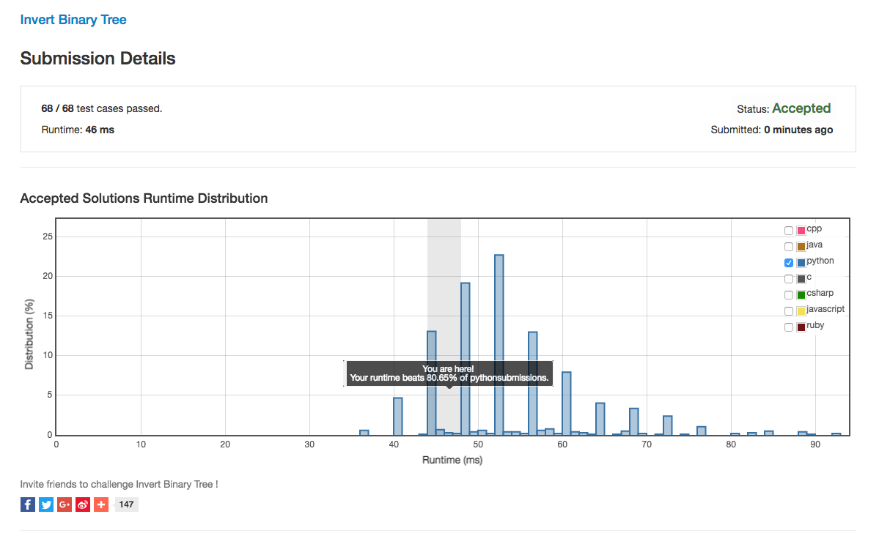

# 大家一起来 Leetcode


# 大家一起来 Leetcode

Leetcode 是一个提供 Online Judge 服务的网站，里面的题目都是一些经典的公司用来面试应聘者的面试题。 

除了应付面试，很多人想要锻炼自己的算法和编程能力时也会选择在 Leetcode 上刷题。

[https://leetcode.com/](https://leetcode.com/)

## LeetCode的题大致分成两类：

### 1）基础算法的知识

这些题里面有大量的算法题，解这些题一般有以下套路：

* 递归（深度优先DFS，广度优先BFS）
* 动态规划（Dynamic Programming）
* 拆半查找（Binary Search）
* 回溯（Back tracing）
* 分治法（Divide and Conquer）
* 还有大量的对树，数组、链表、字符串和hash表的操作。
通过做这些题能让你对这些最基础的算法的思路有非常扎实的了解和训练。

### 2）编程题

比如：atoi，strstr，add two num，括号匹配，字符串乘法，通配符匹配，文件路径简化，Text Justification，反转单词等等，这些题的Edge Case, Corner Case有很多。这些题需要你想清楚了再干，只要你稍有疏忽，就会有几个case让你痛不欲生，而且一不小心就会让你的代码会写得又臭又长，无法阅读。通过做这些题，可以非常好的训练你对各种情况的考虑，以及你对程序代码组织的掌控（其实就是其中的状态变量）。

## 做个题体验一下吧

### 挑个题目

反转二叉树 [Invert Binary Tree](https://leetcode.com/problems/invert-binary-tree/)

关于这道题还有个有趣的小故事： 

Homebrew 的作者去 Google 面试，因为没有在白板上做出这道题所以没通过面试。



### 准备测试数据

LeetCode 支持自定义测试数据，在准备二叉树的测试数据时，你可以这样写： 

`[5,4,7,3,null,2,null,-1,null,9]`

对应的 二叉树是：

```
       5      / \     4   7    /   /   3   2  /   / -1  9
```

文档： [https://leetcode.com/faq/#binary-tree](https://leetcode.com/faq/#binary-tree)

### 写代码

这道题的一般思路是用使用递归，这个给一个 Python 的 版本：

```
# Definition for a binary tree node.# class TreeNode(object):#     def __init__(self, x):#         self.val = x#         self.left = None#         self.right = Noneclass Solution(object):    def invertTree(self, root):        """        :type root: TreeNode        :rtype: TreeNode        """        if (root == None): return None        temp = self.invertTree(root.left)        root.left = self.invertTree(root.right)        root.right = temp        return root
```

### 查看结果

如果代码没有通过所有 Case， LeetCode 会明确地告诉你哪一个 Case 没有通过。

如果代码通过了所有 Case , 你还可以查看 More Detail


可以看到在使用同类语言的代码中，你的代码耗时在哪一个阶段。 

这一次的成绩还不错，比其他 80% 的人要快。

## 收获？

有人分享了他的收获：[Leetcode 编程训练](http://coolshell.cn/articles/12052.html)


