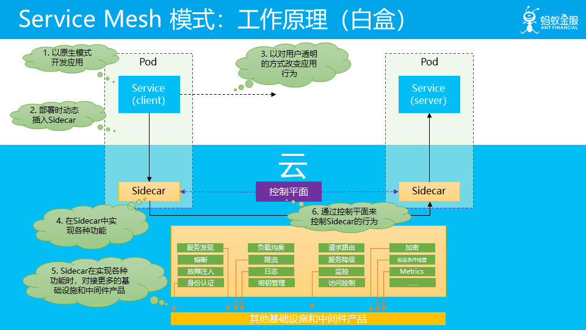
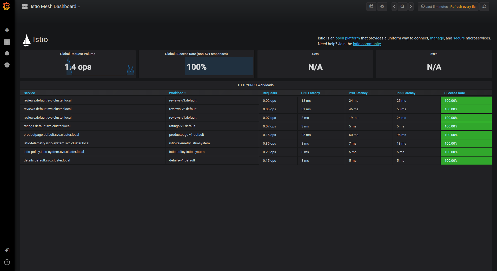

# 未来已来：云原生 Cloud Native

* [前言]()
* [后端架构演化史]()
* [集中式架构]()
* [分布式系统架构]()
* [容器技术新纪元 Docker]()
* [微服务架构]()
* [Kubernetes]()
* [Service Mesh]()
* [总结]()

* [云原生 Cloud Native]()
* [什么是云 Cloud]()
* [什么是原生 Native]()
* [Cloud Native 是道，Service Mesh 是术]()

* [Service Mesh]()
* [纷争 2017]()
* [百家争鸣 2018]()
* [持续发展 2019]()

* [Istio]()
* [连接]()
* [保护]()
* [控制]()
* [观测]()

* [总结]()
* [学习资料/指引]()
* [参考资料]()

## 前言

自 2013 年容器（虚拟）技术（Docker）成熟后，后端的架构方式进入快速迭代的阶段，出现了很多新兴概念：

* 微服务
* k8s
* Serverless
* IaaS：基础设施服务，Infrastructure-as-a-service
* PaaS：平台服务，Platform-as-a-service
* SaaS：软件服务，Software-as-a-service
* Cloud Native： 云原生
* Service Mesh
后端架构的变迁和云计算的发展密切相关，架构其实在不断地适应云计算，特别是云原生，被誉为未来架构，在 2019 年，云原生落地方案 Service Mesh 在国内外全面开花，我认为，未来已来。

接下来，我们将：

* 梳理后端架构演化史，回顾后端架构发展历程；
* 回顾云服务发展历程，探讨云原生概念；
* 梳理云原生实现方案 Service Mesh 的发展历程；
* 介绍 Service Mesh 的代表 Istio 的亮眼功能；
## 后端架构演化史

### 集中式架构

集中式架构又叫单体式架构，在Web2.0模式并未大规模兴起时十分流行。后来，基于Web应用的B/S（Browser/Server）架构逐渐取代了基于桌面应用的C/S（Client/Server）架构。B/S架构的后端系统大都采用集中式架构，它当时以优雅的分层设计，统一了服务器后端的开发领域。

集中式应用分为标准的3层架构模型：**数据访问层M、服务层V和逻辑控制层C**。每个层之间既可以共享领域模型对象，也可以进行更加细致的拆分。

其缺点是

* 编译时间过长;
* 回归测试周期过长;
* 开发效率降低等；
* 不利于更新技术框架
### 分布式系统架构

对于互联网应用规模的迅速增长，集中式架构并无法做到无限制的提升系统的吞吐量，而分布式系统架构在理论上为吞吐量的上升提供了无限扩展的可能。因此，用于搭建互联网应用的服务器也渐渐地放弃了昂贵的小型机，转而采用大量的廉价PC服务器。

### 容器技术新纪元 Docker

分布式架构的概念很早就出现，阻碍其落地的最大问题是容器技术不成熟，应用程序在云平台运行，仍然需要为不同的开发语言安装相应的运行时环境。虽然自动化运维工具可以降低环境搭建的复杂度，但仍然不能从根本上解决环境的问题。

Docker的出现成为了软件开发行业新的分水岭；容器技术的成熟，也标志技术新纪元的开启。Docker让开发工程师可以将他们的应用和依赖封装到一个可移植的容器中。就像当年智能手机的出现改变了整个手机行业的游戏规则一样，Docker也大有席卷整个软件行业，并且进而改变行业游戏规则的趋势。通过集装箱式的封装，开发和运维都以标准化的方式发布的应用，异构语言不再是桎梏团队的枷锁。

在 Docker 之后，微服务得以流行开来

### 微服务架构

微服务架构风格是一种将一个单一应用程序开发为一组小型服务的方法，每个服务运行在自己的进程中，服务间通信采用轻量级通信机制(通常用HTTP资源API)。这些服务围绕业务能力构建并且可通过全自动部署机制独立部署。这些服务共用一个最小型的集中式的管理，服务可用不同的语言开发，使用不同的数据存储技术。

**微服务优势**

* 可扩展
* 可升级
* 易维护
* 故障和资源的隔离
**微服务的问题**

但是，世界上没有完美无缺的事物，微服务也是一样。著名软件大师，被认为是十大软件架构师之一的 Chris Richardson 曾一针见血地指出：“微服务应用是分布式系统，由此会带来固有的复杂性。开发者需要在 RPC 或者消息传递之间选择并完成进程间通讯机制。此外，他们必须写代码来处理消息传递中速度过慢或者不可用等局部失效问题。”

在微服务架构中，一般要处理以下几类问题：

* 服务治理：弹性伸缩，故障隔离
* 流量控制：路由，熔断，限速
* 应用观测：指标度量、链式追踪
**解决方案 Spring Cloud（Netflix OSS）**

这是一个典型的微服务架构图

Spring Cloud 体系提供了服务发现、负载均衡、失效转移、动态扩容、数据分片、调用链路监控等分布式系统的核心功能，一度成为微服务的最佳实践。

**Spring Cloud 的问题**

> 如果开始构建微服务的方法，肯定容易被 Netflix OSS/Java/Spring/SpringCloud 所吸引。但是要知道你不是Netflix，也不需要直接使用 AWS EC2，使得应用程序变得很复杂。如今使用 docker 和采用 memos/kubernetes 是明智之举，它们已经具备大量的分布式系统特性。在应用层进行分层，是因为 netflix 5年前面临的问题，而不得不这样做（可以说如果那时有了kubernetes，netflix OSS栈会大不相同）。
> 
> 因此，建议谨慎选择，按需选择，避免给应用程序带来不必要的复杂度。

的确 SpringCloud 方案看起来很美好，但是它具有非常强的侵入性，应用代码中会包含大量的 SpringCloud 模块，而且对其他编程语言也不友好。

### Kubernetes

Kubernetes 出现就是为了解决 SpringCloud 的问题，不侵入应用层，在容器层解决问题。

**Kubernetes 起源**

Kubernetes最初源于谷歌内部的Borg，提供了面向应用的容器集群部署和管理系统。

Kubernetes的目标旨在消除编排物理/虚拟计算，网络和存储基础设施的负担，并使应用程序运营商和开发人员完全将重点放在以容器为中心的原语上进行自助运营。

Kubernetes 也提供稳定、兼容的基础（平台），用于构建定制化的 workflows 和更高级的自动化任务。 Kubernetes 具备完善的集群管理能力，包括多层次的安全防护和准入机制、多租户应用支撑能力、**透明的服务注册和服务发现机制、内建负载均衡器、故障发现和自我修复能力、服务滚动升级和在线扩容、可扩展的资源自动调度机制、多粒度的资源配额管理能力**。

Kubernetes 还提供完善的管理工具，涵盖开发、部署测试、运维监控等各个环节。

### Service Mesh

Service Mesh 是对 Kubernetes 的增强，提供了更多的能力。

2018年9月1日，Bilgin Ibryam 在 InfoQ 发表了一篇文章 [Microservices in a Post-Kubernetes Era](https://www.infoq.com/articles/microservices-post-kubernetes/)，中文版见后 [Kubernetes 时代的微服务](https://www.infoq.cn/article/microservices-post-kubernetes)（译文有些错误，仅供参考）。

文中作者的观点是：在后 Kubernetes 时代，服务网格（Service Mesh）技术已**完全取代了使用软件库实现**网络运维（例如 Hystrix 断路器）的方式。

如果说 Kubernetes 对 Spring Cloud 开了第一枪，那么 Service Mesh 就是 Spring Cloud 的终结者。

### 总结

最后我们用一个流程图来描述后端架构的发展历程

**每个关键节点的大概时间表**

|集中式架构     |~   |
|分布式架构     |~   |
|Docker         |2013|
|微服务         |2014|
|Spring Cloud   |2014|
|Kubernetes 成熟|2017|
|Service Mesh   |2017|

可以看出，微服务生态这里，Spring Cloud 为代表的这条路已经后继无人了，未来属于 Service Mesh 。

Service Mesh 经过2年的发展，目前 Service Mesh 已经足够成熟，已经有生产落地的案例，我们接下来就看看 Service Mesh，在此之前，我们要先理解一个概念，云原生。

## 云原生 Cloud Native

如何理解“云原生”？之所以将这个话题放在前面，是因为，这是对云原生概念的最基本的理解，而这会直接影响到后续的所有认知。

**注意**：以下云原生的内容将全部引用敖小剑的 [畅谈云原生（上）：云原生应用应该是什么样子？](https://www.infoq.cn/article/fA42rfjV*dYGAvRANFqE) 这篇文章，图画得太好了。

云原生的定义一直在发展，每个人对云原生的理解都可能不同，就如莎士比亚所说：一千个人眼中有一千个哈姆雷特。

2018 年 CNCF ([Cloud Native Computing Foundation](https://www.cncf.io/))更新了云原生的定义。

这是新定义中描述的代表技术，其中容器和微服务两项在不同时期的不同定义中都有出现，而服务网格这个在 2017 年才开始被社区接纳的新热点技术被非常醒目的列出来，和微服务并列，而不是我们通常认为的服务网格只是微服务在实施时的一种新的方式。

那我们该如何理解云原生呢？我们尝试一下，将 Cloud Native 这个词汇拆开来理解，先看看什么是 Cloud。

### 什么是云 Cloud

快速回顾一下云计算的历史，来帮助我们对云有个更感性的认识。

云计算的出现和虚拟化技术的发展和成熟密切相关，2000 年前后 x86 的虚拟机技术成熟后，云计算逐渐发展起来。

基于虚拟机技术，陆续出现了 IaaS/PaaS/FaaS 等形态，以及他们的开源版本。

2013 年 docker 出现，容器技术成熟，然后围绕容器编排一场大战，最后在 2017 年底，kubernetes 胜出。2015 年 CNCF 成立，并在近年形成了 cloud native 生态。

在这个过程中，云的形态一直变化，可以看到：供应商提供的功能越来越多，而客户或者说应用需要自己管理的功能越来越少。

**架构也在一直适应云计算的变化**

### 什么是原生 Native

在回顾完云计算的历史之后，我们对 Cloud 有更深的认识，接着继续看一下：什么是 Native？

字典的解释是：与生俱来的。

那 Cloud 和 native 和在一起，又该如何理解？

这里我们抛出一个我们自己的理解：云原生代表着原生为云设计。详细的解释是：应用原生被设计为在云上以最佳方式运行，充分发挥云的优势。

这个理解有点空泛，但是考虑到云原生的定义和特征在这些年间不停的变化，以及完全可以预料到的在未来的必然变化，我觉得，对云原生的理解似乎也只能回到云原生的出发点，而不是如何具体实现。

### Cloud Native 是道，Service Mesh 是术

那在这么一个云原生理解的背景下，我再来介绍一下我对云原生应用的设想，也就是我觉得云原生应用应该是什么样子。

在云原生之前，底层平台负责向上提供基本运行资源。而应用需要满足业务需求和非业务需求，为了更好的代码复用，通用型好的非业务需求的实现往往会以类库和开发框架的方式提供，另外在 SOA/ 微服务时代部分功能会以后端服务的方式存在，这样在应用中就被简化为对其客户端的调用代码。

然后应用将这些功能，连同自身的业务实现代码，一起打包。

而云的出现，可以在提供各种资源之外，还提供各种能力，从而帮助应用，使得应用可以专注于业务需求的实现。

非业务需求相关的功能都被移到云，或者说基础设施中去了，以及下沉到基础设施的中间件。

以服务间通讯为例：需要实现上面列举的各种功能。

SDK 的思路：在应用层添加一个胖客户端，在这个客户端中实现各种功能。

Service Mesh 的思路，体现在将 SDK 客户端的功能剥离出来，放到 Sidecar 中。就是把更多的事情下沉，下沉到基础设施中。

在用户看来，应用长这样：

云原生是我们的目标，Service Mesh 交出了自己的答卷，接下来我们可以回到 Service Mesh 这里了。

## Service Mesh

其中文译名是**服务网格**，这个词最早使用由开发Linkerd的Buoyant公司提出，并在内部使用。

定义

服务网格的基本构成

### 纷争 2017

2017 年年底，当非侵入式的 Service Mesh 技术终于从萌芽到走向了成熟，当 Istio/Conduit 横空出世，人们才惊觉：微服务并非只有侵入式一种玩法，更不是 Spring Cloud 的独角戏！

[解读 2017 之 Service Mesh：群雄逐鹿烽烟起](https://www.infoq.cn/article/2017-service-mesh)

文章总结一下：

创业公司 Buoyant 的产品 Linkerd 开局拿下一血；

Envoy 默默耕耘；

从 Google 和 IBM 联手推出 Istio，Linkerd 急转直下；

2017 年底 Buoyant 推出 Conduit 背水一战；

Nginmesh 与 Kong 低调参与；

### 百家争鸣 2018

2018 年，Service Mesh 又多了哪些内容呢？在 2018 年，Service Mesh 在国内大热，有多家公司推出自己的 Service Mesh 产品和方案，Service Mesh 更加热闹了。

详细见这篇文章 [下一代微服务！Service Mesh 2018 年度总结](https://www.infoq.cn/article/DtxylyFwlyl7K5Jte*WI)

文章总结一下：

Service Mesh 在国内大热，有多家公司加入战场；

Istio 发布1.0，成为最受欢迎的 Service Mesh 项目，获得多方支持；

Envoy 继续稳扎稳打，Envoy 被 Istio 直接采用为数据平面，有望成为数据平面标准；

Linkerd1.x 陷入困境，Conduit 小步快跑，但响应平平，Buoyant 公司决定合并产品线，Linkerd1.x + Conduit = Linkerd2.0；

更多的公司参与 Service Mesh，国外有 Nginx、Consul、Kong、AWS等，国内有蚂蚁金服、新浪微博、华为，阿里 Dubbo，腾讯等；

### 持续发展 2019

2019 将会听到更多 Service Mesh 的声音，请关注[Service Mesh 中文社区](https://www.servicemesher.com)

## Istio

前文讲到 Istio 是当前最受欢迎的 Service Mesh 框架，一句话定义 Istio：一个用来连接、管理和保护微服务的开放平台。

它能给我们的微服务提供哪些功能呢？

### 连接

* 动态路由
* 超时重试
* 熔断
* 故障注入
[详细见官网介绍](https://istio.io/zh/docs/tasks/traffic-management/)

### 保护

安全问题一开始就要做好，在 Istio 实现安全通讯是非常方便的。

Istio 支持双向 TLS 加密

[见官方文档](https://istio.io/zh/docs/tasks/security/)

### 控制

速率限制

黑白名单

[见官方文档](https://istio.io/zh/docs/tasks/policy-enforcement/)

### 观测

* 指标度量：每秒请求数，Prometheus 与 Grafana

使用 Grafana 观测流量情况

* 分布式追踪：Jaeger 或 Zipkin

快速观测调用链路

* 日志：非应用日志

* 网格可视化

快速理清服务的关系

## 总结

虚拟化技术推动这云计算技术的变革，顺带也影响了后端架构的演进，目前我们身处云时代，将会有更多的元原生应用出现，Istio 作为其中的佼佼者，值得你投入一份精力了解一下。

## 学习资料/指引

[Service Mesh 中文社区](https://www.servicemesher.com) 上面提供了丰富的学习资料。

搭建 Kubernetes 集群会比较麻烦，推荐几种方式。主要原因是很多镜像需要翻墙才能下载。

1. Docker Desktop 自带的 Kubernetes 集群
2. [使用 Rancher2.0 搭建 Kubernetes 集群](https://blog.csdn.net/aixiaoyang168/article/details/88600530)
3. 在 Google Cloud 上直接开集群，可以领 300 美金的体验金，需要翻墙
不推荐 MiniKube,翻墙和代理问题非常难搞。

再附上 Docker [设置代理的方式](https://zhuanlan.zhihu.com/p/26033249)

[在线体验 Istio](https://katacoda.com/courses/istio/deploy-istio-on-kubernetes)

## 参考资料

[kubernetes-handbook](https://jimmysong.io/kubernetes-handbook/)

[istio-handbook](https://www.servicemesher.com/istio-handbook/)

[微服务学习笔记](https://skyao.gitbooks.io/learning-microservice/content/definition/Martin-Fowler/microservices.html)

[畅谈云原生（上）：云原生应用应该是什么样子？](https://www.infoq.cn/article/fA42rfjV*dYGAvRANFqE)

[Service Mesh：下一代微服务？](https://juejin.im/entry/59fbab2151882576ea350afb)

[从架构到组件，深挖istio如何连接、管理和保护微服务2.0？](https://www.jianshu.com/p/8104194ff6fd)

