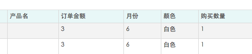
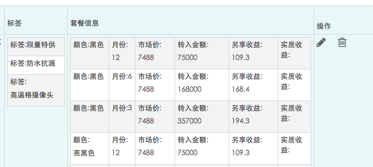

# 用 sails、jade 和 angular 写个 CRUD


### 前言

在做运营活动的时候，要提供一个管理界面给运营使用，经常要用到一些 CRUD 的功能，所以就想着写个通用的模板，目标是：开发填好一个 model 的配置，一个管理页面就出来了。极大地提高生产力。

### 怎么配置

1. 新建一个 sails 的 model，就叫 Foo.js 按照规则定义好每个一个字段。见 Demo
2. 新建一个与 model 名字对应 sails 的 controller: FooController

> 你也可以使用 sails 的生成器命令 sails generate api Foo 这样可以一次生成 Model 和 Controller 文件。

3. 访问 [http://localhost:8080/foo/crud](http://localhost:8080/foo/crud)，一个管理界面就出来。访问 [http://localhost:8080/foo/crud_s](http://localhost:8080/foo/crud_s) 则是另一种交互风格的管理页面。

4. 长这样


### 原理

后端使用 jade 模板来渲染 html，访问 [http://localhost:8080/foo/crud](http://localhost:8080/foo/crud) 其实就是访问 crud.jade 这个 view 文件。后端读取了对应 model 的配置，并把属性配置注入到 jade 模板，然后生成对应的 table，和编辑框。

前端 html 的数据绑定工作是借助 **angular** 来实现的。

#### 一个 Model 的Demo

```
/** *  电商化产品 */module.exports = {  title: '电商产品',  sort: 'no',  attributes: {    no: {type: 'string', name: '编号', required: true},    name: {type: 'string', name: '名字', required: true},    name_detail: {type: 'string', name: '详细名字', required: true},    ram: {type: 'integer', name: '内存'},    icon_src: {type: 'string', image: true, name: '缩略图', required: true},    list_src: {type: 'string', image: true, name: '列表图', required: true},    detail_src: {      type: 'array', name: '细节图', attributes: {        name: {type: 'string', image: true, name: '细节图'}      }    },    description: {type: 'string', textarea: true, name: ' 描述'},    tags: {      type: 'array', name: '标签', required: true, attributes: {        name: {type: 'string', name: '标签'}      }    },    prices: {      type: 'array', name: '套餐信息', required: true, attributes: {        color: {type: 'string', name: '颜色'},        month: {type: 'integer', name: '月份'},        price: {type: 'string', name: '市场价'},        trans_amount: {type: 'string', name: '转入金额'},        earning: {type: 'string', name: '另享收益'},        earning_real: {type: 'string', name: '实质收益'}      }    }  }};module.exports = require('../lib/crud').fixModel(module.exports)
```

title 是这个页面的 title 

sort 决定列表数据的排序方式 

最后记得用 crud 的 fixModel 方法来处理这个 model（原因是 sails 不支持你这样随便修改 model）

### 一个 Control 的 Demo

```
var crud = require('../lib/crud')module.exports = {};module.exports = require('../lib/crud').extendController(module.exports)
```

这里引入了 crud 的方法，用来给这个 controller 注入页面渲染的功能。

### Model 的定义

可以给 model 的字段定义以下类型，在前端会被翻译成对应的控件

* string

文本类型 前端对应的是文本输入框
* integer/float

数字类型 前端是 html5的文本输入框 number 类型
* 长文本

添加一个 textarea:true 属性即可，前端会展示成一个文本框。
* 日期类型

type=date 前端是 html5的 date 类型的文本输入框
* 选择框

需要添加一个 options 属性，描述每个 option 的 key and value

这样前端就能构造一个 选择框了。
```
compare: { name: '', type: 'string', options: [    {value: '-2', name: '小于等于'},    {value: '-1', name: '小于'},    {value: '0', name: '等于'},    {value: '1', name: '大于'},    {value: '2', name: '大于等于'}  ]},
```

* 图片地址

某个字段如果是保存图片地址的话，配置一个属性 image:true

在编辑和展示这个字段都能看到图片预览


* object 需要继续定义 object 里有哪些类型的数据

在前端会把 object 的子内容铺开。


```
price: {  name: '套餐', type: 'object', readOnly: true, attributes: {    "month": {type: 'string', name: '月份'},    "color": {type: 'string', name: '颜色'}  }},
```

* array 同 object 需要继续定义数据类型。

在前端会以一个子 table 的形式来展开。


编辑的时候是这样的：


```
prices: {  type: 'array', name: '套餐信息', required: true, attributes: {    color: {type: 'string', name: '颜色'},    month: {type: 'integer', name: '月份'},    price: {type: 'string', name: '市场价'},    trans_amount: {type: 'string', name: '转入金额'},    earning: {type: 'string', name: '另享收益'},    earning_real: {type: 'string', name: '实质收益'}  }}
```

### 代码

crud.jade 里的 extends layout2 里引用了 css 和 js 文件，这里不便公开。 

[https://github.com/myfjdthink/CodeNode/tree/master/crud](https://github.com/myfjdthink/CodeNode/tree/master/crud)

### TODO

分页功能 

导出 Excel 功能 

在 model 字段比较多的时候提供一个更好的编辑交互。

### 总结

本文只是提供一个实现 CRUD 思路，你可以根据你的实际项目来替换使用。 

REST 接口可以很多 Web 框架都会提供。 

视图模板除了 Jade 还有 ejs 等。 

前端的数据绑定也可以考虑使用 Vue。


