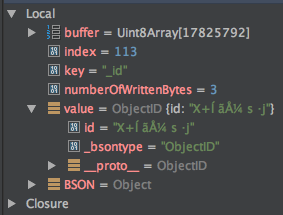
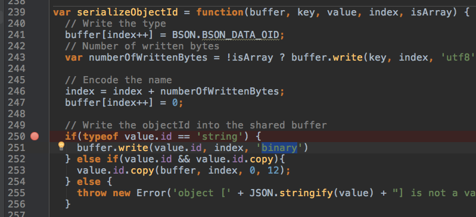

# 记录一个 NPM 包冲突的问题


# 记录一个 NPM 包冲突的问题

## 问题

项目中使用 sails 这个 Web 框架，sails 集成的 orm 是 waterline ，waterline 针对 mongo 的适配器是 sails-mongo，最近线上爆了一个 BUG，sails-mongo 在执行 native 方法时报错 ：

> TypeError: Argument must be a string
> 
> 
> at TypeError (native)
> 
> 
> at Buffer.write (buffer.js:791:21)
> 
> 
> at serializeObjectId (node_modules/sails-mongo/node_modules/bson/lib/bson/parser/serializer.js:242:10)
> 
> 
> at serializeInto (node_modules/sails-mongo/node_modules/bson/lib/bson/parser/serializer.js:699:17)
> 
> 
> at serialize (node_modules/sails-mongo/node_modules/bson/lib/bson/bson.js:47:27)
> 
> 
> at Query.toBin (node_modules/sails-mongo/node_modules/mongodb-core/lib/connection/commands.js:143:25)
> 
> 
> at Cursor._find (node_modules/sails-mongo/node_modules/mongodb-core/lib/cursor.js:339:36)
> 
> 
> at proto.(anonymous function) (node_modules/sails-mongo/node_modules/mongodb/lib/apm.js:547:16)
> 
> 
> at proto.(anonymous function) (node_modules/sails-mongo/node_modules/mongodb/lib/apm.js:547:16)
> 
> 
> at proto.(anonymous function) (node_modules/sails-mongo/node_modules/mongodb/lib/apm.js:547:16)
> 
> 
> at proto.(anonymous function) (node_modules/sails-mongo/node_modules/mongodb/lib/apm.js:547:16)
> 
> 
> at proto.(anonymous function) (node_modules/sails-mongo/node_modules/mongodb/lib/apm.js:547:16)
> 
> 
> at proto.(anonymous function) (node_modules/sails-mongo/node_modules/mongodb/lib/apm.js:547:16)
> 
> 
> at proto.(anonymous function) [as _find] (node_modules/sails-mongo/node_modules/mongodb/lib/apm.js:547:16)
> 
> 
> ……

## 解决问题

针对这个问题 Google 了一下，已经有人发现了这个问题并在 sails-mongo 的 github 项目里提了 issue 了， [https://github.com/balderdashy/sails-mongo/issues/415](https://github.com/balderdashy/sails-mongo/issues/415)。 

查看这个 issue 可以知道，问题原因是项目中同时使用了 sails-mongo 和 mongo 两个包，在 sails-mong 的版本为 0.12.0 的情况下， mongodb 这个包升级到 2.2.0 以上就会导致报错。 

issue 里给出的解决方案是：


## 分析

OK， 问题解决后分析下两个包出现冲突的原因。 

业务代码是这样写的：

```
var ObjectId = require('mongodb').ObjectID;...  query.push({    $match: {      $or: _.map(posts, function(post) {        return {          _id: { $eq: ObjectId(post.id) },          status: { $ne: 'trash' }        }      })    }  });
```

这里把 mongodb（2.2.x） 的 ObjectId 对象传给了 sails-mongo 的处理逻辑中，导致了最终的报错。 

sails-mongo 里也引用了 mongodb 这个库，版本是 2.1.3


这个版本与外部的 mongodb 库 2.2.x 版本有冲突，看来 mongodb 这个库在 2.2.x 升级了某些东西，我们进一步追查，根据报错信息可以定位报错的代码

> at serializeObjectId
> 
> 
> (node_modules/sails-mongo/node_modules/bson/lib/bson/parser/serializer.js:242:10)

看来是 bson 这个库里有问题，这个是 sails-mongo 里的 bson（0.4.23） 的代码的报错位置


在 242 行加上断点，可以看到 value 这个变量的情况：



而 mongodb 里引用的 bson（0.5.6） 的此处代码是这样的



加断点看到的变量情况：


看来是 ObjectID 的类型变了， 由之前的 String 变成了 Uint8Array ，这也就契合了报错信息里的 “TypeError: Argument must be a string”， 这就是问题的根源。

## 总结

这个问题初看好像是 npm 包版本导致的冲突（NPM 其实已经处理好了不同版本的依赖问题），但是实际上是代码应用层使用不当导致的问题，根据 issue 提供的解决方案，要获取 ObjectID 对象，应该使用 sails-mongo 来提供这个对象：

```
const ObjectId = require('sails-mongo').mongo.objectId
```

而不是从外部获取：

```
var ObjectId = require('mongodb').ObjectID;
```

其实是不是可以说是 sails-mogno 坑？

---

11/18日更新： 

哈哈哈， sails-mogno 果然是坑，看看它提供的 objectId 的实现：


如果你想要生成一个新的 ObjectID，这样写的话

```
var id = ObejctId()
```

你将得到一个 null ! 

无语呢，所以呢，还是要这样引用才行：

```
var ObjectID = require('sails-mongo/node_modules/mongodb').ObjectID;
```


