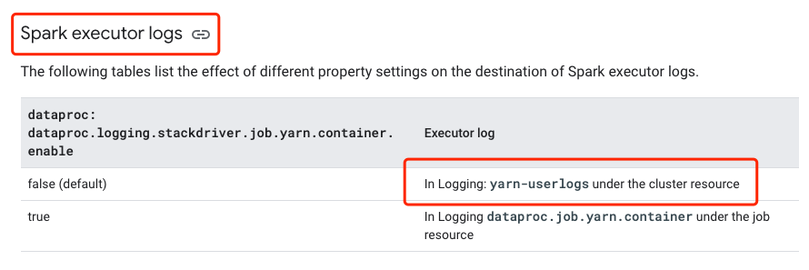

在 Dataproc 部署了 Spark 集群后，我们可以通过 gcloud 命令来 submit spark job，gcloud 会以流式的方式返回 spark driver logs，那要如何看到 executor 的 logs 呢？
```bash
gcloud dataproc jobs submit job-command \
    --cluster=cluster-name \
    --region=region \
    other dataproc-flags \
    -- job-args
```

一开始我想着是进入 Dataproc 集群的 Spark History Server 上进行查看，但是也不太方便，其实有个更简单的办法，在集群的顶部菜单中，右上角有一个查看日志的入口


点击进去后，我们可以看到很多服务的日志，Google 已经把这些日志都集成好了。页面跳转后，会默认执行以下查询
```config
resource.type="cloud_dataproc_cluster"
resource.labels.cluster_name="xxxx"
resource.labels.cluster_uuid="ffe84392-4012-4a4a-ac81-c3e513a9cdf0"
```
界面


该查询的作用是把 cloud_dataproc_cluster 服务的 xxxx cluster 集群的日志查询出来，我们再进一步过滤

查询 dataproc [文档](https://cloud.google.com/dataproc/docs/guides/dataproc-job-output#spark_executor_logs) 可以知道，executor 的 logs 存储位于 yarn-userlogs



所以我们在日志查询系统里再补充 log_name 过滤条件
```config
resource.type="cloud_dataproc_cluster"
resource.labels.cluster_name="xxxx"
resource.labels.cluster_uuid="ffe84392-4012-4a4a-ac81-c3e513a9cdf0"
log_name="projects/xxxproject/logs/yarn-userlogs"
```

这样就要可以看到所有 job 的 executor logs 了。

我们也可以继续做过滤，例如过滤单个 job 的 logs，通过 application name 过滤.

note: application 在 gloud submit job 后会打印在命令行中

```config
resource.type="cloud_dataproc_cluster"
resource.labels.cluster_name="internal-16-60-07-19"
resource.labels.cluster_uuid="ffe84392-4012-4a4a-ac81-c3e513a9cdf0"
log_name="projects/xxxproject/logs/yarn-userlogs"
jsonPayload.application="application_1658199041103_0098"
```
