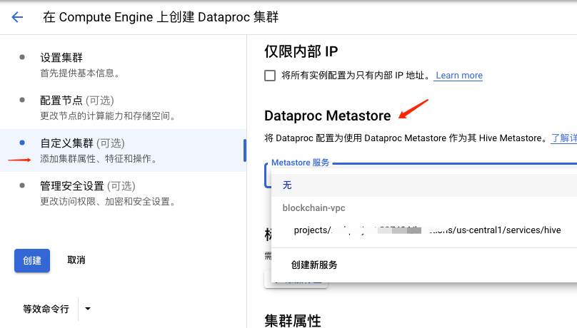

## 本地体验
如果只是想在本地体验 Iceberg，可以直接使用这个 [docker-compose 服务](https://github.com/tabular-io/docker-spark-iceberg)。

它是用 Spark 的 JdbcCatalog 来管理 table 的，Iceberg 会复用 Spark 的 Catalog。

服务启动后，通过 notebook 环境来体验 Iceberg

## Dataproc

Dataproc 开启一个 Spark 集群非常容易，这里就不详细介绍了，说一下关键点。

### Metastore
Iceberg 支持 Hive Metastore，Dataproc 也提供了替代 Metastore 服务，是完全兼容 Hive Metastore 的。

先创建一个 Metastore 服务，然后在创建 Dataproc 集群时把 Metastore 服务 选上即可


### 配置 Spark Iceberg
这里完全可以照着 Iceberg 的文档来了

启动 SparkSql
```shell
spark-sql --packages org.apache.iceberg:iceberg-spark3-runtime:0.12.0\
    --conf spark.sql.extensions=org.apache.iceberg.spark.extensions.IcebergSparkSessionExtensions \
    --conf spark.sql.catalog.hive_prod=org.apache.iceberg.spark.SparkCatalog \
    --conf spark.sql.catalog.hive_prod.type=hive \
    --conf spark.sql.catalog.hive_prod.uri=thrift://10.36.64.18:9083
```
注意点
- iceberg-spark3-runtime 的版本要和 dataproc spark 一致
- spark.sql.catalog.hive_prod.uri 就是刚刚创建的 Metastore URI，在 Metastore 界面可以查询到

创建 Table 并查询
```sql
CREATE DATABASE IF NOT EXISTS hive_prod.gsdb;
CREATE TABLE hive_prod.gsdb.gs_table2 (id int, data string) USING iceberg;
INSERT INTO hive_prod.gsdb.gs_table2 VALUES (1, 'a'), (2, 'b'), (3, 'c'), (4, 'a');
SELECT * FROM hive_prod.gsdb.gs_table2;
```

能查出数据就成功啦

### 问题
数据存在哪里？
Dataproc Metastore 里有展示数据存储位置，在 GCS 上。

