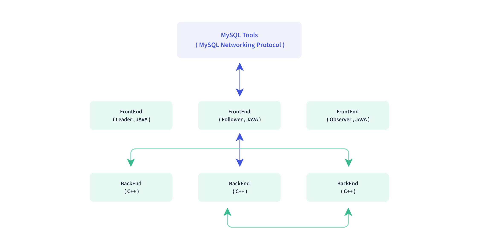
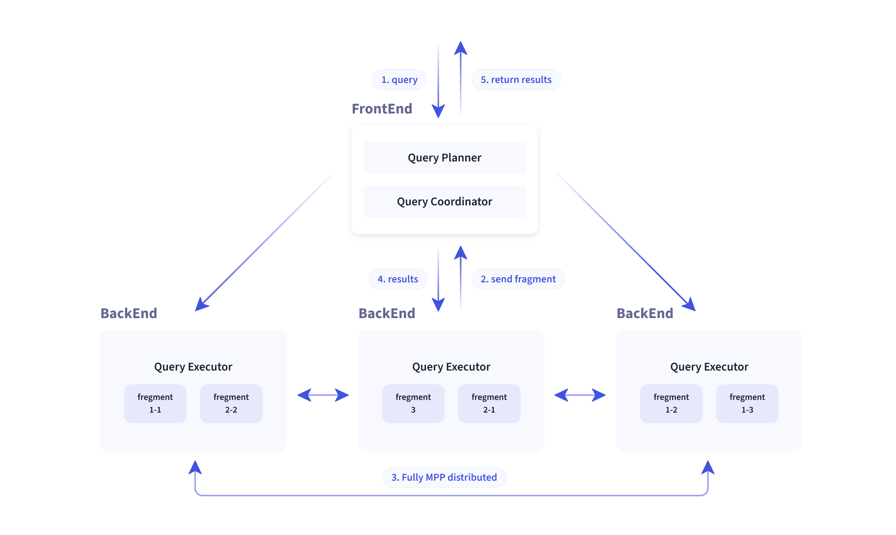

# 目录
[[toc]]

## 架构

### FE BE 分离
* 采用 MySQ L 协议
* 采用列式存储，按列进行数据的编码压缩和读取

### 存储模型
Doris 支持多种存储模型，针对不同的场景做了针对性的优化：
* Aggregate Key 模型：相同 Key 的 Value 列合并，通过提前聚合大幅提升性能
* Unique Key 模型：Key 唯一，相同 Key 的数据覆盖，实现行级别数据更新
* Duplicate Key 模型：明细数据模型，满足事实表的明细存储

### 查询引擎 MPP And 向量化
节点间和节点内都并行执行，也支持多个大表的分布式 Shuffle Join，从而能够更好应对复杂查询。

Doris 查询引擎是向量化的查询引擎

向量化:批处理(列存)>逐行(行存)，充分使用计算能力

* [5分钟了解MPP数据库](https://zhuanlan.zhihu.com/p/148621151)
* [数据库计算引擎的优化技术](https://zhuanlan.zhihu.com/p/100933389)
* [SIMD简介](https://zhuanlan.zhihu.com/p/55327037)

## 表设计

### Partition Bucket & Tablet
Tablet :在 Doris 的存储引擎中，用户数据被水平划分为若干个数据分片（Tablet，也称作数据分桶）

一个表的 Tablet 总数量等于 (Partition num * Bucket num)，单个 Tablet 的数据量理论上没有上下界，但建议在 1G - 10G 的范围内。

小表不需要 Partition，可以只分 Bucket

一般按日期 Partition，要了解动态分区的用法

### 参考资料
- [官方文档-数据划分](https://doris.apache.org/zh-CN/docs/data-table/data-partition#%E5%88%86%E5%8C%BA%E5%92%8C%E5%88%86%E6%A1%B6:~:text=%E5%85%B3%E4%BA%8E%20Partition%20%E5%92%8C%20Bucket%20%E7%9A%84%E6%95%B0%E9%87%8F%E5%92%8C%E6%95%B0%E6%8D%AE%E9%87%8F%E7%9A%84%E5%BB%BA%E8%AE%AE)
- [动态分区文档](https://doris.apache.org/zh-CN/docs/advanced/partition/dynamic-partition/)

## 字段设计

- float 存在小数精度丢失问题，推荐用 double or decimal 

## Load 数据
- Broker Load 大量数据用这个方式
- Spark Load
- Stream Load(Spark Doris 用此方式)
- S3 Load 支持各种云存储

[数据导入文档](https://doris.apache.org/zh-CN/docs/data-operate/import/import-way/broker-load-manual)

## 索引

### 前缀索引
aggregate key 和 unique 是排序存储的，在排序的基础上，将一行数据的前 36 个字节 作为这行数据的前缀索引。

所以选择 unique key 的时候，把小字段（例如 int ）放前面，可以极大地提高查询效率.

前缀索引的实现方式是稀疏索引，好处是节省索引空间，但是效率会比密集索引差一点

- [前缀索引-官方文档](https://doris.apache.org/zh-CN/docs/data-table/index/prefix-index)
- [密集索引和稀疏索引](https://juejin.cn/post/6956421181465427981)

### BloomFilter 索引
适合高基列，数据几乎不重复的列，例如 userId/from_address/to_address 

- [官方文档-BloomFilter索引](https://doris.apache.org/zh-CN/docs/data-table/index/bloomfilter)
- [BloomFilter 原理](http://oserror.com/backend/bloomfilter/)

### Bitmap 索引
适合低基列，字段内容只有固定几个值的，例如 age，gender 

[位图索引原理](https://www.cnblogs.com/lbser/p/3322630.html)

### Rollup
把热门查询的几个列独立到一张表中，提高查询速度

可以用 Rollup 调整前缀索引顺序

[官方文档-Rollup](https://doris.apache.org/zh-CN/docs/data-table/hit-the-rollup)

## Profile
### Explain 查询计划

实例分析

### Profile 记录分析

## 缓存

### 分区缓存
TBD

## 其他

### Doris 官方：Apache Doris 性能优化原理篇
时间换空间：建索引，加缓存，适合固定查询场景

数据剪裁：谓词下推/Join-Reorder，适合即席查询

[PPT 回顾](https://mp.weixin.qq.com/s/EMcBr_bSkY0QbfYKnLGI-g)
