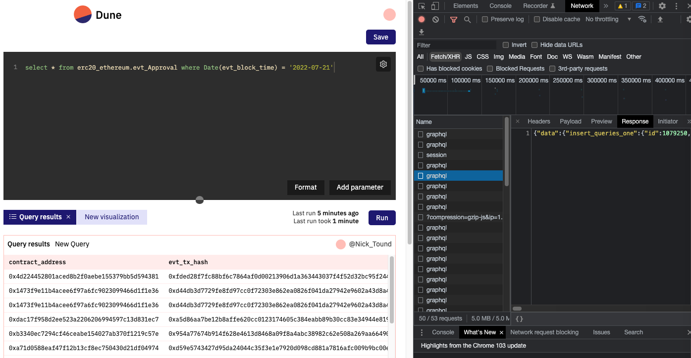

## Dune 的前端体验
我们在 Dune 发起一个 query 请求，背后的系统是如何运行的？我们可以从前端的体验来推测一下, F12 打开浏览器控制台，观察 Network, 可以看到点击 run query 会触发多个异步查询请求，我们一个一个分析。


可以看到所有请求访问的地址是 `https://core-hsr.duneanalytics.com/v1/graphql`
从名字上可以看出和 graphql 有关，背后的服务是 [hasura](https://hasura.io/), hasura 是开源的 graphql 服务，只需要配置好 database，就可以自动读取 table schema 并生成对应的 graphql 接口。

（怎么看出来是 hasura 的？刚好用过~）


接下来看第一个 request body，这是将用户写的 SQL 提到到数据库中
```json
{
  "operationName": "UpsertQuery",
  "variables": {
    "object": {
      "id": 1079250,
      "dataset_id": 1,
      "name": "New Query",
      "query": "select * from erc20_ethereum.evt_Approval where Date(evt_block_time) = '2022-07-21'",
      "user_id": 56489,
    },
    "session_id": 56489
  }
}
```

第二个 request body, 告诉后端执行刚刚用户提交的 SQL，注意是通过 query_id 来定义一个 query 的，而且 sql query 是异步的。
```json
{
  "operationName": "ExecuteQuery",
  "variables": {
    "query_id": 1079250,
    "parameters": []
  }
}
```
hasura 会调度一个 engine 来完成 sql query。不过会同步返回一个 job_id 给前端
```json
{
  "data": {
    "execute_query": {
      "job_id": "6c1969e8-1398-48db-900d-6fd7ed5247df",
      "__typename": "execute_query_response"
    }
  }
}
```

第三至 N 个 request body, 不断轮询后端（通过job_id），查看 sql 的执行状态
```json
{
  "operationName": "GetQueuePosition",
  "variables": {
    "job_id": "6c1969e8-1398-48db-900d-6fd7ed5247df"
  }
}
```
等后端返回说 sql query 完成是，前端会发起取数请求
```json
{
    "operationName": "FindResultDataByJob",
    "variables": {
        "job_id": "6c1969e8-1398-48db-900d-6fd7ed5247df"
    }
}
```

这样用户就看到了查询结果

OK 我们可以得到初步结论，Dune 的查询是异步式的，使用 hasura 来管理用户是 query 生命周期。


## 查询引擎
刚刚收到 hasura 会调度 engine 来完成 sql query，Dune V1 是直接用 Postgres 集群，后面性能更不上了，就出现了 [Dune Engine V2](https://docs.dune.com/dune-engine-v2-beta/dunes-new-query-engine)

从文档的介绍可知，V2 的 engine 是 “Instance of Apache Spark hosted on Databricks” ，托管在 Databricks 的 Spark 集群，SQL方言也改为了 DatabricksSQL。

TBD


## 抽象

Why DBT?

