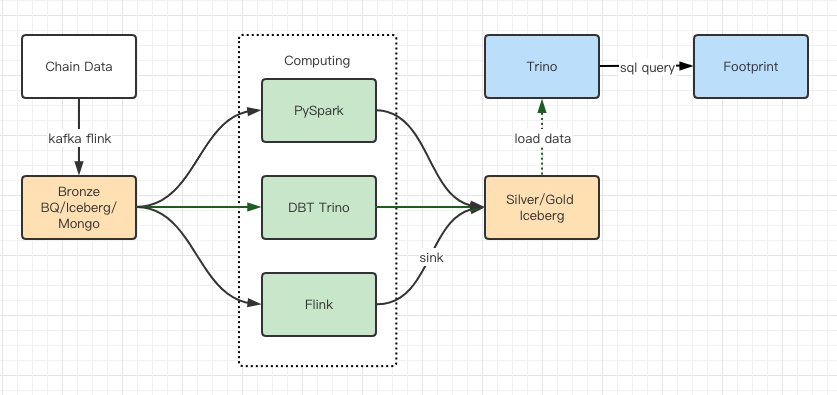

# 介绍
Apache Iceberg 是一种用于跟踪超大规模表的新格式，是专门为对象存储（如S3）而设计的。 
本文将介绍为什么 Footprint Analytics 需要构建 Iceberg，
Apache Iceberg 的高层次设计，并会介绍那些能够更好地解决查询性能问题的细节。

# 问题
Footprint Analytics 最开始的版本使用 Bigquery 作为存储和查询引擎，Bigquery 是一款优秀的产品，他提供的动态算力，和灵活的 UDF 语法帮助我们解决了很多问题。

不过我们也碰到以下问题：
* 数据没有经过压缩，存储费用过高，特别是我们需要存储将近 20 条区块链的原始数据
* Bigquery 同时运行的 Query 只有 100 哥，不能为 Footprint 提供高并发查询

所以在新版的架构中，我们尝试寻找一个开源的解决方案，我们倾向的是一个存储和查询分离的方案，我们找到了 Iceberg

# Iceberg 的特点

目前 Iceberg 提供以下核心能力：

* 完善的ACID语义。
* 支持行级数据变更能力。
* 支持历史版本回溯。
* 支持高效的数据过滤。
* 支持Schema变更（Schema Evolution）。
* 支持分区布局变更（Partition Evolution）。
* 支持隐式分区（Hidden Partitioning）。

Iceberg建立在Apache Spark引擎之上，并与其他流行的大数据技术无缝集成，
如 Apache Hive、Trino/Presto、Apache Flink。

它支持广泛的数据格式，包括Parquet、Avro和JSON，并与各种数据存储系统兼容，包括HDFS、S3和GCS。

# 为什么选择 Iceberg

以下是我们选择 Iceberg 的主要原因

## 更低的数据存储成本
得益于 Iceberg 对 Parquet、Avro 等数据格式的支持，我们可以将数据压缩后存储。 

我们做了个简单的测试，使用 Avro 格式对数据进行压缩后，可以节省 80% 的空间

## 更快的查询速度
Iceberg 支持高级过滤，它为每个 table 建立了表元数据 table metadata, 
这样就可以使用分区和列级统计数据进行修剪数据文件。

例如 table metadata 记录了某个 data file 中 column_a 的最小值和最大值分别为 10 和 100。

当查询条件为 column_a > 110 时，就可以直接跳过读取该 data file 。

## 支持 merge 操作

在 Hive 中，update table 是个头疼的事情，而 Iceberg 提供了 Merge 支持，可以让我们对数据实现行级别的更新。

直接使用 merge into 语法，并且该更新操作是原子性的，读者从不会看到部分更改或未提交的更改

## 支持丰富的对象存储
Works with any cloud store 可以在任何云商店工作，我们不想绑定某个云服务厂商

## 支持丰富的计算引擎
支持 Spark，Trino，Flink 等计算引擎，可以适应各种计算场景。

- Spark 完成复杂的计算任务
- Trino 完成简单 ETL 
- Flink 实现实时计算

# Iceberg In Footprint
经过2个月的辛苦工作，我们最终完成了 Iceberg 在 Footprint 的落地，这个是我们最新的数据流程图

我们使用各种计算引擎完成数据计算并把结果存回 Iceberg，再由 Trino 将数据提供给用户查询。

使用了 Trino Iceberg 这套架构组合后，我们的存储费用下降了 80%，查询速度提升了 100%。

说说我们碰到的问题：

- iceberg table 每次 update 都会产生一个新的的 snapshot，会影响查询速度，需要定时清理过时的 snapshot
- 写入大量文件时，如果并行度太高，会产生大量的小文件，影响查询速度，要注意写入并行度和文件大小的平衡

# 总结
Iceberg 作为新一代的 table format，解决了 Hive 的诸多问题。

在设计方向上，它采取开放兼容做法，可以非常方便地融入现有的大数据架构。

配合数据压缩和过滤等功能，做到节省存储费用和提高查询速度。

# 参考
- https://zhuanlan.zhihu.com/p/140472408
- https://iceberg.apache.org/docs/latest/
- https://www.starburst.io/blog/tag/iceberg/
