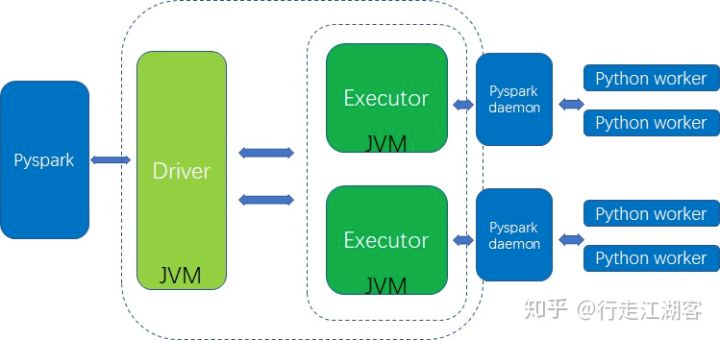

## Koalas 是什么
[koalas](https://koalas.readthedocs.io/en/latest/index.html): pandas API on Apache Spark

这是 koalas 官网的描述，在 Spark 上的 pandas api.

pandas 具有非常庞大的用户基础，为了让这些用户顺利从 pandas 迁移到 Spark，就出现了 koalas。

pandas 只能分析单机能够处理的数据集, 对大数据束手无策，从另一个角度，你可以认为 koalas 是 pandas 的分布式实现。

## Koalas 的问题
准确来说是 python udf 的问题，运行速度非常慢。

虽然 Spark 提供了 python api：pyspark，但是背后调用的还是 jvm，我们看看 架构图



spark为了保证核心架构的统一性，在核心架构外围封装了一层python，spark的核心架构功能包括计算资源的申请，task的管理和分配， driver与executor之间的通信，executor之间的通信，rdd的载体等都是在基于JVM的。

pyspark 会先调起 jvm 进程，然后在 jvm 里再run python daemon 以运行 python udf（自定义函数），这里进程之间的通信开销是非常庞大的，
虽然 spark 后面引入后 arrow 来减少数据序列化的开销，但是比起 java scala udf，还是有非常大的差距的

## 性能测试
我们做一个对比测试，先从数据库中读取 30w 条数据，spark 的大概配置是 1主2从，每个节点 8CUP+2G内存

```py
df_origin = spark.read.format("bigquery") \
  .option("filter", "on_date > '2022-06-21' and on_date < '2022-06-30' ") \
  .load("db.table")
df_price = df_origin.select("on_date",'token_address','price','token_symbol') \
  .where("chain = 'BSC' ")

df_price.show()
```

### 使用 koalas 对字段做 lower 操作
```py
def upper_udf(item):
    item['token_address_new'] = item['token_address'].upper()
    return item

df_ks.apply(upper_udf, axis=1).head(20)
```

将 token_address 字段做 upper 处理，执行时间大概是 14s


### 使用 pyspark.sql.functions
```py
from pyspark.sql.functions import upper,col

df_price.withColumn("token_address_new",upper(col("token_address"))).show(20)
```

多次执行平均时间是 1s

### 使用 spark sql
```py
df_price.createOrReplaceTempView('token_price_daily')
spark.sql('select *,lower(token_address) as token_address_new from token_price_daily').show()
```

多次执行平均时间是 1s

### 总结
为什么 spark sql 会快那么多？

spark sql 会直接解析成 spark 的 rdd 操作，rdd 操作都在 jvm 内执行，没有和 python 程序的数据交互。

不是 spark sql 快，是 koalas 使用了 python udf，是 udf 执行太慢了。


## 建议
正因如此，我目前在设计 spark 代码架构时，优先推荐的方式是
- spark.read 加载 dataframe
- 将 dataframe.createOrReplaceTempView() 注册 table
- 使用 sql 完成业务计算
- 必要情况下才使用 koalas udf，而且优先考虑 scala udf（编译好后通过 jar 包来引入）

koalas udf 的唯一使用情况是：业务上必须使用 udf，而且没有人会写 java or scala。


如果你的业务足够简单，使用 SQL 就可以覆盖绝大部分情况，你还可以考虑 [dbt-spark](https://github.com/dbt-labs/dbt-spark), dbt 使用了软件工程的思想来管理 sql。

## 参考文章
https://zhuanlan.zhihu.com/p/61665905
https://www.mobvista.com/cn/blog/2019-12-27-2/
