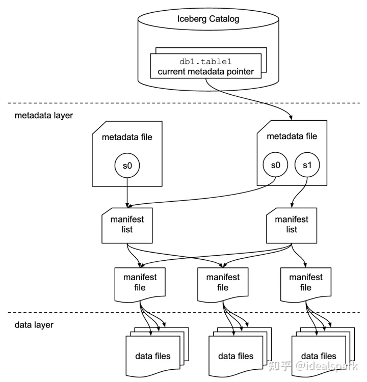

## Iceberg 优化方案

Iceberg 本身可以通过 metadata 上的 static 信息有效地过滤数据，减少底层数据的扫描量，可以[达到 10 倍的性能提升](https://iceberg.apache.org/docs/latest/performance/#scan-planning).

除此之外，我们还可以有更多的方式来优化查询，例如 Bloom Filter Index 和 Order 排序。

为了能深入理解其优化原理，我们需要对 Iceberg 的数据结构和查询生命周期有个基本了解。

## Iceberg 数据结构
详细内容可以参考以下几篇文章，讲得非常好
- [A Hands-On Look at the Structure of an Apache Iceberg Table](https://www.dremio.com/blog/a-hands-on-look-at-the-structure-of-an-apache-iceberg-table/)
- [Iceberg 原理分析](https://zhuanlan.zhihu.com/p/488467438)

整体数据结构
- data files: 数据文件，可以是 parquet，orc 等格式
- manifest file:  manifest file 可以索引多个数据文件(data files), 作用是记录 data file 的静态信息，min max value 等
- manifest list file: 一个快照一个 manifest list file ，manifest file 文件的索引，作用是区分不同分区
- metadata file: 版本文件, 区分不同版本
- catalog



在磁盘上的文件列表示例


## Iceberg 查询生命周期
详细内容可以看这篇文章 [The Life of a Read Query for Apache Iceberg Tables]( https://www.dremio.com/blog/the-life-of-a-read-query-for-apache-iceberg-tables/)

假设我们做以下查询
```sql
SELECT *
FROM orders
WHERE order_ts BETWEEN '2021-06-01 10:00:00' and '2022-05-3110:00:00';
AND amount > 10
```
其执行流程如下：
1. 确定 catalog，默认是 default，通过文件夹过滤
2. 确定 table name 是 orders，通过文件夹过滤
3. 确定 snapshot version，默认是最新 version，根据 metadata file 里的信息过滤
4. 确定 partition，是 `BETWEEN '2021-06-01 10:00:00' and '2022-05-3110:00:00'`，根据 manifest list file 里的信息过滤
5. 确定 过滤条件 `amount > 10`，根据 manifest file 来过滤，其记录了每个 data file 里 amount 的 min max value，不符合条件的可以直接过滤

正是这一系列的过滤，大大减少了数据 load 到内存的数量，加速了查询

## 索引优化

在了解 Iceberg 的基本数据结构和查询方式后，接下来介绍几种索引优化方案

### Bloom Filter
在 data files 层，如果我们使用了 parquet orc 等数据结构，我们可以利用这类数据结构提供的 bloom filter 功能。

bloom filter 可以快速判断一个元素存不存在，不存在的话，可以直接跳过扫描该 data file。

如果一个字段的区分度特别高，例如 id，hash 值这样的唯一性高的字段，就适合添加 bloom filter，反之，像城市名，省份名，这样的区分地很低的字段则不适合。

使用方法：
在 Trino 中，建表时配置 `orc_bloom_filter_columns` 和 `orc_bloom_filter_fpp` 两项。

```sql
CREATE TABLE orders (
    order_id integer,
    create_time date,
    amount double)
WITH (
    format = 'ORC',
    location = '/var/example_tables/test_table',
    orc_bloom_filter_columns = ARRAY['order_id'],
    orc_bloom_filter_fpp = 0.05)
```

如果是对已存在的 table 修改配置，旧数据不会自动添加 bloom filter，需要重新写入数据，或者使用 Spark 的 rewrite 功能。

注意：
- 可同时对多个 key 做 bloom filter
- bloom filter 带来的额外存储不大，一个字段大概增加 1% 的存储空间
- bloom filter 只能做精确过滤 a=1 ，不能做大小过滤 a > 1

我们实测下来，bloom filter 普遍能带来 3 倍的查询速度提升


### Order
目前 Trino 还不支持写入 Iceberg 时对数据做排序 Order，所以通过 Trino 写入的数据，每个 data file 的内容是乱序的，这样会导致 min max value 的过滤效果变差。

在 Trino 解决这个问题之前，我们可以通过 Spark 对已有数据做 rewrite 排序
```python
spark.sql("CALL footprint.system.rewrite_data_files(table => 'catalog_name.table_name', strategy => 'sort', sort_order => 'amount DESC')")
```

注意：
- Order 字段应选择用户最常用的过滤字段
- Order 在 1 partition 里有多个 data file 是效果更明显，可以调大 partition 的数据量，例如按日分区改为按月分区，或者调低 data file 的最大值，例如从 1G 改为 100M

我们实测下来，设置好 Order 普遍能带来 10 倍的查询速度提升

### Z-Order

这里就不介绍其原理啦，因为 Order 只能一个字段排序，Z—Order 结构可以对多个字段同时排序。

可以通过 Spark 对已有数据做 rewrite 排序，排序方式是 zorder

```python
spark.sql("CALL footprint.system.rewrite_data_files(table => 'catalog_name.table_name', strategy => 'sort', sort_order => 'zorder(amount, product_name)')")
```

其实就是把 Order 的提升效果，分摊到多个字段上去了。

我们实测下来，设置好 Z-Order 普遍能带来 3 倍的查询速度提升


## 更多优化方案
除了添加索引优化查询速度，还有其他设置可以优化 Iceberg，我们逐一介绍

### 向量化查询
TBD

### Snapshot 清理 与 小文件合并
Trino 写入 Iceberg 默认使用的是 `merge on read` 策略，这样会导致 Snapshot 版本过多之后，查询性能会急剧下降，因为每次查询都要做 merge 操作。

可以使用以下方式对 Snapshot 做定期清理，操作方式这里不介绍了，自行搜索吧

频繁往 Iceberg 写入数据的时候，会产生很多小文件，同样会影响查询性能，解决方案是类似的。


