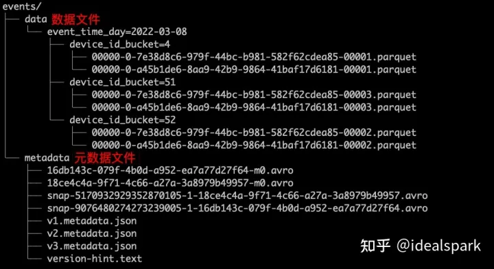

# Iceberg 性能优化方案

Iceberg 是一个开源的数据表格管理库，它可以通过 metadata 上的 static 信息有效地过滤数据，减少底层数据的扫描量。除此之外，我们还可以有更多的方式来优化查询，例如 Bloom Filter Index 和 Order 排序。

为了深入理解其优化原理，我们需要对 Iceberg 的数据结构和查询生命周期有基本了解。

## Iceberg 数据结构
Iceberg 的整体数据结构包括 data files、manifest file、manifest list file、metadata file 和 catalog。其中 manifest file 可以索引多个 data files，并记录静态信息如 min max value 等；而 manifest list file 则是一个快照一个 manifest 文件列表，并用于区分不同分区。metadata 文件则用于版本控制。

在磁盘上文件列表示例：



## Iceberg 查询生命周期
假设我们执行以下查询：
```sql
SELECT *
FROM orders
WHERE order_ts BETWEEN '2021-06-01 10:00:00' and '2022-05-3110:00:00';
AND amount > 10;
```
其执行流程如下：
1. 确定 catalog，默认是 default。
2. 确定 table name 是 orders。
3. 确定 snapshot version，默认是最新 version。
4. 确定 partition：`BETWEEN '2021-06-01 10:00:00' and '2022-05-3110:00:00'`。
5. 根据 manifest 文件记录每个 data file 中 amount 的 min max value 进行过滤。

这一系列过滤大大减少了内存中加载的数量并加速了查询。

## Bloom Filter Index
如果使用 parquet 或 orc 数据格式，则可利用 bloom filter 快速判断元素是否存在从而跳过扫描该 data file。适合唯一性高字段（如 id）添加 bloom filter；反之像城市名或省份名等区分度低字段则不适合添加 bloom filter。在 Trino 中建表时配置 `orc_bloom_filter_columns` 和 `orc_bloom_filter_fpp` 即可使用该功能。

实测结果显示：bloom filter 普遍能带来三倍左右的查询速度提升。

### Order 排序
Trino 目前还不支持写入时对数据进行排序操作，在 Trino 写入后每个 datafile 内容都会乱序导致 min max value 过滤效果变差。因此，在 Trino 解决这个问题之前，我们可以通过 Spark 对已有数据做 rewrite 排序操作：

```python
spark.sql("CALL footprint.system.rewrite_data_files(table => 'catalog_name.table_name', strategy => 'sort', sort_order => 'amount DESC')")
```

注意事项：
* Order 字段应选择用户最常用的过滤字段；
* 在单个 partition 中含有多个 datafile 更明显；
* 应调整 partition 大小或者降低单文件大小以获得更好效果；

实测结果显示：设置好 Order 普遍能带来十倍左右的查询速度提升。


### Z-order
Z-order 结构可以同时对多个字段进行排序操作, 可以通过 Spark 对已有数据做 rewrite 排序操作:

```python
spark.sql("CALL footprint.system.rewrite_data_files(table => 'catalog_name.table_name', strategy => 'sort', sort_order => 'zorder(amount, product_name)')")
```

实测结果显示：设置好 Z-order 普遍能带来三倍左右的查询速度提升。


## Snapshot 清理与小文件合并

频繁往 Iceberg 写入数据会产生很多小文件影响到性能, 同样也会导致 Snapshot 版本太多影响到性能; 因此需要周期性清理无用Snapshot 并且将小文件合并成较大块.

以上就是针对 iceberg 性能优化方案介绍及说明
