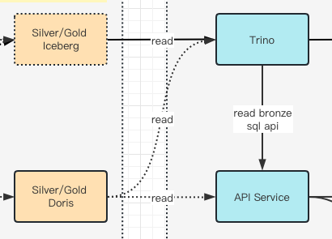

## 背景
随着公司的业务场景的增长，我们需要为用户提供高 QPS 的查询服务，Trino + Iceberg 的架构明显不能胜任，所以引入 OLAP 来承担这部分工作。

同时，我们还希望 Trino 能直接查询 Doris 上的数据，可以不用存两份数据。

## 解决方案

基本上在 Trino  Mysql Connector 的基础上使用特定配置就可以满足需求，实现例子已开源
[trino-doris-demo](https://github.com/myfjdthink/trino-doris-demo)

