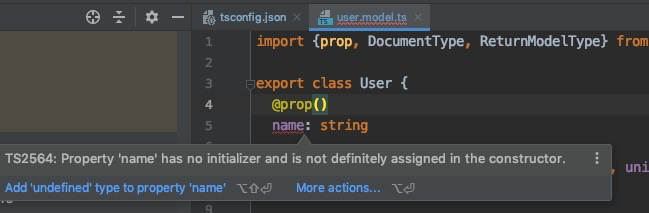
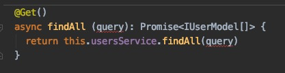
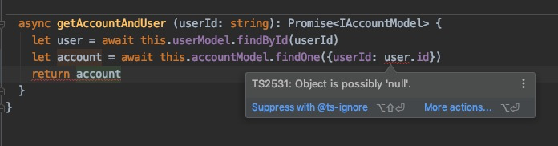
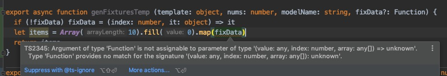

开启了严格模式后，可以帮助我们提前发现很多 BUG，关于严格模式的详细介绍，可以看看[这篇文章](https://juejin.im/post/5dba8981e51d452a1a580f9d)

接下来，我将在一个实际项目上打开严格模式，看看要如何落地

## Property has no initializer
变量声明后没有初始化



这种问题要根据实际情况来解决，需要初始化的补上即可。
在这个例子中，这是一个 model 对象，我们明确知道 mongoose 会帮我们做好初始化的，我们可以这样声明字段：

```ts
name!: string
```

感叹号的意思是，告诉 type checker：“这个字段你就不用担心初始化问题了，我们开发会搞定的”。

除了这个方式，我们还有其他的解决方案，具体可以看看[这篇文章](https://mariusschulz.com/blog/strict-property-initialization-in-typescript)

## Parameter is any type



这是一个很常见的场景，用 query 表示 object 参数，至于 query 里面有什么东西，请允许我引用一个经典笑话：

    当我写下这一行代码时，只有我和上帝知道是什么意思。一个月后，只有上帝才知道是什么意思了…

我们可以在开发规范里要求大家写文档，但这种约束力明细不如
**“不写清楚类型就不让你执行”**
来得稳妥。

所以，这种情况下，严格模式的 typescript 会报错：

    Error:(18, 18) TS7006: Parameter 'query' implicitly has an 'any' type.

不允许 any 类型的参数，所以我们必须为参数声明类型

```ts
export class UsersQueryDto {
  @IsNotEmpty()
  readonly userId!: string
}
```

然后标记类型：

```ts
@Get()
async findAll (query : UsersQueryDto): Promise<IUserModel[]> {
    return this.usersService.findAll(query)
}
```

当然了，不像 Java 那么死板，也不是所有参数都要搞一个类来声明类型的，声明类型也可以更简单些：

```ts
@Get()
async findAll (query : {userId : string}): Promise<IUserModel[]> {
    return this.usersService.findAll(query)
}
```

是否要声明一个类，取决于是否要将这个参数类型在其他地方共享

## Module need types
我们直接引入一个包，以 mongoose 为例
```ts
import * as mongoose from 'mongoose'
```
会报错：

    Error:(3, 27) TS7016: Could not find a declaration file for module 'mongoose'. 'klg-nest-starter/node_modules/mongoose/index.js' implicitly has an 'any' type.
      Try `npm install @types/mongoose` if it exists or add a new declaration (.d.ts) file containing `declare module 'mongoose';`

安装提示把对应的 types 安装以下即可，执行：

```bash
npm install @types/mongoose
```

如果你使用的包没有提供 types，那就需要你自己编写 types，具体可以参考其他包的写法。
不过 typescript 目前的火热程度，稍微有人气的包都会提供 types，或者很多包干脆就是直接用 typescript 编写的，不用太担心这个问题。

## Nullable
在有了 @types/mongoose 的基础上，我们可以提前发现更多问题了



mongoose 对 findById 的返回值定义是 **T | null**
```ts
findById(id: any | string | number,
      callback?: (err: any, res: T | null) => void): DocumentQuery<T | null, T, QueryHelpers> & QueryHelpers;
```
所以这里 user 的查询结果可能会 null，直接是用 user.id 可能会出现错误。
修复方案：

```ts
  async getAccountAndUser (userId: string): Promise<IAccountModel> {
    let user = await this.userModel.findById(userId)
    if (!user) throw new Error('User not found ' + userId)
    let account = await this.accountModel.findOne({userId: user.id})
    if (!account) throw new Error('Account not found ' + user.id)
    return account
  }
```

## Type Match
```ts
export async function genFixturesTemp (template: object, nums: number, modelName: string, fixData?: Function) {
  if (!fixData) fixData = (index: number, it: object) => it
  let items = Array(10).fill(0).map(fixData)
  return items
}

```
这段代码里有个 bug，能一眼看出来吗？

typescript 给了我们一个提示：fixData 这个函数和 map 的参数不匹配



原来 map 函数对参数的定义是
```ts
map<U>(callbackfn: (value: T, index: number, array: T[]) => U, thisArg?: any): U[];
```
第一个参数 value 第二个参数才是 index：number
修复方案：
```ts
export async function genFixturesTemp (template: object, nums: number, modelName: string, fixData?: (it: object, i: number) => any) {
  if (!fixData) fixData = (it: object, index: number) => it
  let items = Array(10).fill(0).map(fixData)
  return items
}
```
调整函数，并准确声明 Function 的类型
