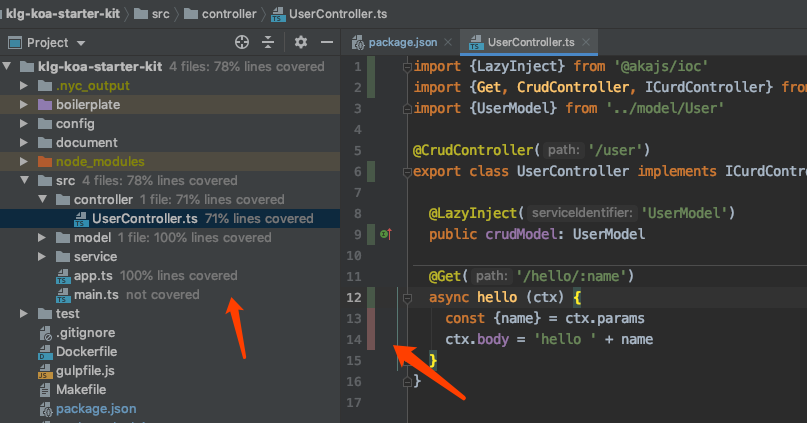
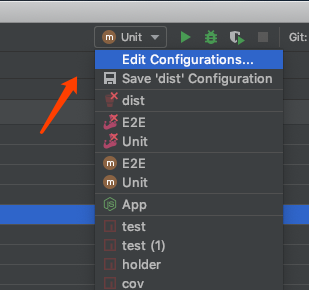
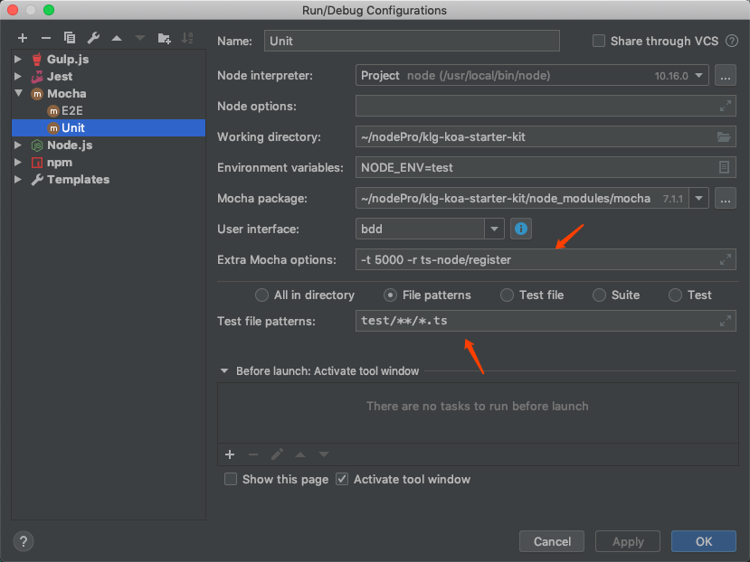
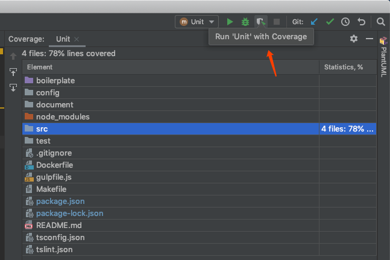
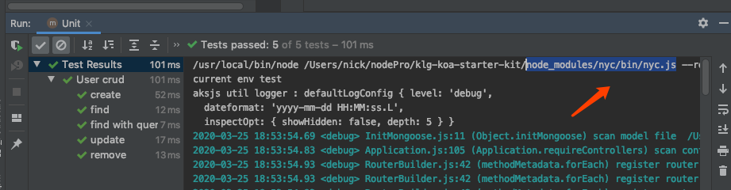

## 效果

WebStorm 对 Coverage 提供了原生支持，方便开发者快速预览哪些代码还没被测试覆盖到。如下图，左侧目录树有覆盖率的提示，右侧代码行数右侧，粉红色的代码就是没有被测试覆盖的代码，非常清晰。



## 配置

那么要如何配置呢？配置一个 Mocha Runner， 在右上角点击添加一个运行配置



具体配置如下



* Extra mocha options 是 mocha 运行需要的参数，-t 是超时时间，-r 是要额外引入的包，这里为了支持 typescript，引入了 ts-node; 你也可以在项目目录下添加一个 test/mocha.opts 文件来实现同样的配置，具体见 mocha 文档。
* Test file patterns 就是 mocha 要测试的文件Runner
## 运行

配置完成后，有三种运行模式，普通RUN， Debug，和 Coverage，分别对应右侧的三个图标，点击用 Coverage 模式运行，就可以生成 Coverage 报告了。

如下图，我们可以知道 src 目录的测试覆盖是 78%



## 原理

到这里，大家可能会有个疑问，WebStorm 是怎么做的 Coverage 呢？观察一下 WebStorm 的输出内容，可以发现，实际上是用 nyc 这个非常流行的包实现的，关于 nyc 的其他信息，请[查阅官网](https://istanbul.js.org)。



OK，只要几步配置，就完成覆盖率的展示了。

## 快速配置

为了方便大家更简单地实现覆盖率测试，akajs 为大家提供了一个后端项目模板，只要两个命令就可以生成项目骨架，并且已经配置好了 Coverage 所需的所有东西。

```
klg-init --type project-ts project-name
```

在生成的项目中，已经配置好了 mocha 和 nyc 所需的相关配置。直接执行

```
npm run test
npm run cov
```

即可

