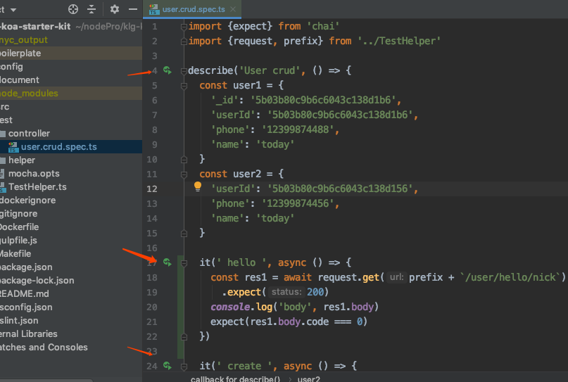
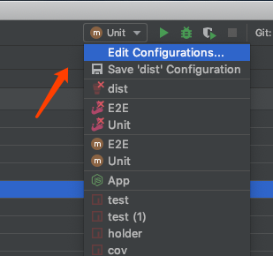
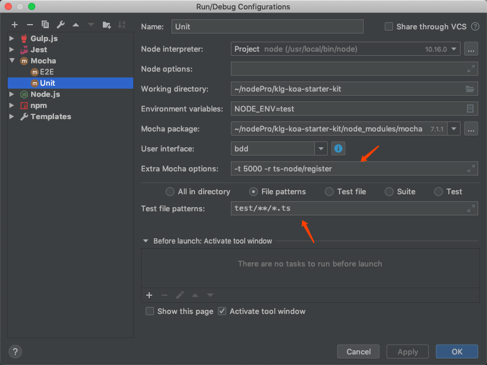
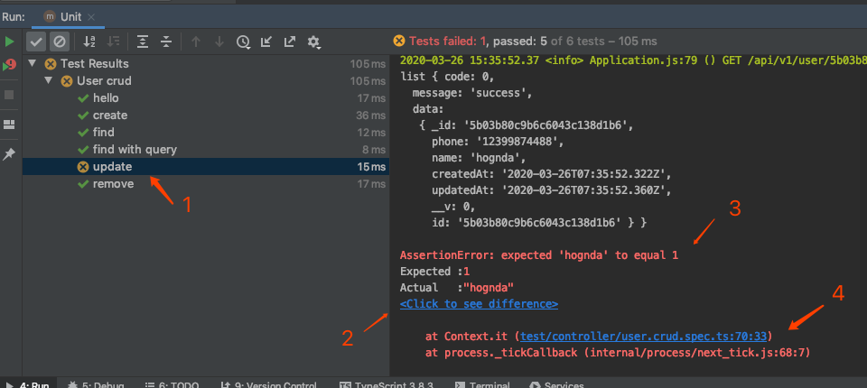
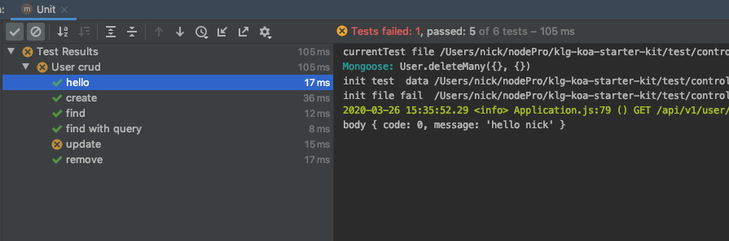
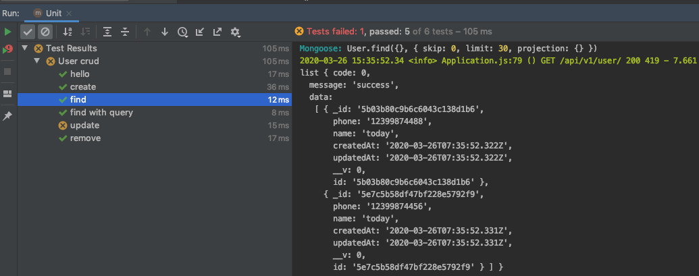

## 单独运行测试
WebStorm 对常见的单元测试框架做了集成，像 mocha jest karma 等，其中 mocha 效果会最好。

打开一个测试文件，可以看到每一个 case 左侧都会有个绿色的小圆点，点击即可运行测试，如果测试文件是用 typescript 编写的，WebStorm 会自动帮你引入 ts-node。

如果我们只想运行 hello 这个 case，直接点击其左侧的绿色小按钮即可。
WebStorm 会在运行命令里帮你加上 

`--grep "^User crud  hello $"`

用于过滤测试 case ，就不用我们手动写 only 了，不然容易忘了去掉 only。

## 项目整体测试

除了运行单个测试文件，我们可以可以配置运行整个项目的测试。
在右上角点击添加一个运行配置

具体配置如下

- Extra mocha options 是 mocha 运行需要的参数，-t 是超时时间，-r 是要额外引入的包，这里为了支持 typescript，引入了 ts-node; 你也可以在项目目录下添加一个 test/mocha.opts 文件来实现同样的配置，具体见 mocha 文档。
- Test file patterns 就是 mocha 要测试的文件Runner 

## 运行结果展示
运行效果如下

1. 失败case用黄色标记，左上角可以过滤只看成功和只看失败
2. see difference, 这个case的差异比较明显，用不上这个功能，如果是对比复杂对象的时候很有用
3. 错误原因
4. 点击可以直接跳转到错误位置

点击其他测试 case，右侧的 log 会自动联动，方便我们查看这个 case 相关的 log

