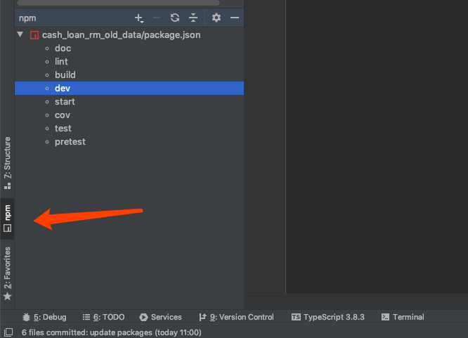
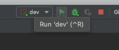
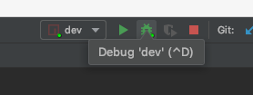
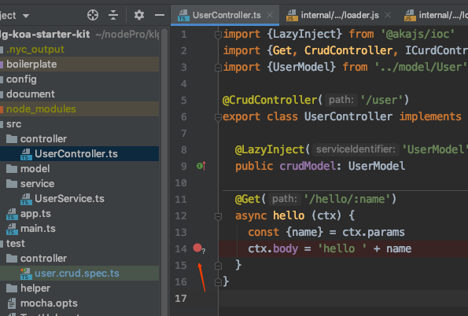
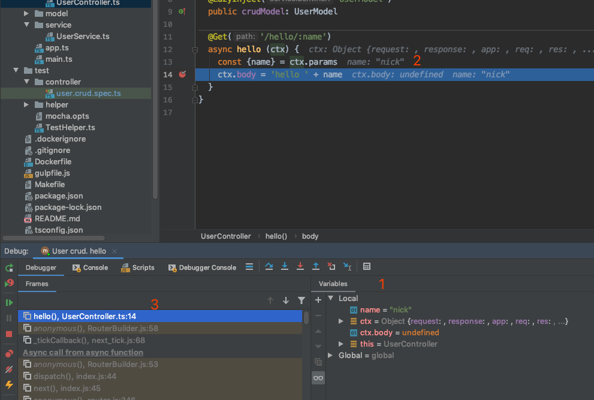
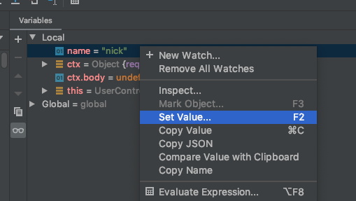
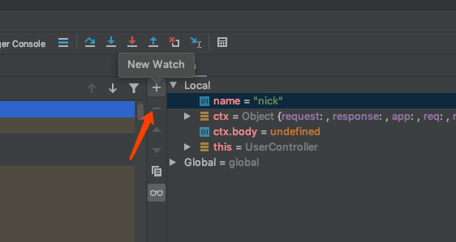
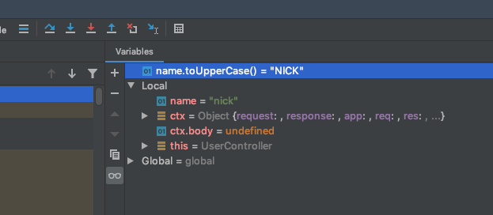
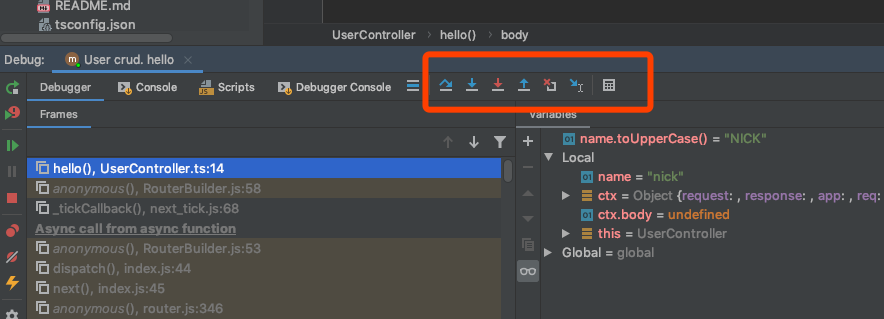
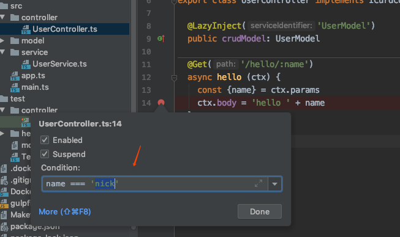

## 使用 Debug

WebStorm 里只用 Debug 功能非常方便，点击左下角的 npm 视图（Mac 系统快捷键是 Alt+F11），可以看到当前项目里可以run 的命令。

选择其中一个名执行。之后，右上角的 Runner 视图里就可以选择这个 dev 命令。

在这里，有两种运行模式，那个绿色的小虫子就是 debug 模式，debug 模式下，程序会在断点处停下。打断点的方式和其他编辑器没啥区别，点击行号右侧那里就行。

值得说明一下的是，跑单元测试的时候也是支持 debug 的。

## 断点的上下文

程序在断点处定下后，默认视图下我们可以看到上下文的各种变量

1. 复杂对象的值也可以在 Variables 视图里查看
2. 变量值直接附在代码后面，清晰
3. 左下角是代码调用的目录树，可以看到所有调用到此断点的代码，处理循环依赖的时候特别有用
在变量视图里，我们可以直接修改值

也可以输入自定义的代码，例如这里可以直接键入 name.toUpperCase()，不用改代码

## 流程控制

程序暂停后，我们经常会需要让程序单步执行，以观察数值变化，下图的一排按钮就是用于流程控制的。

常用的流程跳转有：

* 执行下一行 Step Over(F8)
* 进入下一级调用，Step Into(F7)，一般用于进入函数调用
* 跳到上一级，Step Out，一般用户跳到调用者那里
## 断点的条件

有些情况下，我们希望特定情况下断点才生效，我们可以使用断点条件。

右键点击断点，直接编辑断点条件

这个条件其实就是 js 表达式，里面能用上下文所有的变量

这样，只有 name 参数是‘nick’的时候才会生效。
