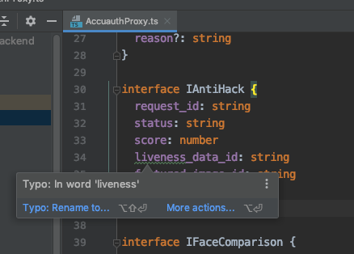

## Inspect Code

想让代码更简洁好看？WebStorm 可以帮助你。

Kalengo 的 CodeStyle 是 Standard 的，和 WebStorm 的默认配置不一样，在执行代码检查之前，我们要先把 CodeStyle 调整到和项目一致。

打开 WebStorm 配置，找到 TypeScript 的 CodeStyle，选择 Standard 即可。

接下来，我们对 src 目录执行代码检查，右键点击 src 目录，选择 Inspect Code

然后就得到结果了

一共有几个分类，我们一个一个讲

## 重复代码

双击列表里的文件，可以自动跳到文件位置

可以看到，重复代码位置那里的背景是淡黄色的，表示 warning。

鼠标移动到此处，会弹出一个选项

点击 show all

重复代码被高亮显示，左下角也展示有所用重复的地方，看来这段代码已经重复了三次了。

**解决方案**

1. Controller 里的重复代码，一般是 Joi 的校验重复了

这种问题建议引入 akajs, akajs 提倡使用 DTO 对象，并且提供了 @DTO 注解帮助完成参数校验，而 DTO 是非常方便实现共享的。

1. Service 里的重复代码

看下图，WebStorm 还是比较聪明的，不是单纯地 match string，还是会把注释代码过滤掉的。

这类问题，要根据实际情况解决，首先就是要搞清楚不同 Service 之前的关系，组合还是继承，然后把重复的 function 通过继承或者调用来实现共享。

1. test 里的重复代码

这类问题，一般是断言的逻辑重复了，要根据实际情况决定要不要把断言的逻辑抽成一个 function

## 多余的代码

这类问题，一般是 WebStorm 告诉我们，代码可以更简洁，看下面的问题列表，关键字有两个 Redundant 和 Unused，多余和无用的意思。

这类问题请根据事情情况一一处理，WebStorm 如果判断它可以自动完成修复工作的话，会在视图上方直接提供修复选项，点击修复即可。

## 拼写问题

拼写错误的单词都会被找出来

编码过程中，有留心的话，编辑器里已经是有提示的了，变量下方会有个波浪线

解决这类问题，也比较简单，如果是真的拼写错误，请酌情修改。

* 如果只是一个 function 内的变量，直接使用 WebStorm 的重构 rename 功能即可。
* 如果是全局变量或者 model 字段，那就无法修改了，或者有些名词是我们创作出来的，这种情况下，我们可以选择把这个名词添加到 WebStorm 的“字典”中。

可以选择全局字典或者项目字典，添加后就不会报错了。

有个小问题，这个字典是保存在 .idea/dictionaries/yourname.xml 中的，没有上传到 git 中，可以考虑把这个文件添加到 git 中

## TypeScript

这类问题，一般是风格问题，酌情修改即可，有个小技巧，可以把 npm lint --fix 作为 npm test 的前置条件，就不会漏了 tslint 的问题了

