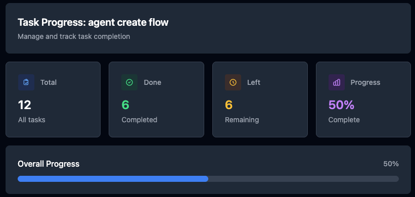

# Spec 编程实践：用规范驱动开发的新玩法

最近在尝试一种新的开发方式 —— Spec 编程（Specification-Driven Development），感觉挺有意思的，今天分享一下实践体验。

## 什么是 Spec 编程？

Spec 编程是一种把"可执行规范"当作一等公民的开发方式：

**核心理念**：先用结构化的规范（schema/IDL/DSL）把数据结构、接口契约、行为流程、约束与指标写清楚，再用这些规范自动生成代码骨架、校验、测试、文档与运维配置，并在 CI/CD 中持续校验实现是否"符合规范"。

简单说，就是先写规范，后写代码。规范即是文档，也是代码生成的源头。

## 我用的工具框架

我使用的是这个 MCP 框架：[spec-workflow-mcp](https://github.com/Pimzino/spec-workflow-mcp)

它提供了一套完整的 Spec 编程工作流。

## 核心概念和工作流

### Steering - 项目级别的文档

**Steering** 是项目的"方向盘"，包含三个核心文件：

- **product.md** - 产品功能描述
- **structure.md** - 代码结构设计
- **tech.md** - 架构设计文档

这三个文件相当于给项目建立了一个"知识库"，让 AI 能快速理解项目全貌。

### Spec - 单次需求流程

每个具体需求都要走一套标准化流程：

```
Requirements --> Design --> Tasks
```

**每一步都可以走 PR 流程**：审核 --> 重新生成 --> 通过

最终生成的 Tasks 可以直接交给 Claude Code 分步执行。



## 实际使用感受

### 优点：Steering 很实用

**Steering 文档真的很好用**，把项目概况浓缩了，方便 Claude Code 理解项目背景。不用每次都要重新解释项目是干什么的，技术栈是什么。

### 缺点：流程有点重

**每次需求都要走完整流程，有好有坏。**

**好的地方**：AI 对需求理解不到位的地方，在 requirements 和 design 环节就暴露出来了，你可以提前纠正它。相当于有了一个"需求澄清"的环节。

**坏的地方**：AI 按照预设模板来思考，容易"想太多"。你需要做大量的修改来避免它过度设计，需要反复多次编辑，挺费心的。

## 适用场景

从我的使用经验来看，Spec 编程比较适合：

1. **复杂项目** - 需要多人协作，需要统一的规范和理解
2. **长期项目** - 投入建立 Steering 文档的成本能够摊销
3. **API 密集型项目** - 接口规范化收益明显
4. **对质量要求高的项目** - 需要严格的设计审核流程

对于小项目或者快速原型，这套流程可能有点"杀鸡用牛刀"了。

## 总结

Spec 编程是一个有趣的尝试，它把软件工程中的"设计先行"理念用 AI 工具具体化了。

**优势**是规范化程度高，AI 参与的设计质量更稳定。

**劣势**是流程比较重，对于习惯了"敏捷开发"的团队可能需要一个适应过程。

我觉得这更像是一种"工程化的产品开发方式"，适合那些对过程管控要求比较高的场景。

不过话说回来，随着 AI 编程工具越来越强，我们确实需要更多这种"人机协作"的新方法论。Spec 编程可能不是最终答案，但绝对是一个值得尝试的方向。