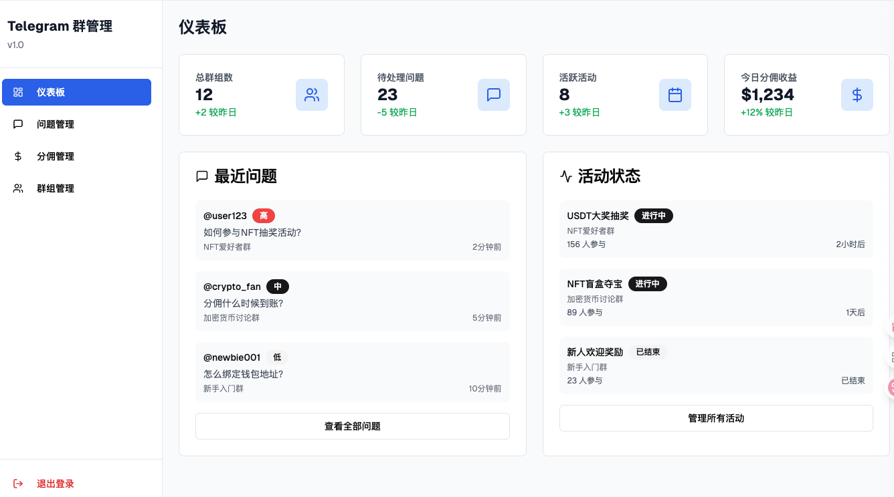

# 高效开发模式

作为产品，总是希望自己的想法能快速落地，最近总结了一套经过验证的开发模式，适用于 AI、Web3 等创新型产品的快速迭代。

## 1. 收集整理产品需求

项目伊始，首先要与需求方充分沟通，收集所有原始需求。此阶段建议采用结构化的需求收集表，确保信息全面、无遗漏。

## 2. 使用 Agent 转换为专业需求文档

我在 GPT Store 上创建了 [产品需求生成器](https://chatgpt.com/g/g-686cbdebe01081918591b311539b6e8a-chan-pin-xu-qiu-sheng-cheng-qi) Agent

利用这个 Agent，将原始需求自动转化为标准化、专业的需求文档（PRD）。这样不仅提升了文档质量，也极大节省了人力成本。

## 3. 基于需求文档在 V0 生成预览

根据 PRD，快速生成 V0 版本的产品预览（如原型、界面草图或 Demo）。这一阶段重点在于“快”，让需求方能直观感受产品雏形。

> V0 是由 Vercel 推出的生成式 UI 工具，你只需用自然语言描述想要的界面（比如按钮、表单、仪表盘等），它就会生成对应的 React + Tailwind（或 Shadcn UI）组件代码，并支持进一步自然语言微调迭代，是快速构建原型和前端体验的 AI 助手

## 4. 与需求方确认并调整细节

将 V0 预览展示给需求方，收集反馈，及时调整细节，确保产品方向与预期一致。

## 5. 使用 Agent 生成完整架构并评审

我在 GPT Store 上创建了 [技术架构方案助手](https://chatgpt.com/g/g-686ce000a75481918f90ffdf2effc42d-ji-zhu-jia-gou-fang-an-zhu-shou) Agent

通过 Agent 工具自动生成系统架构设计，包括：
- 数据模型
- 技术选型
- 业务流程图

架构初稿需与其他开发者进行深入讨论和确认，确保技术方案可落地。

## 6. 下载 V0 代码，使用 Cursor 继续开发

Agent 生成的 V0 代码可直接下载，开发团队可在 Cursor 等 IDE 中继续迭代开发。

## 7. 补充数据库连接功能（以 Prisma 为例）

根据实际业务需求，补充数据库连接与 ORM（如 Prisma）相关功能，完善数据层。

## 8. 完成登录授权

实现用户登录与授权机制，保障系统安全性。

## 9. 特殊难题找专业人员解决

遇到复杂或跨领域难题时，及时寻求专业人员协助，避免因技术瓶颈拖慢进度。

## 10. 完成开发与测试验收

开发完成后，进行全面测试与需求方验收，确保产品质量。

## 11. 部署到 Vercel 并配置域名

最终，将产品部署到 Vercel 等云平台，完成域名配置，实现产品上线。

---
这套开发模式兼顾了效率与质量，适合小团队或创新型项目快速试错与迭代。希望对正在探索高效开发流程的团队有所启发。 

# 实际案例
做一个 Bot 可以辅助群主管理群问题，还可以使用抽奖来活跃群。

[代码仓库](https://github.com/myfjdthink/telegram-group-manager)

产品效果

